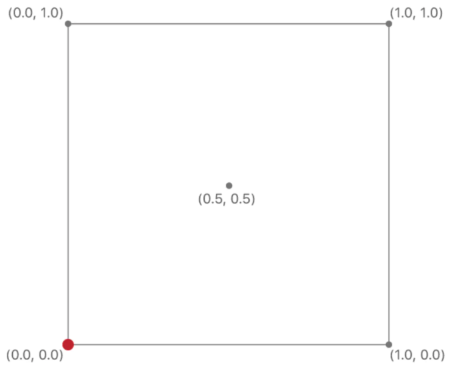
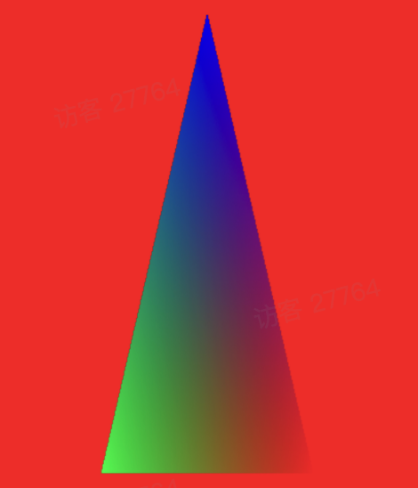

## 初步了解移动端图像处理

### 1 分类

计算机能以矢量图（Vector）或位图（bitmap）格式显示图像。

#### 1.1 矢量图

组成：

- 直线和曲线
- 位置信息
- 色彩

编辑：

数学公式

类型：

- DWG
- SVG
- ai
- dxf

#### 1.2 位图

组成：

- 像素数（分辨率）
- 每个像素的颜色深度

编辑：

- 可对每个像素单独做编辑

类型：

- JPG
- GIF
- PNG
- tiff

#### 1.3 区别

##### 放大效果

矢量图放大后不会糊，所谓的无限放大不会模糊

位图放大后会糊

##### 真实度

矢量图难以表现色彩层次丰富的逼真图像效果，无法产生色彩艳丽、复杂多变的图像。真实照片逼真度低，要画出自然度高的图像需要很多的技巧。

位图有着足够多的不同色彩的像素，就可以制作出色彩丰富的图像，逼真的表现自然界的景象。

##### 文件大小

矢量图中图像中保存的是线条和图块的信息，所以矢量图形文件与分辨率和图像大小无关，只与图像的复杂程度有关，图像文件所占的存储空间较小。

位图图像中有很多不同色彩的像素块，保存后的文件较大。

#### 1.4 位图画质

主观上描述：

- 清晰度，质量高低；
- 锯齿、噪点、对比度
- ...

客观上：

- 图片编码格式及质量因子；
- 图片宽高尺寸（像素数量）
- ...

更具体的可移步阅读：[关于像素尺寸和打印图像分辨率](https://helpx.adobe.com/cn/photoshop/using/image-size-resolution.html)


### 2 对位图的图像处理

> 维基百科
>
> 


#### 2.1 改变图像的像素值

比如，手机相机的滤镜，祛斑祛痘

#### 2.2 改变图像的像素位置

比如，瘦脸，增高塑形

#### 2.3 在图像上增加素材

比如，涂鸦，文字&贴纸


### 3 技术实现

基于 CPU 还是基于 GPU 处理图像？

> https://www.intel.cn/content/www/cn/zh/products/docs/processors/cpu-vs-gpu.html
>
> CPU 与 GPU 对比：充分发挥两者的性能1
>
> 中央处理器 (CPU) 和图形处理器 (GPU) 是基本的计算引擎。但是，随着计算需求的发展，人们并不总是明白 CPU 和 GPU 之间的区别以及哪种工作负载最适合它们。

> https://www.omnisci.com/technical-glossary/cpu-vs-gpu
>
> https://developer.nvidia.com/blog/cuda-refresher-reviewing-the-origins-of-gpu-computing/
>
> 
>
> GPU 被设计用于高密度和并行计算，更确切地说是用于图形渲染。因此更多的晶体管被投入到数据处理而不是数据缓存和流量控制。

#### 3.1 原生绘图引擎

> 图片from [iOS图形处理概论：OpenGL ES，Metal，Core Graphics，Core Image，GPUImage，Scene Kit (3D) ，Sprite Kit (2D)，OpenCV](https://cloud.tencent.com/developer/article/1332271)


#### 3.2 OpenGL

我们先简单了解一下OpenGL的相关概念。

> `OpenGL`（英语：`Open Graphics Library`，译名：开放图形库或者“开放式图形库”）是用于渲染2D、3D矢量图形的跨语言、跨平台的应用程序编程接口（API）。这个接口由近350个不同的函数调用组成，用来从简单的图形比特绘制复杂的三维景象。

##### 3.2.1 OpenGL 着色器

GL的渲染流程如上图，其中有以下几个名词，这里通俗地解释一下：

* 顶点着色器：用于确定要绘制的点坐标
* 片段着色器：对每个绘制点执行脚本，确定绘制点的颜色
* `Framebuffer`：可以简单理解为一份图片的颜色数据，在涂抹过程中，就是往`FrameBuffer`里写入数据。
* 纹理（`Texture`）：也是一份颜色数据，一张图片要先转成纹理，才能在GL中进行绘制。


以修改像素色值为例，流程如下：
1、顶点着色器计算要绘制的点的坐标。
2、素材图作为纹理传入片段着色器。
3、片段着色器从纹理中获取颜色信息并计算绘制点的颜色。
4、片段着色器输出的颜色绘制到`FrameBuffer`上。
5、屏幕刷新时将`FrameBuffer`显示到手机屏幕。

##### 3.2.2 OpenGL 渲染数据流


- Texture Data
  - eg. 对图片（纹理）本身做处理的滤镜，渲染图形时的线框填充、颜色填充、纹理填充，像素填充
- Uniforms
  - 是一个通道，传入的比较统一的数据，eg. 旋转矩阵，渲染矩阵
- Attributes
  - 传入的是不断改变的数据
    - 顶点坐标
    - 颜色数据
    - 纹理坐标
    - 光照法线

① 顶点着色器

- 根据传入的数据（颜色，位移，光照），每个顶点都执行一次

② 图元装配

- 裁剪、透视分割
- 视口变换、光栅化

③ 片元着色器

- 每个像素点的颜色填充和计算

④ 绘制


#### 3.3 瘦脸案例

##### 3.3.1 基于 CPU 的C++实现

1. 获取圆形变化区域的所有像素点的初始位置
   - 两层for 循环，CPU 对 x 和 y 轴遍历像素
2. 根据操作轨迹映射出变换后的像素位置
3. 变化后每个像素点的值通过映射后目标点周围像素重采样（插值求解）
   - 一份原图和一份结果图


##### 3.3.2 基于 GPU 的 OpenGL 实现

1. 将图片纹理细分出足够多的定点，顶点越多三角形越多


2. 根据操作点实时调整对应区域的定点做出偏移
3. 顶点偏移造成像素压缩，需要重新采用


可以利用 GPU 的并行计算，提高图片处理速度


#### 3.4 Metal

> Metal是2018年apple推出的新一代图形编程接口。Metal提供面向对象的接口，更方便安全的数据同步，使开发人员更容易的开发出优秀的3D程序。通过Metal相关api直接操作GPU，能最大限度利用GPU能力 。

> **下文有大篇幅内容摘录自 [Metal入门教程总结](https://cloud.tencent.com/developer/inventory/1366/article/11920488) **

##### 3.4.1 基本组件结构


对象关系：


`MTLDevice` 对象代表GPU，通常使用`MTLCreateSystemDefaultDevice`获取默认的GPU；

`MTLCommandQueue`由device创建，用于创建和组织`MTLCommandBuffer`，保证指令（`MTLCommandBuffer`）有序地发送到GPU；

`MTLCommandBuffer`会提供一些encoder，包括编码绘制指令的`MTLRenderCommandEncoder`、编码计算指令的`MTLComputeCommandEncoder`、编码缓存纹理拷贝指令的`MTLBlitCommandEncoder`。对于一个`commandBuffer`，只有调用encoder的结束操作，才能进行下一个encoder的创建，同时可以设置执行完指令的回调。

每一帧都会产生一个`MTLCommandBuffer`对象，用于填放指令；

GPUs的类型很多，每一种都有各自的接收和执行指令方式，在`MTLCommandEncoder`把指令进行封装后，`MTLCommandBuffer`再做聚合到一次提交里。

`MTLRenderPassDescriptor` 是一个轻量级的临时对象，里面存放较多属性配置，供`MTLCommandBuffer`创建`MTLRenderCommandEncoder`对象用。


`MTLRenderPassDescriptor` 用来更方便创建`MTLRenderCommandEncoder`，由MetalKit的view设置属性，并且在每帧刷新时都会提供新的`MTLRenderPassDescriptor`；`MTLRenderCommandEncoder`在创建的时候，会隐式的调用一次clear的命令。

最后再调用`present`和`commit`接口。


介绍下Metal的主要常用组件：

- `MTLDevice`，就是GPU，Metal可以运行的设备。可以通过`MTLView`通过系统来生成，也可以自己创建

- `CAMetalDrawable`，是可绘制对象，包含纹理 和 图层

  ```objective-c
  @protocol CAMetalDrawable <MTLDrawable>
  
  @property (readonly) id<MTLTexture> texture;
  
  @property (readonly) CAMetalLayer *layer;
    
  @end  
  ```

- `MTLCommandQueue` ，是接受顺序的`commandbuffer`的一个队列，所有的`MTLCommandBuffer`都发送给 `commandQueue` 执行

- `MTLCommandBuffer`，是一个储存编码的交给GPU绘制的命令的缓冲区

- `MTLLibrary`，代表工程里面`.metal`结尾的对象 ，可以理解为metal着色器这个对象

- `MTLBuffer`


##### 3.4.2 Metal图形渲染管线

Metal把输入、处理、输出的管道看成是对指定数据的渲染指令，比如输入顶点数据，输出渲染后纹理。

`MTLRenderPipelineState` 表示渲染管道，最主要的三个过程：顶点处理、光栅化、片元处理：


转换几何形状数据为帧缓存中的颜色像素，叫做点阵化（rasterizing），也叫光栅化。其实就是根据顶点的数据，检测像素中心是否在三角形内，确定具体哪些像素需要渲染。

对开发者而言，顶点处理和片元处理是可编程的，光栅化是固定的（不可见）。

顶点函数在每个顶点被绘制时都会调用，比如说绘制一个三角形，会调用三次顶点函数。顶点处理函数返回的对象里，必须有带`[[position]]`描述符的属性，表面这个属性是用来计算下一步的光栅化；返回值没有描述符的部分，则会进行插值处理。


##### 3.4.3 纹理

Metal要求所有的纹理都要符合`MTLPixelFormat`上面的某一种格式，每个格式都代表对图像数据的不同描述方式。

例如`MTLPixelFormatBGRA8Unorm`格式，内存布局如下：


每个像素有32位，分别代表BRGA。

`MTLTextureDescriptor` 用来设置纹理属性，例如纹理大小和像素格式。

`MTLBuffer`用于存储顶点数据，`MTLTexture`则用于存储纹理数据；`MTLTexture`在创建之后，需要调用`replaceRegion:mipmapLevel:withBytes:bytesPerRow:`填充纹理数据；因为图像数据一般按行进行存储，所以需要每行的像素大小。

`[[texture(index)]] `用来描述纹理参数，比如说

```c++
samplingShader(RasterizerData in [[stage_in]], texture2d<half> colorTexture [[ texture(AAPLTextureIndexBaseColor) ]])
```

在读取纹理的时候，需要两个参数，一个是sampler和texture coordinate，前者是采样器，后者是纹理坐标。

读取纹理其实就把对应纹理坐标的像素颜色读取出来。

纹理坐标默认是（0，0）到（1，1），如下：



##### 3.4.4 示例代码说明

那么我来看下怎么生成图形里面的那个经典三角形吧 ，通过这个示例了解：

- 创建Metal环境
- 传入顶点数据
- 创建Command
- 提交给队列
- 最终生成一个五颜六色的三角形

1 创建Metal环境，这里用`MTLView`来获取

```objective-c
- (id<MTLDevice>)mtlDevice {
  // 获取 MTLDevice
  if(nil == _mtlDevice) {
    _mtlDevice = self.metalView.metalLayer.device;
  }
  assert(_mtlDevice != nil);
  return _mtlDevice;
}

```

2 获取可绘制对象

```objective-c
- (id<CAMetalDrawable>)metalDrawable {
	// 获取 drawable
  if(nil == _metalDrawable) {
    _metalDrawable = self.metalView.metalLayer.nextDrawable;
  }
  assert(_metalDrawable != nil)；
  return _metalDrawable;
}

```

3 配置指令，创建` MTLCommandQueue`等

```objective-c
id<MTLDevice> mtlDevice = self.mtlDevice;
id<CAMetalDrawable> metalDrawable = self.metalDrawable;
   
//指令的配置，生成
MTLRenderPassDescriptor *renderPassDesc = [[MTLRenderPassDescriptor alloc]init];
//  renderPassDesc.colorAttachments[0].clearColor = MTLClearColorMake(0.48, 0.74, 0.92, 1);
renderPassDesc.colorAttachments[0].clearColor = MTLClearColorMake(1.0, 0.0, 0.0, 1);
 
renderPassDesc.colorAttachments[0].texture = metalDrawable.texture;
renderPassDesc.colorAttachments[0].loadAction = MTLLoadActionClear;
renderPassDesc.colorAttachments[0].storeAction = MTLStoreActionStore;
   
id<MTLCommandQueue> commandQueue = [mtlDevice newCommandQueue];
   
id<MTLCommandBuffer> commandBuffer = [commandQueue commandBuffer];
id<MTLRenderCommandEncoder> commandEncoder = [commandBuffer     renderCommandEncoderWithDescriptor:renderPassDesc];

```

4 创建渲染管线

在 Metal 里面有个 `MTLRenderPipelineDescriptor` 描述这个渲染管线，在这个描述符里面传入一些参数。

```objective-c
id<MTLLibrary> mtlLibrary = [mtlDevice newDefaultLibrary];
id<MTFunction> vertexFunction = [mtlLibrary newFunctionWithName: @"vertexShader"];
id<MTFunction> fragmentFunction = [mtlLibrary newFunctionWithName: @"fragmentShader"];

MTLRenderPipelineDescriptor *pipelineDescriptor = [[MTLRenderPipelineDescriptor alloc] init];
piplelineDesciptor.lable = @"Hello Metal Pipeline";
pipelineDescriptor.vertexFunction = vertexFunction;
pipelineDescriptor.fragmentFunction = fragmentFunction;
pipelineDescriptor.colorAttachments[0].pixelFormat = self.metalView.metalLayer.pixelFormat;

NSError *error = nil;
id<MTLRenderPipelineState> pipelineState = [mtlDevice newRenderPipelineStateWithDescriptor:pipelineDescriptor error:&error];
if (nil != error) {
  NSLog(@"error:pipelineState");
  return;
}
[commandEncoder setViewport:(MTLViewport){0.0, 0.0, 300, 300, -1.0, 1.0 }];
[commandEncoder setRenderPipelineState:pipelineState];
```

5 生成顶点数据

```objective-c
// 创建3个顶点
YLZVertex vertices[3] = {
  {
    {0.5, -0.5},
    {1, 0, 0, 1}
  },
  {
    {-0.5, -0.5},
    {0, 1, 0, 1}
  },
  {
    {0.0, 0.5},
    {0, 0, 1, 1}
  }
}
NSData *vertexData = [NSData dataWithBytes:&vertices length:sizeof(YLZVertex)*3];

```

6 生成对应的buffer 并提交给 `commandQueue`

```objective-c
id<MTLBuffer> vertexBuffer = [mtlDevice newBufferWithLength:vertexData.length options:MTLResourceStorageModeShared];
memcpy(vertexBuffer.contents, vertexData.bytes, vertexData.length);
   
//
[commandEncoder setVertexBuffer:vertexBuffer offset:0 atIndex:YLZVertexInputIndexVertices];
[commandEncoder setVertexBytes:vertexData.bytes length:3 * sizeof(YLZVertex) atIndex:YLZVertexInputIndexVertices];
[commandEncoder drawPrimitives:MTLPrimitiveTypeTriangle vertexStart:0 vertexCount:3];
// 提交渲染
[commandEncoder endEncoding];
[commandBuffer presentDrawable:metalDrawable];
[commandBuffer commit];
```

7 着色器

环境建好。主要操作是传入顶点数据，写对应的着色器

```c
#include <metal_stdlib>
using namespace metal;

#import "component/YLZShaderTypes.h"

typedef struct
{
    float4 position [[position]];
    float4 color;
} RasterizerData;

vertex RasterizerData vertexShader(constant YLZVertex *vertices [[buffer(YLZVertexInputIndexVertices)]],
                                     uint vid [[vertex_id]]) {
    RasterizerData outVertex;

    outVertex.position = vector_float4(vertices[vid].position, 0.0, 1.0);
    outVertex.color = vertices[vid].color;

    return outVertex;
}

fragment float4 fragmentShader(RasterizerData inVertex [[stage_in]]) {
    return inVertex.color;
}

```

运行效果：


