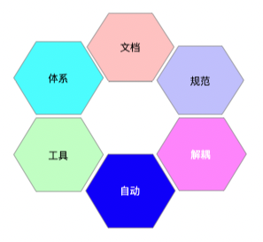
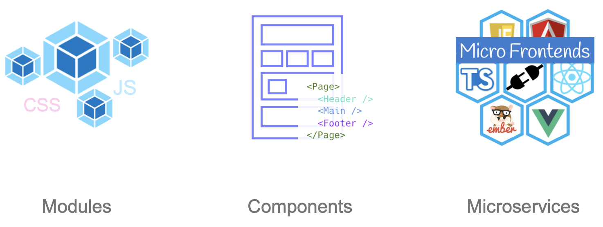
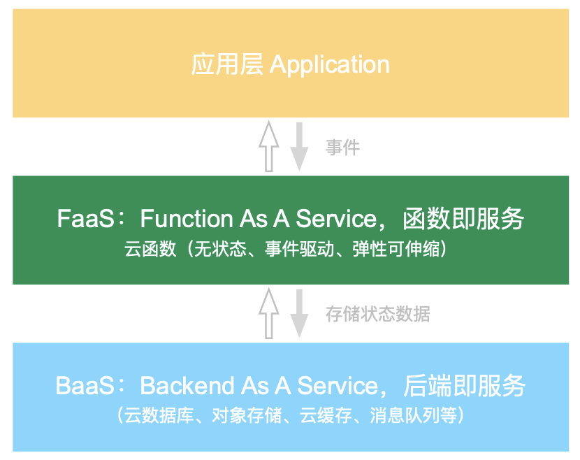

## 前端观察

最早接触前端是大学同学一起学习前端开发。那时候学习的是：原生 js ➕ jQuery ➕ h5。期间码过网页，也一度想过毕业以后就从事前端开发的工作。后来我学习了移动iOS开发，偶尔看看前端的技术发展趋势。中间出现过很多热词：大前端、前端架构师、全栈等等

直到移动端开始热衷于**混合开发**以及大厂的ReactNative、Weex等框架的火热登场，我又重拾了前端技术，但是前端技术发展让我刮目相看。而且随着硬件的发展，混合开发的软件有着接近原生开发流畅的体验，和跨端的效率优势。更让我瞠目结舌的是前端**工程化开发**已经和我当时接触前端的时候有了质的变化。

### 工程化开发

> 以系统化、规范化、可度量的方法用于应用开发和维护的过程。

| 质量                                         | 效率                                         | 成本                             |
| -------------------------------------------- | -------------------------------------------- | -------------------------------- |
| 降低故障率，提高安全稳定性、性能以及用户体验 | 解放生产力，提高工作效率，避免重复或无效工作 | 境地开发、运营以及运行和维护成本 |

### 实践方法、方向

#### 1 文档

以终为始，先把文档落地

- 设计思路or技术方案文档
  - 架构、流程
  - 接口
  - 配置
- 开发资料or历史记录文档
  - 调研
  - 版本
- 接入or使用文档
  - 接入手册

要达到的目标：

- 提高开发效率
- 保证开发质量
- 提高代码维护性
- 降低沟通成本

#### 2 规范

规范难在制定高度认可的标准，更难在实施。

一千个人心中有一千个哈姆雷特，如何形成共识，并达到可推而实施是一门学问。关键还是抓住大家的共情，才能长久稳定的实施。

| 需求评审阶段 | 技术方案阶段 | 开发阶段 | 测试用例评审阶段 | 构建与发版 | 维护与对接 |
| ------------ | ------------ | -------- | ---------------- | ---------- | ---------- |
| 需求规范     | 技术选型     | 代码风格 | 测试与自测规范   | 构建规范   | 维护规范   |
| 文档规范     | 架构设计     | 接口风格 | ...              | 部署规范   | 交接规范   |
| ...          | 安全规范     | ...      |                  | ...        | ...        |
|              | ...          |          |                  |            |            |

#### 3 解耦（模块化，组件化）

- 业务复杂度随着发展交织复杂

- 代码规模变大，如何降低开发和维护成本
- 团队规模变大，如何更好的协作

##### 模块化

前端有诸如：CommonJS/ AMD/ UMD/ ESM 等模块规范

遵循：单一职责、最小粒度、可复用性等设计原则

##### 组件化

基于模块化基础之上的 UI 视图的拆分、组合、复用等业务视图组织形式，同样遵循模块化的规范和原则。比如：React、Vue 等

##### 与服务端资源和运维解耦

> https://github.com/serverless/serverless

- 只关注业务开发本身
- 降低开发者参与业务服务端研发、部署、交互的门槛
- 减少运维、服务器和人力成本

#### 4 自动

「脚手架」前端开发喊的挺响亮

> 由“程序员手写代码”跨越到了“程序员指挥机器自动生成代码”的时代

- 一键创建项目的脚手架，是流行框架的标配
  - Vue-cli
  - Vite
  - Create-react-app
- 自动代码检查
  - ESLint
  - Code Smell
  - Prettier
- 自动生成文档
- 自动构建
  - Jenkins
- 自动测试
- ...

#### 5 工具

- 选工具
- 用工具
- 造工具

#### 6 体系

| 通用基础设施 | 业务基础设施 | 低、无代码平台     | 管理系统、工具平台 |
| ------------ | ------------ | ------------------ | ------------------ |
| UI 组件库    | 业务组件库   | 可视化页面搭建系统 | 静态资源管理       |
| 通用工具类库 | 业务 SDK     | 设计工具           | 接口管理           |
| 项目脚手架   | 业务脚手架   | ...                | 日志和性能监控     |
| ...          | ...          |                    | 设计、生成工具...  |

