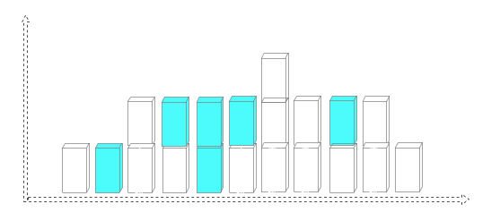
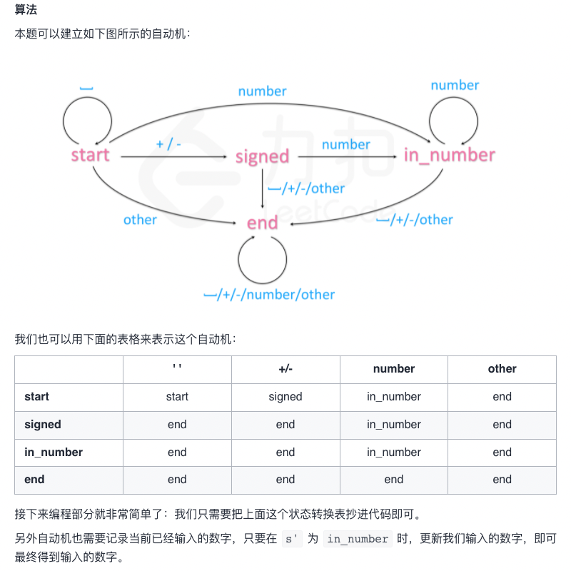

## 算法题目

### 1 单调栈

> #### 栈
>
> 特征：`LIFO`(Last In, First Out - 后进先出)
>
> 操作：
>
> 1. 进栈 -` push` - 将元素放置到栈顶
> 2. 退栈 - `pop` - 将栈顶元素弹出
> 3. 栈顶 - `top` - 得到栈顶元素的值
> 4. 是否空栈 - `isEmpty` - 判断栈内是否有元素
> 5. 时间复杂度：
>    1. 进栈 O(1)
>    2. 出栈 O(1)
>
> #### 单调栈
>
> 在栈的基础上加了约束：栈中的元素是单调递增或者单调递减的。如果出栈的元素是单调增的，那就是单调递增栈，如果出栈的元素是单调减的，那就是单调递减栈。
>
> eg. 【1,2,3,4】（左侧为栈底）出栈 4,3,2,1 是一个单调递减栈
>
> **如果压栈之后仍然可以保持单调性，那么直接压。否则先弹出栈的元素，直到压入之后可以保持单调性。 被弹出的元素都是大于当前元素的，并且由于栈是单调减的，因此在其之后小于其本身的最近的就是当前元素了**

鉴于上述，如果遇到题目需要找**在其之后第一个小于其本身的位置**的题目，就可考虑使用单调栈。

```swift
class Solution {
    func monostoneStack(arr:[Int]) -> [Int] {
        var stack: [Int] = []
        /// 表示在其之后第一个小于其本身的位置，results[i] 表示 arr[i] 之后第一个小于 arr[i]的位置
        /// results[i] 为 -1 表示这样的位置不存在
        var results: [Int] = Array(repeating: -1, count: arr.count)
        
        for i in 0..<arr.count {
            // print(i)
            while (stack.count>0) && (arr[i]>arr[stack.last!]) {
                let peek = stack.removeLast()
                results[peek] = i - peek
            }
            stack.append(i)
        }
        
        return results
    }
}
/*
时间复杂度：由于 arr 的元素最多只会入栈，出栈一次，因此时间复杂度仍然是 O(N)，其中 N 为数组长度。
空间复杂度：由于使用了栈，并且栈的长度最大是和 arr 长度一致，因此空间复杂度是 O(N)，其中 N 为数组长度。
*/
```

> 题目：给定 n 个非负整数表示每个宽度为1的柱子的高度图，计算按此排列的柱子，下雨之后能接多少雨水。
>
> 
>
> 上面是由数组 [0,1,0,2,1,0,1,3,2,1,2,1] 表示的高度图，在这种情况下，可以接 6 个单位的雨水（蓝色部分表示雨水）。示例：
>
> 输入: [0,1,0,2,1,0,1,3,2,1,2,1]
>
> 输出: 6
>
> 思路：如图所示要求收集的水，用下雨后的体积 V2 - 下雨前的体积 V1 即可。柱子单位是 1 所以：
>
> ```swift
> // V = V2 - V1
> for i in 0..<heightArr1.count {
>     V += (heightArr2[i] - heightArr1[i]) * 1
> }
> ```
>
> 已知 heightArr1 ==> [0,1,0,2,1,0,1,3,2,1,2,1]
>
> 据上图可得： heightArr2 ==> [0,1,1,2,2,2,2,3,2,2,2,1]
>
> 上述，伪代码中的 heightArr2[i] 该如何计算？？？
>
> 问题的关键就是求**该位置左右两边柱子较小者**
>
> - Left[i+1] < Right[i] ，那么存水的高度由 i 的左侧最大值决定
> - Left[i+1] >= Right[i] ，那么存水的高度有 i 的右侧最大值决定

```swift
/**
 * left/right，分别指向头尾。当指针的位置的雨水量已经计算完成，我们移动到下个位置用同样的方法计算
 * 
 */

class Solution {
    func calPonding(heightArr:[Int]) -> Int {
        let n = heightArr.count
        var result = 0
        var leftMax = 0, rightMax = 0
        var left = 0, right = n - 1
        
        while left < right {
            // 短板在 heightArr[left]，否则短板在 heightArr[right]
            if heightArr[left] < heightArr[right] {
                // 则当前柱子积水面积为(leftMax - heightArr[left])，否则无法积水
                if heightArr[left] < leftMax {
                   result += leftMax - heightArr[left] 
                } else {
                    leftMax = heightArr[left]
                }
                left += 1
            } else {
                // 则当前柱子积水面积为(rightMax - heightArr[right])，否则无法积水
                if heightArr[right] < rightMax {
                    result += rightMax - heightArr[right]
                } else {
                    rightMax = heightArr[right]
                }
                right -= 1
            }
        }
        
        return result
    }
}
// 时间复杂度：O(N)
// 空间复杂度：O(1)
```

> ```swift
> 给出一个以头节点 head 作为第一个节点的链表。链表中的节点分别编号为：node_1, node_2, node_3, ... 。
> 每个节点都可能有下一个更大值（next larger value）：对于 node_i，如果其 next_larger(node_i) 是 node_j.val，那么就有 j > i 且  node_j.val > node_i.val，而 j 是可能的选项中最小的那个。如果不存在这样的 j，那么下一个更大值为 0 。
> 
> 返回整数答案数组 answer，其中 answer[i] = next_larger(node_{i+1}) 。
> 
> 注意：在下面的示例中，诸如 [2,1,5] 这样的输入（不是输出）是链表的序列化表示，其头节点的值为 2，第二个节点值为 1，第三个节点值为 5 。
> 
> 示例 1：
> 输入：[2,1,5]
> 输出：[5,5,0]
> 
> 示例 2：
> 输入：[2,7,4,3,5]
> 输出：[7,0,5,5,0]
> 
> 示例 3：
> 输入：[1,7,5,1,9,2,5,1]
> 输出：[7,9,9,9,0,5,0,0]
>  
> 提示：
> 对于链表中的每个节点，1 <= node.val <= 10^9
> 给定列表的长度在 [0, 10000] 范围内
> ```

```swift

public class ListNode {
    public var val: Int
    public var next: ListNode?
    public init() {
        self.val = 0
        self.next = nil
    }
    public init(_ val: Int) {
        self.val = val
        self.next = nil
    }
    public init(_ val: Int, _ next: ListNode?) {
        self.val = val
        self.next = next
    }
}

class Solution1 {
    /**
     单调栈的思路
     1 栈中保存链表的节点编号（即下标），还需要保存下标对应的链表值（避免再次遍历链表）
     2 按单调递减栈的入栈顺序，如果出现当前遍历到的节点比栈顶值大，说明需要将栈中元素出栈，并更新 res 值
     */
    func nextLargerNodes(_ head: inout ListNode?) -> [Int] {
        var st: [(Int,Int)] = [], res: [Int] = []
        while (head != nil) {
            while st.count > 0 && head!.val > st.last!.1 {
                res[st.popLast()!.0] = head?.val ?? -1
            }
            st.append((res.count, head?.val ?? -1))
            res.append(0)
            head = head?.next
        }
        return res
    }
    
    func constructListNodeFromNums(nums: [Int]) -> ListNode? {
        if nums.count <= 0 {
            return nil
        }
        let dummyNode = ListNode.init(-1, nil)
        var preNode = dummyNode
        for i in 0..<nums.count {
            let curNode = ListNode.init(nums[i])
            preNode.next = curNode
            preNode = preNode.next!
        }
        return dummyNode.next
    }
}

/**
var head = Solution1.init().constructListNodeFromNums(nums: [2,7,4,3,5])
print(Solution1.init().nextLargerNodes(&head))
*/
```


### 2 两数之和

> 给定一个整数数组 nums 和一个目标值 target，请你在该数组中找出和为目标值的那 两个 整数，并返回他们的数组下标。
>
> 你可以假设每种输入只会对应一个答案。但是，你不能重复利用这个数组中同样的元素。
>
> 示例:
>
> 给定 nums = [2, 7, 11, 15], target = 9
>
> 因为 nums[0] + nums[1] = 2 + 7 = 9
> 所以返回 [0, 1]
>
> 思路：
>
> 使用 Map 记录已经遍历过的数字及其对应的索引值。这样当遍历一个新数字的时候就去 Map 里查询 **target 与该数的差值 diff 是否已经在前面的数字中出现过**。如果出现过，说明 diff + 当前数 = target，我们就找到了一组答案。
>
> - 求和- -> 为求差
> - 借助 Map 结构将数组中每个元素及其索引相互对应
> - 以空间换时间，将查找时间从 O(N) 降低到 O(1)

```swift
class Solution {    
    func towSum(nums: [Int]?, target: Int) -> [Int] {
        guard let arr = nums, arr.count > 1 else { return [] }
        
        var map: [Int: Int] = [:]
        
        for (i,num) in arr.enumerated() {
            let diff = target - num
            if map.keys.contains(diff) {
                return [map[diff]!, i]
            }
            map[num] = i
        }
        return []
    }
}  
```


### 3 分桶

```swift
在整数数组 nums 中，是否存在两个下标 i 和 j，使得 nums [i] 和 nums [j] 的差的绝对值小于等于 t ，且满足 i 和 j 的差的绝对值也小于等于 ķ 。
如果存在则返回 true，不存在返回 false。


示例 1:
输入: nums = [1,2,3,1], k = 3, t = 0
输出: true

示例 2:
输入: nums = [1,0,1,1], k = 1, t = 2
输出: true

示例 3:
输入: nums = [1,5,9,1,5,9], k = 2, t = 3
输出: false
  
当擦除hashmap中的元素时，键的计算方法应该和插入时的计算方法一致。否则会错误地擦除需要的元素或者保留不需要的元素。
例如：
输入：nums = [-1,10,20,1], k = 2, t = 3
预期结果：false
实际输出：true
解释：当i = 3时, 删除了nums[i-k]/mod = 0的键，但实际上值"-1"存储在键为-1的桶中，造成i=4时的错误判断。  
```


```swift
/// 简单的思路: 双层循环，找出所有的两两组合。然后逐个判断其是否满足 nums [i] 和 nums [j] 的差的绝对值最大为 t，并且 i 和 j 之间的差的绝对值最大为 ķ。
class Solution {
  
/// 双循环
    func containsNearbyAlmostDuplicate1(nums: [Int], k: Int, t: Int) -> Bool {
        let numsCount = nums.count
        for i in 0..<numsCount {
            for j in i+1..<numsCount {
                if (abs(nums[i]-nums[j]) <= t) && (j-i <= k) {
                    return true
                }
            }
            /// 剪枝
            /// 实际上我们只需要 i + 1 到 min(len(nums), i + k + 1)
            /*
            for j in i+1..<min(numsCount, i+k+1) {
                if abs(nums[i]-nums[j]) <= t {
                    return true
                }
            }
            */
        }
        return false
    }
  
///////////////////////////////////////////////////////////////////////////

/// 分桶
    /**
     使用 t+1 个桶，将所有数据除以（t+1）的结果作为编号存到一个哈希表中，哈希表的编号范围将是：
     [0,t]
     经过这个处理
     - 如果两个数字的编号相同，那么意味着绝对值差小于等于 t
     - 如果两个数字的编号不同，相邻编号也可能是绝对值差小于等于 t。需要检查以下情况：
        - 当前编号
        - 左边相邻的编号
        - 右边相邻的编号
     题干要求，索引差小于等于 k，
     因此我们可以固定一个窗口大小为 k 的滑动窗口，
     每次都仅处理窗口内的元素，
     这样可以保证窗口内的数任意两个数都满足索引之差的绝对值小于等于k。
     因此我们需要清除不在窗口内的信息。
     
     */
    /**
    优质评论：
    很多小伙伴对getID有点迷惑,就是为什么取负数,如w=10, 因为非负数是0~9，10~19...这种一组，而负数是-1~-10, -11~-20...这些是一组，如果-1~-10直接除以10，会被分到两组中，而不是-1这一组，所以先+1变成-0--9,与正数一致，再除以10，最后减1，正好是-1这一组，其它组也是同理
    */
    func getId(x: Int, w: Int) -> Int {
        if x >= 0 {
            return x/w
        }
        return (x+1)/w - 1
    }
    func containsNearbyAlmostDuplicate(nums: [Int], k: Int, t: Int) -> Bool {
        if t<0 {
            return false
        }
        var bucket: [Int: Int] = [:]
        for (i,v) in nums.enumerated() {
            let id = getId(x: v, w: t+1)
            
            if bucket.keys.contains(id) {
                return true
            }
            if let a = bucket[id-1], abs(v - a) <= t {
                return true
            }
            if let b = bucket[id+1], abs(v - b) <= t {
                return true
            }
            /// 不存在的话暂时添加到 bucket
            bucket.updateValue(v, forKey: id)
            ///  维护大小为k的滑动窗口，清除不在窗口内的信息
            if i >= k {
                bucket.removeValue(forKey: getId(x: nums[i-k], w: t+1))
            }
        }
        
        return false
    }
  	/**
  优质评论：
  桶的解法相当凝练，不过有一点可以啰嗦两句。不知道有没有人疑惑，在比较id - 1和id + 1这两个相邻桶时，只比较了一个元素，这足够吗？哈希表的行为不是会用新元素覆盖旧元素，一个桶里有多个元素怎么办？
  其实是覆盖根本不会发生...因为一旦要覆盖，就说明存在两个元素同属一个桶，直接返回true了。这就是题解说的“一个桶内至多只会有一个元素”——数组输入里当然可以有多个元素属于同一个桶，但是一旦出现一对，算法就结束了。
  	*/
  
  
  /*
  时间复杂度：O(n)，其中 n 是给定数组的长度。每个元素至多被插入哈希表和从哈希表中删除一次，每次操作的时间复杂度均为 O(1)。

	空间复杂度：O(min(n, k))，其中 nn 是给定数组的长度。哈希表中至多包含 min(n, k + 1) 个元素。
*/
}
```


### 4 零钱兑换 TODO

> ```swift
> /*
> 给定不同面额的硬币和一个总金额。写出函数来计算可以凑成总金额的硬币组合数。假设每一种面额的硬币有无限个。
> 
> 示例 1:
> 输入: amount = 5, coins = [1, 2, 5]
> 输出: 4
> 解释: 有四种方式可以凑成总金额:
> 5=5
> 5=2+2+1
> 5=2+1+1+1
> 5=1+1+1+1+1
> 
> 示例 2:
> 输入: amount = 3, coins = [2]
> 输出: 0
> 解释: 只用面额 2 的硬币不能凑成总金额 3。
> 
> 示例 3:
> 输入: amount = 10, coins = [10]
> 输出: 1
> 
> 注意:
> 你可以假设：
> 0 <= amount (总金额) <= 5000
> 1 <= coin (硬币面额) <= 5000
> 硬币种类不超过 500 种
> 结果符合 32 位符号整数
> */
> ```


### 5 确定有限状态机（deterministic finite automaton, DFA）

```swift
/**
 请你来实现一个 myAtoi(string s) 函数，使其能将字符串转换成一个 32 位有符号整数（类似 C/C++ 中的 atoi 函数）。

 函数 myAtoi(string s) 的算法如下：

 1 读入字符串并丢弃无用的前导空格
 
 2 检查下一个字符（假设还未到字符末尾）为正还是负号，读取该字符（如果有）。 确定最终结果是负数还是正数。如果两者都不存在，则假定结果为正。
 
 3 读入下一个字符，直到到达下一个非数字字符或到达输入的结尾。字符串的其余部分将被忽略。
 
 4 将前面步骤读入的这些数字转换为整数（即，"123" -> 123， "0032" -> 32）。如果没有读入数字，则整数为 0 。必要时更改符号（从步骤 2 开始）。
 
 5 如果整数数超过 32 位有符号整数范围 [−2^31,  2^31 − 1] ，需要截断这个整数，使其保持在这个范围内。具体来说，小于 −2^31 的整数应该被固定为 −2^31 ，大于 2^31 − 1 的整数应该被固定为 2^31 − 1 。
 
 6 返回整数作为最终结果。
 
 注意：
 本题中的空白字符只包括空格字符 ' ' 。
 除前导空格或数字后的其余字符串外，请勿忽略任何其他字符。
 
 示例 1：
 输入：s = "42"
 输出：42
 解释：加粗的字符串为已经读入的字符，插入符号是当前读取的字符。
 第 1 步："42"（当前没有读入字符，因为没有前导空格）
          ^
 第 2 步："42"（当前没有读入字符，因为这里不存在 '-' 或者 '+'）
          ^
 第 3 步："42"（读入 "42"）
            ^
 解析得到整数 42 。
 由于 "42" 在范围 [-231, 231 - 1] 内，最终结果为 42 。
 
 
 示例 2：
 输入：s = "   -42"
 输出：-42
 解释：
 第 1 步："   -42"（读入前导空格，但忽视掉）
             ^
 第 2 步："   -42"（读入 '-' 字符，所以结果应该是负数）
              ^
 第 3 步："   -42"（读入 "42"）
                ^
 解析得到整数 -42 。
 由于 "-42" 在范围 [-231, 231 - 1] 内，最终结果为 -42 。
 
 
 示例 3：
 输入：s = "4193 with words"
 输出：4193
 解释：
 第 1 步："4193 with words"（当前没有读入字符，因为没有前导空格）
          ^
 第 2 步："4193 with words"（当前没有读入字符，因为这里不存在 '-' 或者 '+'）
          ^
 第 3 步："4193 with words"（读入 "4193"；由于下一个字符不是一个数字，所以读入停止）
              ^
 解析得到整数 4193 。
 由于 "4193" 在范围 [-231, 231 - 1] 内，最终结果为 4193 。

 提示：
 0 <= s.length <= 200
 s 由英文字母（大写和小写）、数字（0-9）、' '、'+'、'-' 和 '.' 组成

 来源：力扣（LeetCode）
 链接：https://leetcode-cn.com/problems/string-to-integer-atoi
 著作权归领扣网络所有。商业转载请联系官方授权，非商业转载请注明出处。
 */
```


> from [力扣](https://leetcode-cn.com/problems/string-to-integer-atoi/solution/zi-fu-chuan-zhuan-huan-zheng-shu-atoi-by-leetcode-/)
>
> 考虑清楚边界（主要是溢出处理）和输入种类（+, -, 0-9以及其他）
>
> 

```swift
class Solution {
    var state = "start"
    var sign = 1
    var ans = 0
    let map: [String: [String]] = ["start": ["start", "signed", "in_number", "end"],
                                 "signed": ["end", "end", "in_number", "end"],
                                 "in_number": ["end", "end", "in_number", "end"],
                                 "end": ["end", "end", "end", "end"]]
    
    func get_col(c: String) -> Int {
        let c = Character(c)
        if c.isWhitespace {
            return 0
        }
        if c == "+" || c == "-" {
            return 1
        }
        if c.isNumber {
            return 2
        }
        return 3
    }
    func get_c(c: String) -> Void {
        state = map[state]![get_col(c: c)]
        if state == "in_number" {
            ans = ans * 10 + Int(c)!
            ans = sign == 1 ? min(ans, Int(Int32.max)) : min(ans, -Int(Int32.min))
        } else if state == "signed" {
            sign = c == "+" ? 1 : -1
        }
    }
    func myAtoi(_ s: String) -> Int {
        for c in s {
            get_c(c: String(c))
        }
        
        return sign * ans
    }
}
/**
时间复杂度：O(n)O(n)，其中 nn 为字符串的长度。我们只需要依次处理所有的字符，处理每个字符需要的时间为 O(1)O(1)。
空间复杂度：O(1)O(1)。自动机的状态只需要常数空间存储
*/
```


