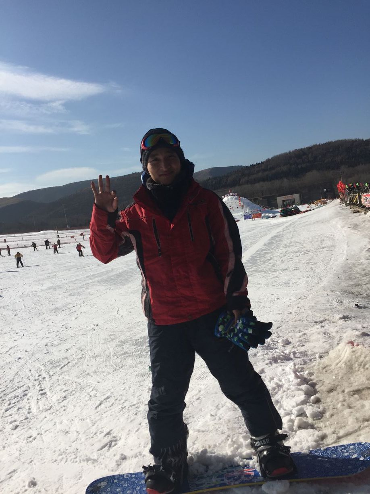
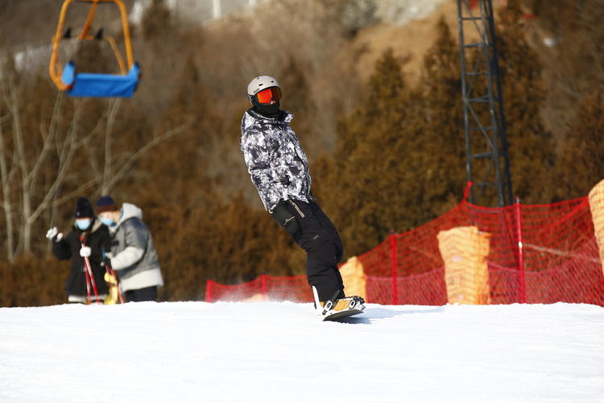

## 滑雪🏂

### 装备清单

- 雪票 🎫
- 雪板 🏂
- 护脸
- 滑雪服🥼
- 滑雪袜🧦
- 雪鞋 🥾
- 手套 🧤
- 护臀/ 膝
- 雪镜 👓
- 头盔 ⛑
- 速干衣👕
- 滑雪裤👖
- 护手腕 
- 帽子 🧢

### 经历

第一次滑雪是在2016年的年底，是一次公司TB，我当时觉得单板比较自由，可以脱下来走路上魔毯，然后就选了单板...

这张图是我在北京渔阳国际滑雪场第一次穿单板，因为整个团队里就我一个人滑单板，同事追着我拍了这张照片 😎

其实当时，我根本不会，完全靠观察别人怎么滑，然后尽可能的复制到自己身上，完全是出于人本能的模仿学习！我已经忘记了那天摔了多少个屁墩儿，但是从那时起种下了一颗种子。

有一个好的教练点拨一下，胜过自己瞎摸索半天。但是如果你没摸索过也会少很多“乐趣”，就像是别人说给你的经验往往不如自己亲身经理来的深刻！！！

滑雪是一项危险刺激的运动，伤痛和喜悦并肩而行。伤痛来自于对技术的追求，对难度的挑战，对自己的过高评估。喜悦则源于自己的进步，挑战的成功，以及遇到一些有趣的灵魂。

我是一个伪爱好者，我只在周末的时候抽一天或者两天去滑雪。滑雪期间也碰到过很多人，在一起的时候就是交流滑雪技术。在一起滑雪的人大都也比较单纯，有这样一个段子，号称学圈儿六大谎言🤡：

- 山顶见
- 我等你
- 一起滑
- 这不滑的挺好嘛
- 我也是刚刚滑
- 下雪季见

随着近几年雪上运动的流行，已经有3亿人参与冰雪运动。今年北京冬奥会从开幕式到各项赛事都非常精彩，可以说举世瞩目！

在晒一张现在我已经算是入门了的照片 ✌️

### 一起向未来

> “一起”——诚挚的冬奥之邀，给人温暖与力量；“未来”——寄托着期盼与梦想，是推动人们跨越坎坷、携手共进的不竭动力。

其实怎么滑、用什么装备滑、在哪里滑都不重要，重要的是心态。如果你不是玩儿职业的自得其乐的初衷不要丢。你滑得怎么样，姿势漂不漂亮，有没有摔倒，根本没人在意，也没人有那闲功夫嘲笑你，因为对其他人而言，你真的没那么重要。但是你自己有家人朋友，爱自己真的很重要！

我们害怕的其实不是摔倒，而是对摔倒的恐惧。这种对未知的不安，才是我们恐惧的来源。希望自己可以在面对恐惧时勇敢，希望自己在新事物面前不要畏首畏尾，希望自己不要活在想象力，活出自己的样子！