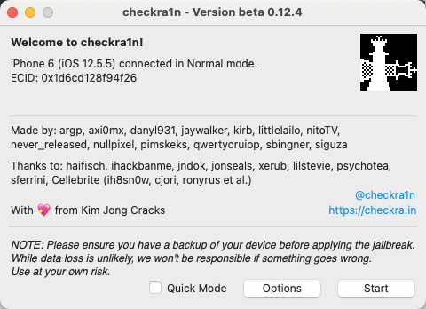
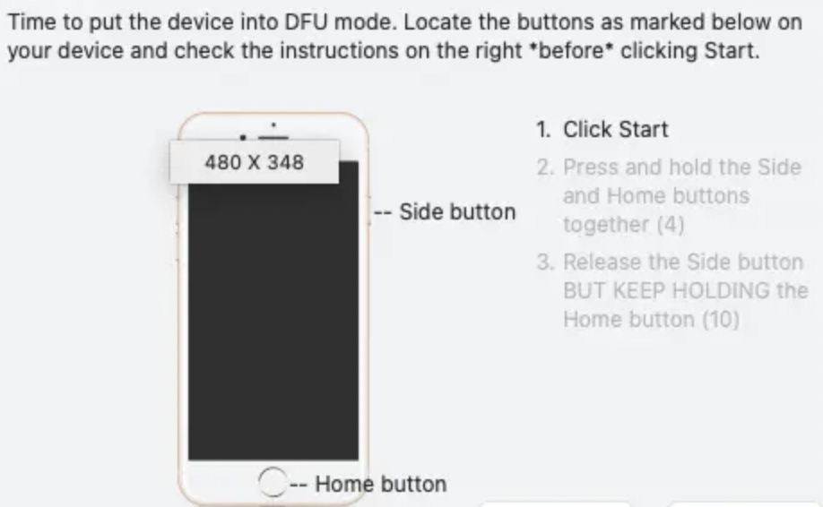

## 关于 iPhone 越狱

### 1 背景

从测试领取了一台iPhone 6 ，然后升级系统的时候，发现有激活锁，但是测试同学也不知道对应的id 是多少了，然后就变成了🧱

于是从网上找所谓的“iCloud 解锁工具”，找到了一款“某学长iCloud 解锁工具”，然后下载一看 98¥ 注册费。。。拉倒吧，网上有一些方法可以绕过激活锁，需要设备先越狱。于是有了这篇文章

### 2 越狱类别

> iOS越狱（英语：iOS Jailbreaking）是获取[iOS设备](https%3A%2F%2Fzh.wikipedia.org%2Fwiki%2FIOS%E8%AE%BE%E5%A4%87%E5%88%97%E8%A1%A8)的[Root权限](https%3A%2F%2Fzh.wikipedia.org%2Fwiki%2F%E8%B6%85%E7%BA%A7%E7%94%A8%E6%88%B7)的技术手段。

##### 2.1 完美越狱

> 完美越狱（Untethered Jailbreak），指 iOS 设备重启后，仍保留完整越狱状态。

##### 2.2 不完美越狱

> 不完美越狱（Tethered Jailbreak），指的是，当处于此状态的iOS设备开机重启后，之前进行的越狱程序就会失效，用户将失去 Root 权限，需要将设备连接电脑来使用等越狱软件进行引导开机以后，才可再次使用越狱程序。否则设备将无法正常引导。

##### 2.3 半不完美越狱

> 半不完美越狱（Semi-tethered Jailbreak），指设备在重启后，将丢失越狱状态，并恢复成未越狱状态。如果想要恢复越狱环境，必须连接计算机并在越狱工具的引导下引导来恢复越狱状态。

##### 2.4 半完美越狱

> 半完美越狱（Semi-untethered Jailbreak），指设备在重启后，将丢失越狱状态；而若想要再恢复越狱环境，只需在设备上进行某些操作即可恢复越狱。

上述越狱类别摘抄自维基百科[越狱 (iOS)](https%3A%2F%2Fzh.wikipedia.org%2Fwiki%2F%E8%B6%8A%E7%8D%84_(iOS))

笔者使用的 [checkra1n](https%3A%2F%2Fcheckra.in) 进行 jailbreak 的结果是进入了半不完美越狱的状态，如果重启 iPhone6 就需要使用 checkra1n 重新引导手机重新进入 Jailbreak 状态。

### 3 开始  Jailbreak

这里可以查看指定系统版本的执行型号的 iOS 设备是否支持越狱的网址：[Can I Jailbreak?](https%3A%2F%2Fcanijailbreak.com)

#### DFU mode

> DFU mode is similar to the BIOS on Windows computers or Recovery Mode on a Mac. It exists "below" the operating system level — iOS — but can still communicate with iTunes or Finder on a Windows or Mac computer. In DFU mode, your iOS device is accessible to iTunes or Finder at a more privileged level.

上述步骤操作完毕后，我们会发现 iPhone 上也安装了 checkra1n 的 App；

然后我们打开 checkra1n 下载越狱系统并会默认安装 Cydia。下载完越狱的Base System 及Cydia App 后。之后我们就可以安装各种插件了。当然也可以自己开发插件

