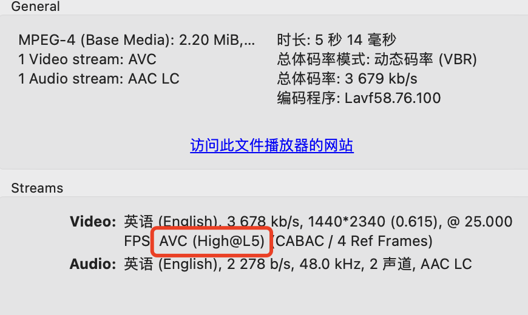
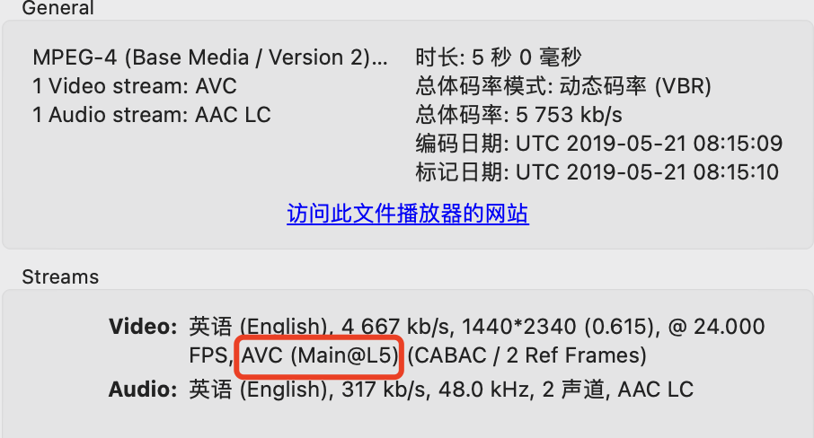

## iOS AVPlayer 使用遇到的问题

### 1 偶发有声音无画面

使用工具，查看了视频素材的信息如下：

图1



图2



图1 的视频偶发有声音无画面的的情况。


### 2 视频画质问题

比较三个指标：码率、帧率、分辨率：

| 素材 | 码率       | 帧率       | 分辨率      |
| ---- | ---------- | ---------- | ----------- |
| 图1  | 3 678 kb/s | 25.000 FPS | 1440 * 2340 |
| 图2  | 4 667 kb/s | 24.000 FPS | 1440 * 2340 |

从现象倒推，视频本身的质量规格对应到播放器的表现是有差异的


### 3 H.264 编码

> H.264 有四种画质级别,分别是 baseline, extended, main, high：
>
> 1. Baseline Profile：基本画质。支持I/P 帧，只支持无交错（Progressive）和CAVLC；
>
> 2. Extended profile：进阶画质。支持I/P/B/SP/SI 帧，只支持无交错（Progressive）CAVLC；(用的少)
>
> 3. Main profile：主流画质。提供I/P/B 帧，支持无交错（Progressive）和交错（Interlaced），也支持CAVLC 和CABAC 的支持；
>
> 4. High profile：高级画质。在main Profile 的基础上增加了8x8内部预测、自定义量化、 无损视频编码和更多的 YUV 格式；
>
> H.264 Baseline profile、Extended profile和Main profile都是针对8位样本数据、4:2:0格式(YUV)的视频序列。在相同配置


### 4 FFmpeg 转 H.265

```bash
#!/bin/bash
if [ -n "$1" ];then
    if [ -n "$2" ];then
        # ffmpeg -i $1 -c:v libx265 -crf 20 -c:a copy  $2
        # 保留所有音频轨、字幕轨等等并且直接复制，仅仅转换视频轨0为H265
        ffmpeg -i $1 -map 0 -c copy -c:v:0 libx265 -y $2
        exit
    else
        echo "缺少输出文件路径"
        exit
    fi
else
    echo "缺少输入文件路径"
    exit
fi
```

上述执行转完以后，iOS AVPlayer 播放只有声音，没有画面。然后执行以下脚本：

```bash
#!/bin/bash
if [ -n "$1" ];then
    if [ -n "$2" ];then
        # https://blog.csdn.net/zqx1205/article/details/115375075
        ffmpeg -i $1 -c:v copy -tag:v hvc1 -c:a copy $2
        exit
    else
        echo "缺少输出文件路径"
        exit
    fi
else
    echo "缺少输入文件路径"
    exit
fi
```

原因：

H265即 HEVC，在打包成mp4时需要有 codec tag。hev1 or hvc1是两种codec tag，表示mp4容器中hevc流的不同打包方式。Quicktime Player和iOS不支持hev1 tag的mp4（见 https://developer.apple.com/av-foundation/HEVC-Video-with-Alpha-Interoperability-Profile.pdf page 3 最后一句话：The codec type shall be ‘hvc1’.）。

所以上述脚本的作用是将hev1 tag 的mp4转成 hvc1 tag的。


### 5 引文

> AVPlayer是iOS上常用的视频播放器组件，支持常见的音视频格式。对于一般应用而言，使用AVPlayer和一套自定义UI基本可以满足需求。目前手Q、微信（公众号）、腾讯视频、新浪微博等app都在广泛使用AVPlayer。
>
> Qzone一直以来也是使用AVPlayer进行视频播放，加上http代理和自定义下载，并封装了对分片mp4的支持，以及相应的预下载和流控策略，每天为超过2千万用户提供近3亿次播放服务。
>
> 在使用AVPlayer的过程中，我们也发现它存在的一些问题，总结下来供大家参考和讨论。
>
> 1. 播放异常问题
>
> 1.1 开始播放时黑屏/花屏一下
>
> 原因：下载数据不够就开始播放，导致卡顿和解码异常，影响播放体验。
>
> 解决办法：收到ReadyToPlay后不要立即播放，多缓存1到2秒的数据后再播放。
>
> 1.2 绿屏
>
> 原因：iOS和Mac系统播放器不支持mp4文件有多个分辨率，如果有多分辨率，在播放到分辨率变化的地方会有绿屏现象。（Android和Windows可以正常播放）
>
> 1.3 拖动后花屏
>
> 原因：某些mp4文件头缺失了stss字段，拖动进度条后会导致无法定位需要播放的帧，出现花屏问题。（Android和Windows可以正常播放）
>
> 1.4 画面卡住
>
> 现象：有些视频出现播放几秒后卡住的问题（iOS & Mac), 检查mp4格式没有异常，但是Android和Windows可以正常播放。
>
> 1. HLS
>
> 2.1 一直播放不起来
>
> 原因：1）m3u8（直播）文件中的ts片不连续 2. 将automaticallyWaitsToMinimizeStalling设置为NO，抓包显示AVPlayer一直在请求同一片数据十多次。
>
> 解决方法：保证ts片是连续的（dns解析到多个ip时，AVPlayer会随机向所有ip请求文件；不同ip返回的片可能不连续）；使用ip直出可以避免该问题。
>
> 2.2 首次缓冲时间长
>
> 原因：调用了AVPlayer的setRate, 导致首片地址下载两次。
>
> 2.3 播放到一半卡住
>
> 原因：中间某个ts片404了。
>
> 2.4 网速对HLS的影响
>
> 网速远大于码率：开始加载首片后立即开始播放（首次缓冲耗时0.5s左右）
>
> 网速接近码率：首片下载完毕后，第二片还下载了一部分才开始播放（首次缓冲耗时8s左右）
>
> 网速小于码率：一直在下载，永远播不起来。
>
> 1. ResourceLoader的问题
>
> 在iOS 9上，我们使用ResourceLoader来绕开ATS。但是在播放长视频时，拖动进度条后，视频会一直loading播不起来。 原因：在拖动时，AVPlayer会触发多次offset-length数据请求，但不会把前一次请求取消，导致重复下载很多数据。（模拟器上没有这个问题，发起新请求之前会把老的请求取消掉。） 解决方法：当检测到后一次请求是前一次请求数据的子集时，手动取消前次请求。
>
> 1. 性能问题
>
> AVPlayer播放单个视频并没有太大的性能问题，但在tableView中滚动时，自动切换和播放视频会造成滑动卡顿，主要是播放器资源的创建和销毁阻塞UI。需要将AVPlayer放到工作线程中。但是需要注意：
>
> 4.1 replaceCurrentItemWithPlayerItem只能在主线程调用。
>
> 4.2 AVPlayer和对应AVPlayerItem的释放操作要放在同一线程，否则会导致crash。
>
> 1. 其他未解决的问题
>
> iOS 10发布后，每天都有用户反馈视频无法播放，并且一旦出现这种情况，所有（使用AVPlayer）的app都无法播放但不报任何错误，需要重启手机恢复（有时候不重启也会恢复）。我们怀疑是iOS 10的bug，某些情况下系统媒体服务被阻塞。这个问题我们用自动化工具跑了很久一直无法重现，暂时也没有找到办法解决。
>
> 总结
>
> 虽然AVPlayer的一些问题给开发者带来点小麻烦，但凭借良好的稳定性和较少的资源消耗，AVPlayer还是成为iOS平台视频播放的首选组件。随着HLS和H265的使用越来越广泛，AVPlayer对他们支持不好的缺点越来越明显，我们也在尝试其他AVPlayer替代方案。
>
> 作者：reallychao
> 链接：https://www.jianshu.com/p/b6e3ea118fc7