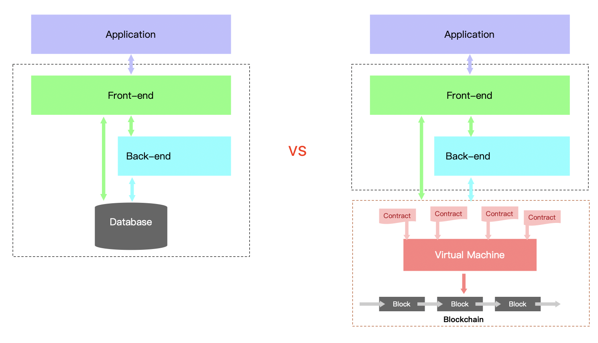
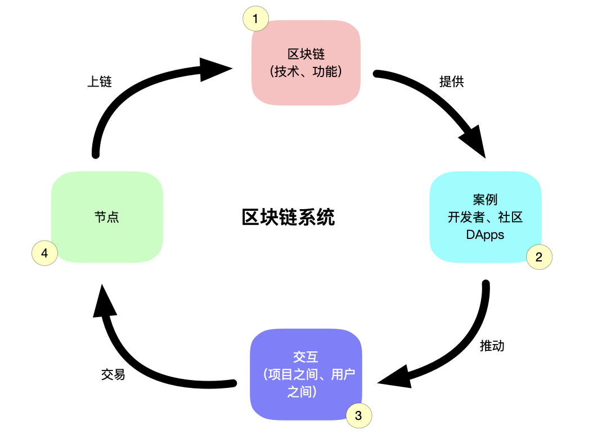
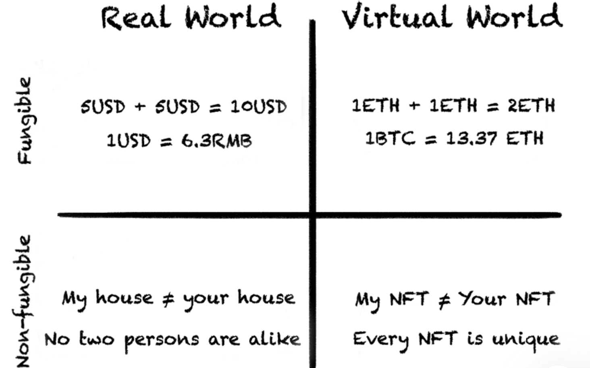

## 学习 Web3

- [学习 Web3](#学习-web3)
  - [写在开头](#写在开头)
  - [以太坊](#以太坊)
  - [DApp](#dapp)
    - [DApp 架构概述](#dapp-架构概述)
    - [DApp 优劣概述](#dapp-优劣概述)
  - [区块链开发测试网络、本地环境与私有链](#区块链开发测试网络本地环境与私有链)
    - [使用测试网络部署合约](#使用测试网络部署合约)
    - [开发工具](#开发工具)
    - [能不能搭建本地私有链？答案是当然可以😁](#能不能搭建本地私有链答案是当然可以)
  - [NFT](#nft)
  - [开发实践浅谈](#开发实践浅谈)
    - [MyFirstNFT 项目学习](#myfirstnft-项目学习)
      - [1 合约代码仓库：](#1-合约代码仓库)
      - [2 网站仓库：](#2-网站仓库)
      - [3 上述应该是 Mac + VSCode + 命令行 + npm + Git + JavaScript 的一套开发流程。我看官方也推荐了 remix 这个IDE，可以在线使用，也可以本地化部署。](#3-上述应该是-mac--vscode--命令行--npm--git--javascript-的一套开发流程我看官方也推荐了-remix-这个ide可以在线使用也可以本地化部署)
    - [Native 调用合约](#native-调用合约)
  - [最后推荐一些学习资料](#最后推荐一些学习资料)
  - [一些主观思绪](#一些主观思绪)
    - [智能合约](#智能合约)
    - [用户群](#用户群)
    - [了解 GameFi](#了解-gamefi)

### 写在开头

如果对区块链、加密货币、挖矿、智能合约以及去中心化也这些概念不熟悉的读者，需要自行检索词条，了解其概念。本文也没有具体代码。主要是我当前对 Web3 的理解和可以着手做的事情的学习笔记。

### 以太坊

目前我了解到的来说，以太坊（[以太坊简介](https://ethereum.org/zh/developers/docs/intro-to-ethereum/)）应该是头部的区块链生态。其作为一个去中心化的开源的有智能合约功能的公共区块链平台。如果想了解更多底层的东西，可以从 GitHub 上看到Go语言版本的 [Ethereum](https://github.com/ethereum/go-ethereum) 比如 `geth` `EVM`等等。推荐两篇文章：

- [ETH函数调用图](https://chuwt.github.io/post/eth%E5%87%BD%E6%95%B0%E8%B0%83%E7%94%A8%E5%9B%BE/)
- [EVM运行原理](https://chuwt.github.io/post/evm%E8%BF%90%E8%A1%8C%E5%8E%9F%E7%90%86/)

### DApp 

#### DApp 架构概述

作为一个程序员，我了解web3 的切入点是 `DApp`。一图胜千言：

这张图画的比较粗略，箭头的交互，包括（app 对接口的调用，对合约的调用，合约的部署，区块上链等这些先按下不表）比较扎眼的是：这里没有了，中心化的数据库存储，取而代之的是**区块链系统**！！！

墙裂推荐 [The Architecture of a Web 3.0 application](https://www.preethikasireddy.com/post/the-architecture-of-a-web-3-0-application) （干货好文）！！！文中还提到了 **Scaling Your DApp**

- One popular scaling solution is [Polygon](https://polygon.technology/)
- Other examples of L2 solutions are [Optimistic Rollups and zkRollups](https://ethereum.org/en/developers/docs/scaling/layer-2-rollups)

#### DApp 优劣概述

那么，依托于区块链的 App 较之前有什么优势呢？如下列已知的几点：
- 无需建立信任，程序可验证
- 数据完整不可篡改
- 去中心化
- 链上程序无停机风险
- 隐私性（公开透明且匿名）

链上应用的数量、质量与一条区块链的健康运作发展可以说是相辅相成！所以一条区块链的运作可大概为如下图：

1. 区块链，举例：以太坊应该是头部生态，其技术支持和功能丰富得到一众玩儿家的推崇
2. 海量使用案例 --> 开发者、社区的活跃 --> 进而产出DApp
3. 链上应用的互相调用、组合；链上用户的交互
4. 第 3 部分的操作，产生计算，形成区块节点

关于上链：
   - 交易签署
   - 节点交易验证，返回交易哈希
   - 交易被节点广播至各个节点的内存池
   - 区块共识
   - 最终落盘

究其根本，能否解决更多的问题，满足用户的需求是区块链的健康发展的前提。之后才会有开发社区的活跃与DApp 的繁荣。

说了诸多优点和其发展蓝图，同时也存在如下的劣势：

- 链上程序无法修改
- 用户需要为每笔执行，开发者为每次部署，付出真金白银
- 网络拥堵问题
- 用户参与门槛高

对于支付挖矿的费用这一点而言是必须的，但是让用户掏钱，必须解决其真正的痛点。要知道当前互联网的一大特点是，“免费”。 ps.当然这种免费是建立在把用户当做商品一部分销售获得盈利的基础上（让用户看广告）。

### 区块链开发测试网络、本地环境与私有链

#### 使用测试网络部署合约

- 以太坊测试网络 Rinkeby 可以领取以太坊代币
  - https://www.rinkeby.io/#faucet
    - 但是，这个地址我用的时候直接 Faucet Offline 。。。
  - https://faucets.chain.link/rinkeby/
  - https://rinkebyfaucet.com/

这样领到代币后，可以把智能合约部署到测试网络上而不需要破费干瘪的口袋。但是这有一个缺点就是，网络拥堵的时候会比较慢。

#### 开发工具

例如： [Hardhat](https://hardhat.org/) 它使 Ethereum 开发者可以更方便的在本地运行的网络中编译、部署、调试和测试他们的智能合约而不需要到线上环境。

#### 能不能搭建本地私有链？答案是当然可以😁

- 如何搭建环境
  
- 怎么创建私有链的创世区块
  
- 启动区块链程序
  
- 创建账号，挖矿，查余额、转账什么的。。。

我这里不再赘述，网上有很多的教学资料哦~

### NFT

在了解 Web3 期间，我大学同学已经 All in Web3 了 respect！！！他向我 **推荐 [My First NFT](https://myfirstnft.info/ )** 

该项目对加密货币、NFT、钱包、Web3 安全等一些概念做了简单明了的阐述。比如：

也是通过这个网页应用，我 mint 了自己的 NFT 头像（灵感是动漫里的一个光头，对没错，“我变秃了，也变强了！”）

### 开发实践浅谈

#### MyFirstNFT 项目学习

这个项目开源了，项目介绍了他们的实践经验。

##### 1 合约代码仓库：

1. 前端工具和开发技能

2. **[Solidity](https://docs.soliditylang.org/)** 语言编写合约

3. **[Azuki NFT](https://www.azuki.com/erc721a)** 的ERC721A 标准合约，用以 mint  NFT
   
   1. ERC721A is an implementation of IERC721 with significant gas savings for minting multiple NFTs in a single transaction.
   
4. **[OpenZeppelin](https://www.openzeppelin.com/)** 的标准合约

5. **[hardhat](https://hardhat.org/getting-started/#installation)**开发、测试（ [chai](https://www.chaijs.com/) 断言库）、部署和验证
   
   1. 通过**[ethers.js](https://github.com/ethers-io/ethers.js) **调用合约。这个就是前端调用合约的库
   
6. **[IPFS](https://ipfs.io/)** IPFS is a distributed file system for storing and accessing data. 用于存储和访问数据的分布式文件系统

   ps. 比较流行的还有 **[Swarm](https://www.ethswarm.org/)**  is a decentralised storage and communication system for a sovereign digital society.

7. **[Alchemy](https://www.alchemy.com/)** 提供区块链开发平台服务，帮助开发者轻松构建运行在区块链上的应用程序。

##### 2 网站仓库：

除了一些基础服务外，技术和组件如下：

- 通过[ethers.js](https://github.com/ethers-io/ethers.js) 调用合约。这个就是前端调用合约的库
- **[web3modal](https://github.com/Web3Modal/web3modal) ** 比较流行和广泛使用的 Web3 链接钱包 React 组件，MIT 协议。

其实从 github 的star 数量来看，**[Web3.js](https://github.com/ChainSafe/web3.js) **貌似有更多的开发者使用，但是他不是 MIT 协议的。

##### 3 上述应该是 Mac + VSCode + 命令行 + npm + Git + JavaScript 的一套开发流程。我看官方也推荐了 [remix](https://remix.ethereum.org/#optimize=false&runs=200&evmVersion=null&version=soljson-v0.8.7+commit.e28d00a7.js) 这个IDE，可以在线使用，也可以本地化部署。

#### Native 调用合约

- **[Web3j](https://github.com/web3j)** -- Android

- **[Web3Swift](https://github.com/skywinder/web3swift)** -- iOS

这两个库是对 web3.js 的 Native 语言实现。

开发 Android 或者 iOS 应用的两个思路：

- 使用 web3swift 或者 web3j 可以直接原生调用合约：Native+调用合约+合约

- 也可以，通过桥接的方式：Native WebView（即浏览器）+ web3.js 或者 ethers.js  + 合约 （solidity）+ 桥接框架。其实就是，浏览器+调用合约+合约

我现在了解的，也就这么多了，现在 web3 还是拓荒时期，可以多学习，多寻找机会 奥利给！！！

### 最后推荐一些学习资料

- 官方文档（工具也好、语言框架也罢，官方文档是第一手资料）
- [The Architecture of a Web 3.0 application](https://www.preethikasireddy.com/post/the-architecture-of-a-web-3-0-application) （干货好文）
- [Solidity](https://docs.soliditylang.org/en/v0.8.14/introduction-to-smart-contracts.html) 编写以太坊智能合约的语言
- [Azuki NFT](https://www.azuki.com/erc721a) 的ERC721A 标准合约
- [OpenZeppelin](https://www.openzeppelin.com/) 的标准合约
- [hardhat](https://hardhat.org/getting-started/#installation) 开发套件
- [IPFS](https://ipfs.io/)  用于存储和访问数据的分布式文件系统
-  [Swarm](https://www.ethswarm.org/)  是主权数字社会去中心化的存储和通信系统
- [Alchemy](https://www.alchemy.com/) 提供区块链开发平台服务，帮助开发者轻松构建运行在区块链上的应用程序
- [Web3j](https://github.com/web3j) -- Android
- [Web3Swift](https://github.com/skywinder/web3swift) -- iOS

---

### 一些主观思绪

#### 智能合约

就目前我了解的来说，智能合约的运行成本和安全性这两大块，我还需要继续学习，进一步认识

#### 用户群

现在的用户需要完成创建钱包、将法币资产转化为加密资产等对新手而言较为繁琐的环节，一定程度也将潜在用户圈定在接触过区块链服务、熟悉加密货币操作的人群上，并通过他们的扩散传播，完成二次裂变。

#### 了解 GameFi

- 通过游戏机制吸引用户（比起从游戏中获利更在意游戏本身的乐趣）、开拓社交、NFT市场等其他功能，将用户真正转变为更在乎产品本身价值而不是获利的“消费型玩家”

- 持续吸引新玩家，不断有新的资金投入。

