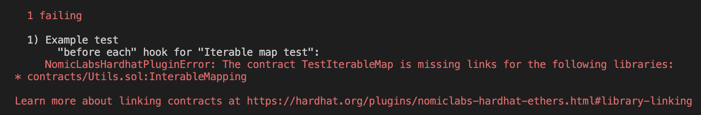
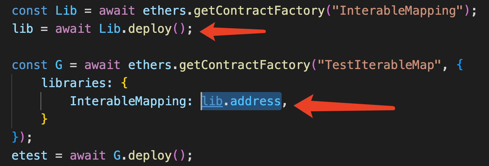

## Solidity 学习

在学习  [Solidity](https://docs.soliditylang.org/)  时你肯定已经对智能合约有一定的了解，并选择了它作为智能合约的编程语言（其他诸如  [Rust](https://www.rust-lang.org/)  等这里按下不表）。以以太坊生态为例，智能合约通常是指运行在 EVM 兼容网络中的 [Solidity](https://docs.soliditylang.org/) 或其他合约语言代码，智能合约负责与用户**交易**发行的资产并存储 DApp 的链上状态。本文是 solidity 语言的学习记录。

Solidity 语言[官方文档](https://docs.soliditylang.org/en/v0.8.13/)（[中文](https://solidity-cn.readthedocs.io/zh/develop/)）是第一手学习资料，此外推荐 [Solidity By Example](https://solidity-by-example.org/) 教程学习 Solidity 语言。 

### Solidity 语言

[language influences](https://docs.soliditylang.org/en/v0.8.14/language-influences.html)，正如官方文档所述， Solidity 深受 C++ JavaScript Python等语言的影响。它支持基本多种数据类型（但不支持浮点数）、复杂数据结构（例如 `map`，`array` 和 `struct`）、合约支持继承和多重继承（`is`）、方法重写（`override`）等。所以，在有一定语言基础的学习者来说，应该可以很快上手。Solidity 是静态语言，需要被编译成字节码。我现在用 [VSCode](https://code.visualstudio.com/) +  [Hardhat](https://hardhat.org/) 进行学习（后边我也会聊几点，使用中遇到的问题和解决方法）。

合约有特殊的构造函数，合约声明的函数支持修饰器语法。特殊地，合约中可以通过 `payable` 声明或显示转换来实现对原生 Gas token (ETH) 的资金操作。

ps. Functions and addresses declared `payable` can receive `ether` into the contract.

#### 个人主观的学习笔记

##### 1 类型

Solidity 虽然是图灵完备的语言，但其中复杂结构的操作会带来相应的 gas 消耗，因此，在设计合约中的状态变量时，应当足够清晰和简单。在设计储存对象时，如何善用声明的内存是需要被考虑的问题之一。简单的法则是，不要为不需要的状态声明过多的内存空间。

```solidity
// SPDX-License-Identifier: MIT
pragma solidity ^0.8.0;

contract Variables {
    // State variables are stored on the blockchain.
    // If you want to write or update a state variable you need to send a transaction.
    string public text = "Hello";
    address public constant MY_ADDRESS = 0x0000000000000000000000000000000000000001;

    function doSomething() public {
        // Local variables are not saved to the blockchain.
        uint i = 456;
        // Here are some global variables
        uint timestamp = block.timestamp; // Current block timestamp
        address sender = msg.sender; // address of the caller
    }
}
/*
int 和 uint
*************uint**********************************
uint8   ranges from 0 to 2 ** 8 - 1
uint16  ranges from 0 to 2 ** 16 - 1
...
uint256 ranges from 0 to 2 ** 256 - 1
*************int***********************************
int8 ranges from -2 ** 7 to 2 ** 7 - 1
int16 ranges from -2 ** 15 to 2 ** 15 - 1
...
int256 ranges from -2 ** 255 to 2 ** 255 - 1
*/
```

提一下  `address` 类型，等价于 `uint160` （20 个字节(byte)，1字节(byte) = 8位 (bit) ）

```solidity
// Cannot use map for either input or output

// Can use array for input
function arrayInput(uint[] memory _arr) public {}

// Can use array for output
uint[] public arr;

function arrayOutput() public view returns (uint[] memory) {
		return arr;
}
```


##### 2 修饰器 modifier

修饰器代码可以在函数调用之前和之后执行。具体可以用在：

- 限制访问

- 输入验证

- 重入 hack

  ```solidity
  modifier noReentrancy() {
      require(!locked, "No reentrancy");
      locked = true;
      _;
      locked = false;
  }

##### 3 可见性

- `public` - any contract and account can call
- `private` - only inside the contract that defines the function
- `internal`- only inside contract that inherits an `internal` function 继承的子类可调用
- `external` - only other contracts and accounts can call 不能被合约内的其他函数调用


##### 4 省 gas

代码写得差可能会直接导致 gas 增加费用增高。。。污染环境。。。

以下是从学习资料中看到的，后期需要多阅读优秀的只能合约代码，才能够逐步提升编写优质的智能合约。

```solidity
// You pay （gas spent） * (gas price） amount of ether
// 你需要支付的是这次交易中消耗的 gas 数量 ✖️ gas 价格
// 这里有两个上限：
// gas limit -- 你设置的本次交易支付的 gas 上限
// block gas limit -- 网络设置的区块 gas 上限
// 1 wei
uint public oneWei = 1 wei;
// 1 wei is equal to 1
bool public isOneWei = 1 wei == 1;
// 1 ether
uint public oneEther = 1 ether;
// 1 ether is equal to 10^18 wei
bool public isOneEther = 1 ether == 1e18;
```

- constant value is hard coded and can save gas cost.
- Replacing `memory` with `calldata`
  - `storage` - variable is a state variable (store on blockchain)
  - `memory` - variable is in memory and it exists while a function is being called
  - `calldata` - special data location that contains function arguments
- Loading state variable to memory
- Replace for loop `i++` with `++i`
- Caching array elements
- Avoid return the entire array because of arrays that can grow indefinitely in length
- Short circuit

```solidity
// SPDX-License-Identifier: MIT
pragma solidity ^0.8.13;

// gas golf
contract GasGolf {
    // start - 50908 gas
    // use calldata - 49163 gas
    // load state variables to memory - 48952 gas
    // short circuit - 48634 gas
    // loop increments - 48244 gas
    // cache array length - 48209 gas
    // load array elements to memory - 48047 gas
    // uncheck i overflow/underflow - 47309 gas

    uint public total;

    // start - not gas optimized
    // function sumIfEvenAndLessThan99(uint[] memory nums) external {
    //     for (uint i = 0; i < nums.length; i += 1) {
    //         bool isEven = nums[i] % 2 == 0;
    //         bool isLessThan99 = nums[i] < 99;
    //         if (isEven && isLessThan99) {
    //             total += nums[i];
    //         }
    //     }
    // }

    // gas optimized
    // [1, 2, 3, 4, 5, 100]
    function sumIfEvenAndLessThan99(uint[] calldata nums) external {
        uint _total = total;
        uint len = nums.length;

        for (uint i = 0; i < len; ) {
            uint num = nums[i];
            if (num % 2 == 0 && num < 99) {
                _total += num;
            }
            unchecked {
                ++i;
            }
        }

        total = _total;
    }
}

```


### VSCode + Hardhat 遇到的问题

1 **[Library linking](https://hardhat.org/plugins/nomiclabs-hardhat-ethers#library-linking)**





### 学习资料

-  [Solidity By Example](https://solidity-by-example.org/) 教程
- Solidity 语言[官方文档](https://docs.soliditylang.org/en/v0.8.13/) 、[中文](https://solidity-cn.readthedocs.io/zh/develop/)