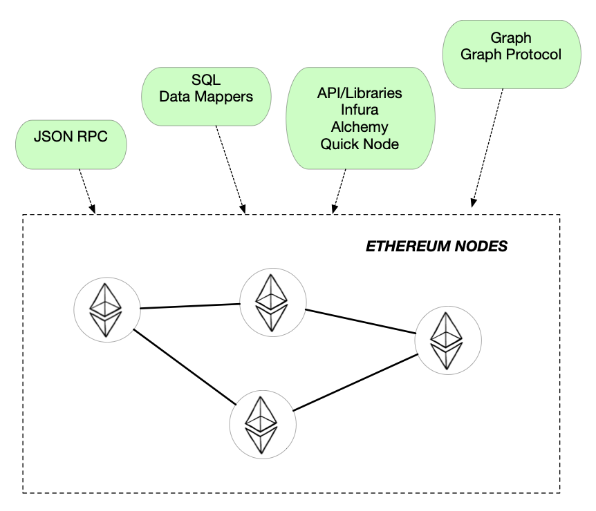

# Web3 -- DAPP 见闻分享

[toc]

> 引用一张来自新科技研究院的图片：
>
> 
>
> Web3.0以强调数据价值归属为核心，具备去中心化、数据自有、数据互联、保障隐私、高度智能和永久保存的特征。
>
> 1）去中心化
>
> 基于区块链的分布式储存与算力，使整个网络节点的权利与义务相同，系统中数据为全网节点共同维护，而不再依靠中央处理节点，实现数据的分 布式存储、记录与更新。
>
> 2）数据自有
>
> 用户创造的数据内容掌控在用户手中，并不由任何一个机构完全掌控。基于区块链技术的数据确权与授权将改善数据归头部平台私藏的情况，用户可以掌握个人数据的使用权和所有权。
>
> 3）数据互联
>
> 用户行为不受第三方主体限制，互联网应用打破原有生态之间的界限和隔阂，基于不同基础设施的应用之间可以通过“跨链”协议解决互联互通。
>
> 4）保障隐私
>
> 基于密码学与分布式存储等技术实现用户数据内容的隐私交易、物理身份和数字身份的隔断等在实际操作中涉及到的数据隐私、身份隐私和计算隐私等方面的保障。
>
> 5）高度智能
>
> 智能不仅体现在人与网之间，还体现在软件与软件之间的互动。人工智能与大数据的运用为用户的网络行为提供优化以及更好的建议，面向用户的 各类推送也更加精准。
>
> 6）永久保存
>
> 以区块链技术为基础的新型数据中心、新型数据平台通过存储体系的分布式和智能化，让关键数据实现永续保存，实现数据资源化、价值化，真正意义上实现信息和数据的广泛存储。

---

我了解 web3 的切入点正是 DAPP。

## App vs DApp

> decentralized app

这张图画的比较粗略，箭头的交互，包括（app 对接口的调用，对合约的调用，合约的部署，区块上链等这些先按下不表）

这需要说明的是：架构图中没有中心化的数据库存储，取而代之的是**区块链系统**！！！

## DApp

### Supplementary DApp architecture

接下来，我们开始完善上述的 DApp 架构图

#### + Provider

当需要与区块链交互时连接的节点通常被称为 **Provider**。

1. 设置您自己的运行以太坊区块链软件的节点

2. 使用来自第三方服务的现有节点。

   - [**Infura**](https://infura.io/)
- [**Alchemy**](https://www.alchemy.com/)
   - [**QuickNode**](https://www.quicknode.com/)
- ...

后记：大量的的去中心化的APP 依赖这中心化的 provider 提供商，或许是发展为完全去中心化过程中的一个阶段吧。。。

#### + Signer

如果你想写入状态，在你将交易提交到区块链之前你还需要做一件事——使用你的**私钥签署**交易。

我使用的是 Metamask 处理密钥管理和交易签名。

#### + Storage

like [IPFS](https://ipfs.io/) or [Swarm](https://www.ethswarm.org/)

### Querying The  Blockchain

> There are three main purposes a node fulfills: maintenance, validation and accessibility. 

#### 1. Ethereum Nodes

> [Geth](https://github.com/ethereum/go-ethereum) is a Go implementation of Ethereum and can be installed in your local machine or server. 

通过下载整个区块链数据并使用 LevelDB 对其进行索引的方式可以方便的进行数据访问。

但是，安装和维护节点会产生大量开销。

#### 2. Node Proviers

> Web3 APIs (such as [Infura](https://infura.io/), [Alchemy](https://www.alchemy.com/), [Quick Node](https://www.quicknode.com/)) takes away the complexity of directly interacting with the Ethereum clients. 

这些 Service 负责安装和管理基础设施，并提供增强的 APIs/Libraries 来访问数据，消除了直接与以太坊客户端交互的复杂性。

尽管它们可以很好地按 blocks and transactions （块和事务）访问数据，但它们对于分析中常见的 aggregation or filtering operations （聚合或过滤操作）效率不高。

#### 3. Data Mappers

数据映射器，通过将区块链数据转换为可以轻松查询的 relational/non-relational store（关系/非关系 存储）。

#### 4. Graph Protocol

> [Graph](https://thegraph.com/) , is a decentralised protocol thats indexes and support efficient querying of blockchain data using GraphQL.
>
> It allows anyone to build **subgraphs** and incentivizes the community to coordinate and grow the network. 
>
> ps. Uniswap 项目就在使用  Graph network，颇被业界看好

### SCALING

关于扩容

这是以太坊官方的文章 [SCALING](https://ethereum.org/zh/developers/docs/scaling/) 讲的比较清楚，我简单总结一下：

#### 链上扩容

##### 区块分片（Sharding）

由于链上扩容的 Sharding 是对以太坊主网的变更，将会对所有历史数据进行迁移，因此进程缓慢，官方预期Sharding会在2023年实现；

#### 链下扩容

##### [Layer 2](https://ethereum.org/en/layer-2/)

- Rollups（Rollups是以太坊社区选定的主要路线、也是扩容路线图的短期重点）
  - [Optimistic rollups](https://ethereum.org/en/developers/docs/scaling/optimistic-rollups/) （乐观卷叠）
  - [Zero-knowledge rollup](https://ethereum.org/en/developers/docs/scaling/zk-rollups/)（零知识卷叠）
- [State Channel](https://ethereum.org/en/developers/docs/scaling/state-channels/)（状态通道）

[sidechains](https://ethereum.org/en/developers/docs/scaling/sidechains/)（侧链）

[plasma chains](https://ethereum.org/en/developers/docs/scaling/plasma/) （plasma 链）

[validiums](https://ethereum.org/en/developers/docs/scaling/validium/)
