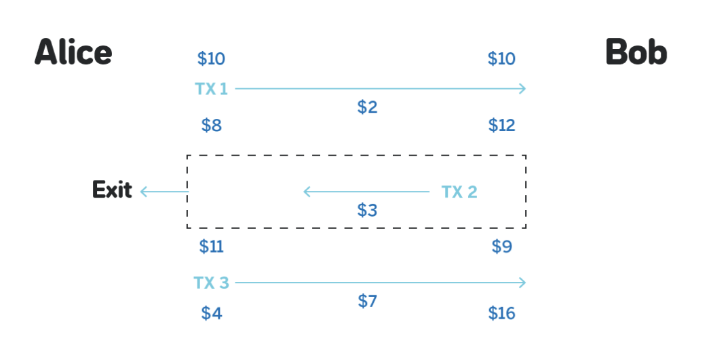
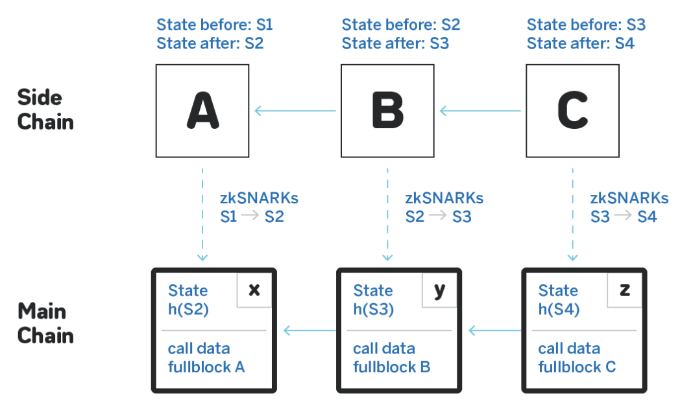
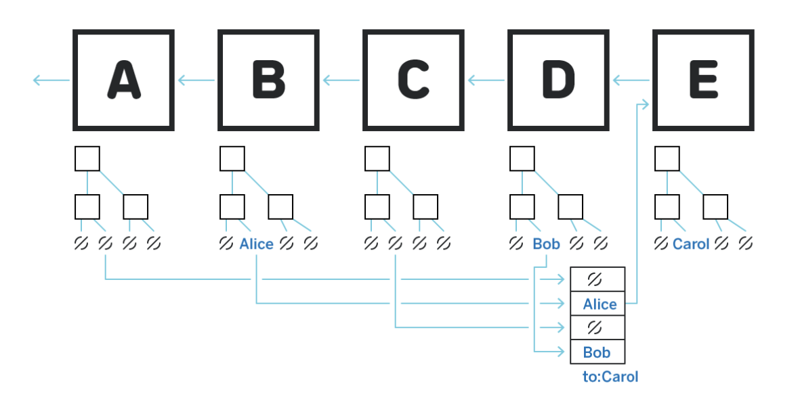
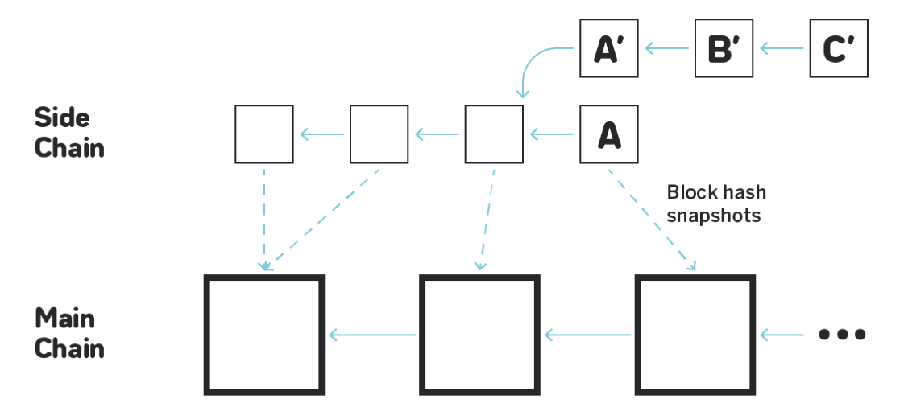

# Web 3 学习日记

[toc]


## Layer2

可扩展性三难困境

```html
                Decentralizeation
                /               \
               /                 \
             Security  —— ——  Scalability
         
```

**以太坊网络是主链，所有直接发生在其上的交易都是“链上”，而其他任何交易都被视为“链下”。侧链和L2等一些脱链解决方案可以帮助以太坊扩大规模，提高交易速度，增加网络可以处理的交易数量。**

### 扩容

> TPS：TPS=(gasLimit/gas)/time
>
> > gasLimit是单个区块允许的最多gas总量，gasLimit决定着区块容量大小，gasLimit大小由矿工决定；
> >
> > gas在这里指的是单笔交易的消耗；
> >
> > time是区块出块时间。
> >
> > 目前以太坊上gasLimit平均大小为8,000,000，在以太坊上消耗gas数量最小的操作是发送支付交易，支付交易的gas数量为21,000。目前以太坊平均出块时间为15秒。则代入上述公式可得(8,000,000/21,000)/15 = 25，即以太坊目前交易吞吐量最大可达到每秒25笔交易
>
> 比特币
>
> TPS = 1024 * 1024 / 160 / 15 * 60 ～ 7
>
> 区块所能容纳的 tx 数除以它每一个区块的出块时间 --> 每秒钟处理tx的次数
>
> 区块大小
>
> 出块时间

以太坊的主网对 layer2 的结果进行正确性验证（Merkle Proofs），需要layer2 把中间所有计算过程全部传到以太坊上而以太网的主网承载的数据量有限，所以，验证正确性（zk/op rollup）要打一个❓

> [Validity (ZK) Proofs vs. Fraud Proofs](https://www.alchemy.com/overviews/validity-proof-vs-fraud-proof)
>
> Zero Knowledge Proofs零知识证明
>
> Fraud Proofs 欺诈证明

#### layer2 是一个中心化的服务器还是一条链？

如果，layer2 是一个中心化的服务器一个没有被以太坊验证的服务器它和中心化交易所的区别在哪儿？

如果，layer2 是一条链，同样面临 TPS 的问题。


> 参考：[Layer 2 Blockchain scaling solutions: Channels, Sidechains, Rollups and Plasma (Part 16)](https://medium.com/techskill-brew/layer-2-blockchain-scaling-solutions-channels-sidechains-rollups-and-plasma-part-16-79819e058ef6)

#### State Channel



> 图片来源[Overview of Layer 2 approaches: Plasma, State Channels, Side Chains, Roll Ups](https://near.org/blog/layer-2/)

> 整个计算都发生在 layer2，计算结果上 layer1
>
> 举个🌰 
>
> Payment channel -- bitcoin
>
> ---
>
> Payment channel是一种在区块链上创建的双方之间的直接支付通道。这种通道允许两个人进行一系列的交易，而这些交易并不需要在区块链上进行确认。相反，只有在通道被关闭时，最终的交易结果才会被提交到区块链上。这种方法可以提高支付的速度和降低交易费用。
>
> Lightning Network是建立在Bitcoin和其他一些加密货币上的支付协议。它利用支付通道的概念来建立一个网络，让用户能够在其中创建支付通道并进行快速的、低成本的交易。Lightning Network的目标是解决区块链可扩展性问题，通过在链下进行交易，减少区块链的负载。
>
> 因此，Payment channel是Lightning Network的基础之一。Lightning Network利用支付通道的概念，建立了一个可扩展、高效的支付网络，使得加密货币交易更加方便和经济。

#### Rollup



> 图片来源[Overview of Layer 2 approaches: Plasma, State Channels, Side Chains, Roll Ups](https://near.org/blog/layer-2/)

##### Zero-knowledge rollup

使用有效性证明

##### Optimistic rollup

使用欺诈证明

#### plasma



> 图片来源[Overview of Layer 2 approaches: Plasma, State Channels, Side Chains, Roll Ups](https://near.org/blog/layer-2/)

可以将Plasma视为以太坊的原生侧链，使用智能合约和默克尔树（Merkle Tree）的组合来创建子链的无限分支。这些子链是以太坊主链的较小副本，具有自己的共识机制。


#### 侧链

> The main difference between sidechains and Ethereum layer 2 solutions is that **while layer 2 inherits the security of the main Ethereum network, sidechains rely on their own security**.
>
> **侧链和以太坊L2解决方案的主要区别是，L2继承以太坊主网络的安全性，而侧链依赖于自己的安全性。**

##### 侧链：



图片来源[Overview of Layer 2 approaches: Plasma, State Channels, Side Chains, Roll Ups](https://near.org/blog/layer-2/)

- **侧链有自己的共识协议，通常是为特定类型的交易设计的，目的是为了交易能够更快、更实惠。**然而，这也意味着它们通常不会继承以太坊的安全属性，当使用侧链时，我们只依赖于侧链的安全性，包括参与其自己的共识协议的节点。流行的侧链包括Polygon PoS， Skale和Rootstock。
- **侧链通过一个双向挂钩系统或将桥与主链相连。**


## Layer1

### 扩容

全网节点分片（组），所有分片共同承担整条链的账户体系并且分摊计算任务。

每一批交易都要分摊到每一个分片上去计算。

全网广播，变成在一个“分片”广播，达成共识即可！

每个分片做不一样的事情（提升 TPS）

两个难题：

- 分片交易
  - 同分片交易
  - 跨分片交易！！！ -- 链上验证，链下存储。但这需要一个高性能的存储公链！！！
- 安全性
  - 任意一个分片被攻破，就影响整条链的安全 -- 瞬间获得大量算力！！！ > 51%


## Layer0

基建

- p2p 网络
- 传输机制
- 存储
- OSI 模型底层

举个🌰：基于 cosmos 开发 layer1 / layer2


#### 存储

> 将非核心数据从公链上分离并存储在分布式存储网络（DSN）中可以提高公链的扩容能力、互操作性和隐私保护。这种方法已经被一些区块链项目采用，例如IPFS、Filecoin等。
>
> 首先，将非核心数据存储在DSN中可以减轻公链的存储和处理压力，从而提高公链的扩容能力。由于DSN通常是去中心化的，因此可以使用更多的存储和计算资源，为区块链应用提供更好的性能和可扩展性。
>
> 其次，通过将非核心数据存储在DSN中，不同的区块链项目可以更容易地进行互操作性，即实现跨链交互。通过使用共同的数据存储和访问协议，不同的区块链项目可以更容易地共享数据和信息，从而实现更高效的跨链交互。
>
> 最后，将非核心数据存储在DSN中可以提高用户的隐私保护。公链上存储的数据是公开的，因此可能会泄漏用户的个人信息。而将非核心数据存储在DSN中，可以更好地保护用户的隐私和数据安全。
>
> 虽然将非核心数据存储在DSN中可以解决一些扩容、互操作性和隐私保护问题，但并不是所有的区块链项目都需要采取这种方法。具体采取哪种方案需要根据具体的场景和需求进行评估和选择。

> Web 2.0
>
> **CDN** **/ 边缘计算**
>
> CDN （构建在互联网上的内容分发网络）依靠部署在各地的**边缘服务器**，通过中心平台调度，让用户能够就近访问所需内容，降低网络拥堵。
>
> **服务器/云存储服务 --> 存储内容**


##### filecoin

期望：高性能公链 + 分布式存储

现实：类似以太坊的公链（低TPS） + 分布式存储

数据存储好了之后，他需要类似 CDN 的这样一个去中心化的**分发系统**对这些数据进行转发。需要一个高性能的公链对矿工的带宽进行激励。

Filecoin 矿工封装垃圾数据提升算力。。。

目前无法实现有效数据的存储和检索以及实现应用落地！！！


##### IPFS

被动扩散，缓存的节点越多，传输效率也就越高

cons：

- 传输效率低下
- 每一个节点都是服务节点，读取的同时，需要缓存
- 缺乏可控的授权访问机制
- 缺乏激励措施，随时回关机


##### Arweave


## DeFi

#### uiswap

AMM（Automated Market Maker）自动做市商

> [DeFi 的灵魂 -- AMM 自动做市商模型](https://mirror.xyz/june023.eth/1hH2RKaJutzh2F750c_tYOgsX1qS_WhQ2UWVzDeErmQ)
>
> 滑点有2种定义。本文采用第一种定义方法，反映交易者成交的真实平均损失。（！！视频里用的第二种定义方式，因为觉得成交后的当时的价格作为市场价格会更有参考意义吧！！）
>
> 1. （成交平均价格-初始价格）/ 初始价格
> 2. （成交后价格-初始价格）/ 初始价格
>
> 无常损失定义：
>
> 1. 有两种选项
>    1. 参加流动性挖矿 ==> w10（参与挖矿的资产市值）
>    2. 持有资产，不参加流动性挖矿 ==> W11（不参与挖矿的资产市值）
> 2. 无常损失 = (w10 - w11) / w11


乘积恒定曲线

无费率：K = x * y 的值始终不变

收取费用：k 值持续增长

> AMM vs Order Book
>
> AMM是一种在去中心化交易所中广泛使用的自动化交易模型。它使用一种数学公式来计算交易所的价格，而不是使用传统的订单簿来匹配买卖双方的订单。AMM将流动性提供给交易对，并自动管理价格调整以确保供求平衡。
>
> Order Book则是传统的中心化和去中心化交易所中广泛使用的交易模型。它使用买卖订单簿来匹配买卖双方的订单，从而确定交易价格和成交量。
>
> AMM和Order Book都有其优缺点。AMM模型通常更容易提供流动性，因为它不需要等待匹配买卖订单，而且其设计可以支持更广泛的资产，如稳定币和非标准代币。但是，由于AMM的价格计算是基于固定的数学公式，所以在高波动性市场中可能会出现价格失调的情况。
>
> Order Book模型则更适合于大量交易量和高频率交易，因为它可以在订单簿中匹配更多的买卖订单，并支持限价、市价等多种订单类型。但是，Order Book模型的缺点是需要更多的流动性和更复杂的交易执行机制。


#### 预言机


#### 稳定币

稳定币发展趋势

##### 公链 + 稳定币

Tron + USDD；Near + USN；Waves + USDN；Celo + cUSD。。。

优势：以公链生态为使用场景；以公链为稳定币背书；用稳定币做生态激励比用价格波动较大的 Token 更具吸引力

##### DeFi协议 +  稳定币

Curve + CrvUSD；AAVE + GHO。。。

优势：以 DeFi 协议为天然使用场景；增加用户收益


#### DEX


#### 数字钱包

|      | 热钱包                                                       | 冷钱包                                                       | 多重签名                                                     | 多方计算                                                     |
| ---- | ------------------------------------------------------------ | ------------------------------------------------------------ | ------------------------------------------------------------ | ------------------------------------------------------------ |
| 描述 | 会连接到互联网，保持签署所需要的私钥始终在线，一笔交易可以自动创建并记录在区块链上，无需人工参与。 | 离线存储，需要人工对每笔交易进行数字签名，从而使交易能够上链。 | 需要多个私钥来授权交易，私钥可以分布在多个不同系统。采用 M of N 模式授权交易，其中 N 是总私钥数量，M 是每次付款所需密钥阈值。 | 将私钥拆分成分布在多个物理设备上的共享密钥，在交易时只需要这单一私钥下的多方参与签名即可。 |
| 优点 | 快速/轻松/方便的进行数字资产交易                             | 最大限度的安全                                               | 在安全和速度间取的平衡，一个密钥被盗取无法影响资产。         | 兼顾了安全/灵活/业务拓展                                     |
| 缺点 | 私钥可能遭受黑客攻击并被盗取                                 | 牺牲了速度，需要 24-48h才能转移资金，无法频繁交易。          | 不灵活，管理难度大，M of N 是固定的，一旦更换地址需要通知全部交易对手 | 缺少可追究性，不知道那些特定的私钥持有者中具体哪些参与了签名交易。 |


#### DeFi 安全 ！！！


## GameFi

**玩 钱**

- 具备中心化金融属性的区块链游戏，包含 NFT 和 代币机制。旨在将游戏的乐趣与游戏内部经济的金融化结合起来。
- 区块链游戏，通常将非同质化代币（NFT）或其他形式的代币资产作为游戏内容，他们可以在区块链推动的市场上以加密货币或法币进行交易。
- 这种全新的游戏类型，模糊了游戏内部资源和现实世界资产之间的界限。对于世界各地的数十亿游戏玩家来说，GameFi 带抱着一种范式的转变，一个将时间和物品财产所有权重新掌握在玩家手中的机会。（可验证的资产所有权/游戏内外建立交易市场）

---

Play to Earn （P2E）游戏， Axie

多通证系统，其中 SLP（Smooth Love Portion）为游戏内货币

AXS（Axie Infinity Shards）为治理货币，SLP 和 AXS 均可自由交易。

---

X to Earn 游戏， Stepn

用户行为数据的金融化和行为目标的游戏化。

---

开放探索型游戏，Sandbox 是一款 UGC 驱动的游戏平台

核心要素：资产/土地/SAND/宝石/催化剂

工具：模型编辑器（VoxEdit）/ 游戏制作器（GameMaker）

知名IP在SandBox 中建设自己的土地。


#### 困境

- 行情好的时候，投机者作为消费者。行情不好的时候，只有生产者，没有消费者，无法从实际角度解决问题。

- 可玩性不足

- 基于区块链的治理伪命题

- 游戏获客问题


## SocialFi

#### Social

社交

- 社交强调信任/交互/共鸣/沉淀关系
- 聚集效应很重要，可以找到志同道合的人进行有效社交

去中心化社交：

- 系的组织形式和合作形式：匿名组织
- 新的社交范围：匿名社交
- 新的挑战：匿名下的跨文化/跨地区/跨组织，需要好的制度和信息系统来支持信任的建立！


web2 是 web3 破圈的关键，他们不是完全割裂的关系。web 2 + web 3 / web 2.5

没有必要，因为有了 web3 就所有东西，都上链。那锤子找钉子。。。

- 上链成本高
- 会牺牲一部分用户体验
- 社交信息的部分可以交给web2的产品沉淀

涉及到价值的部分，需要上链。上链很重要，可以帮助解决新的语境下的新的问题

- 读取方便
- 有公信力
- 应用场景广阔：基于社交图谱的去中心化借贷/招聘等

**下一轮牛市，需要 Social，人进来！！！**

- 公域的宣发/获客

- 私域的社区管理

web3 将迎来社区的复兴


#### Social & Fi

- 以 Fi 作为激励来吸引人社交是一个伪命题，Fi 不是原因而是一个结果
- 使用场景和使用体验是web3 社交的关键成功因素
  - 要有好的 UGC/PUGC 工具帮助大家创造内容和消费内容

> UGC代表“用户生成内容”（User Generated Content），是指由终端用户在互联网上发布、分享、评论或编辑的各种内容，如博客文章、社交媒体帖子、图片、视频等。UGC通常与社交媒体、在线论坛、电子商务等相关。
>
> PUGC代表“专业用户生成内容”（Professional User Generated Content），是一种相对于普通用户生成内容的专业化用户生成内容。PUGC通常是由经验丰富的行业专家、学者、研究人员或受过良好教育的人士生成的高质量、有价值的内容。PUGC通常被认为比普通UGC更可靠、更专业、更有权威性，并可以用于专业知识的传播、学习和研究。
>
> UGC和PUGC都是用户生成内容的一种形式，但它们在内容的质量、产生的动机、产生的背景、使用场景等方面存在很大差异。UGC通常是由普通用户自发产生的，其质量和真实性可能存在不确定性。而PUGC通常是由专业人士或受过良好教育的人士产生的，其质量和真实性更可靠，并具有更高的权威性。
>
> UGC和PUGC在不同的应用场景中都有其重要性和价值。例如，在社交媒体和电子商务中，UGC可以帮助企业与消费者建立联系和信任；在教育和研究中，PUGC可以帮助学生和研究人员获取专业知识和研究成果。


## NFT (Non Fungible Token)

- 金融属性，投资行为
- 情绪价值，社区带来的归属感

#### NFT 未来发展

1. 艺术创作者
   1. 卖家市场的渗透率
   2. 艺术家
   3. 中高端定位的 collective
   4. 传统品牌发型 NFT
   5. 金融票据的NFT化
2. NFT-Fi
3. Leverage 资产
   1. 抵押借贷/租赁
   2. Buy Now Pay Later
   3. 碎片化
   4. 众筹
   5. NFT Stake
4. NFT 流动性
   1. 二级买卖（做多+做空）
   2. NFT ETF
   3. NFT perp 永续合约
   4. AMM
   5. ERC-721P


## DID

Decentralized Identifier -- W3C

Decentralized Identity -- Web3 **user self-sovereignty**


W3C DID：DID + VC = Identity（PGP）

- Signature verification
- End-to-end encrypted communication

Web3 DID：decentralized Identity

- Address/ Naming -> identifier
- Transactions/SBT -> VC
- No Privacy


> Verifiable Data Registry （VDR）
>
> Single Sign-on （SSO）：Google/Facebook/WeChat/Alipay


## DAO

### 社区治理

以某种方式为自己做决定

### 资产管理

包含内部资产，且它有能力将该资产用于奖励某些活动

DAO 的渐进式发展：

|              | 中心化发起                                                   | 弱中心化管理                                                 | 去中心化自治                       |
| ------------ | :----------------------------------------------------------- | ------------------------------------------------------------ | ---------------------------------- |
| 渐进去中心化 | 找方向、找人、找钱；找到 Product-Market Fit；确定基本治理模型；未来的 Token 价值捕获 | 对外辐射共识；引入社区贡献者参与；试跑治理模型；局部去中心化尝试 | 回溯性空投；确定经济模型；规则上链 |
|              |                                                              |                                                              |                                    |
| 其他关键因素 | 超级节点；智能合约+创世宪法；进化的灵活性                    |                                                              |                                    |

DAO 的效率问题和解决办法：


| 问题来源                                     | 解决办法                                           |
| -------------------------------------------- | -------------------------------------------------- |
| 基础设施不完善；中心化程度；治理模型缺乏标准 | DAO 工具；局部中心化；权益分离；直接民主+ 代议民主 |


## Metaverse

元宇宙底层渲染引擎 3D Engine

- Unity
- ...

元宇宙NFT 交易平台 MarketPlace（流动性）

- opensea
- ...

元宇宙DAO治理工具

- snapshot
- ...

---

3D 沉浸式

可互操作

创作者经济

- 线下和web3 上的知名度被 Reset？

- web3 价值网络
  - 共识价值
  - 流动性价值