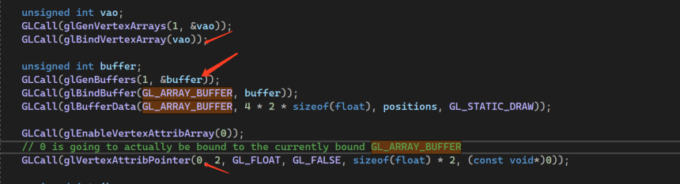
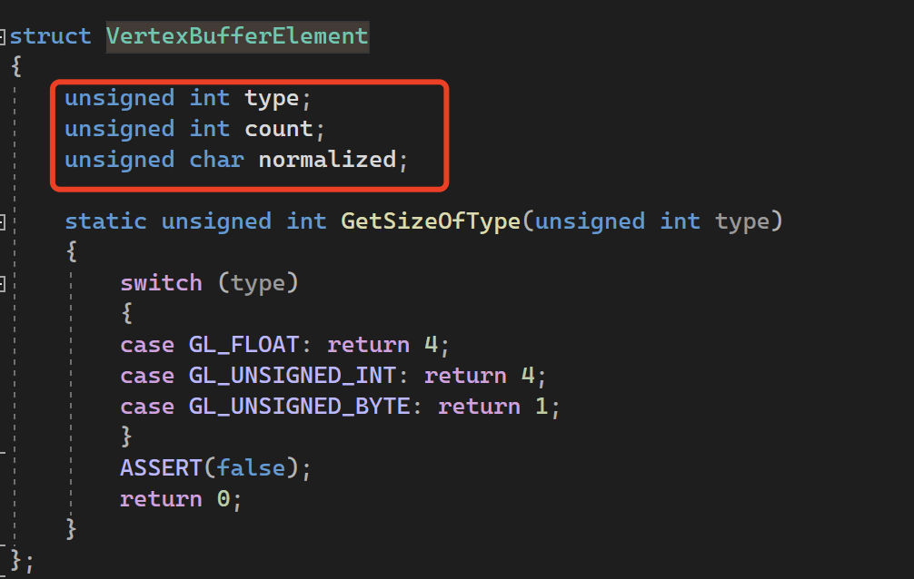
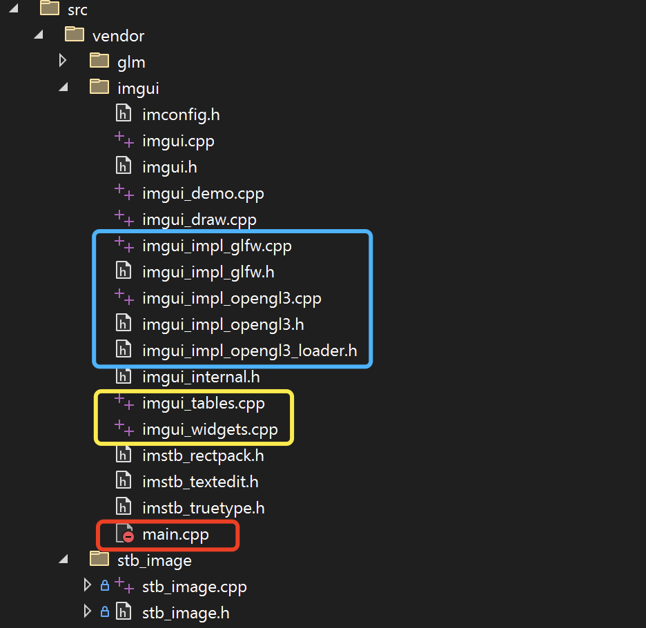
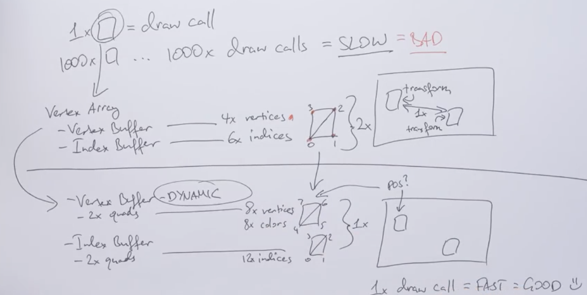

## OpenGL

[toc]


> **Thanks https://youtube.com/playlist?list=PLlrATfBNZ98foTJPJ_Ev03o2oq3-GGOS2 Cherno**

### welcome

OpenGL is just a spec(specification), cross-platform

AMD Intel ... So everyone's implementation of OpenGL is gonna be slightly different

Legacy opengl

Modern Opengl

### Setting up OpenGL and Creating a Window in C++

GLFW

What you compile your application with, so we'll just be using a 32-bit application because we don't need a 64-bit one

添加依赖库


```c++
❌
LNK2019
unresolved external symbol __imp_glClear referenced in function main

What link is trying to do now is find a definition for 
that glClear Function That is inside an opengl library file
so we actuall have to link against that.

Project --> Properties --> Linker --> input --> additional dependencies
opengl32.lib;
```


代码：

```c++

#include <iostream>
#include "GLFW/glfw3.h"

int main()
{
    GLFWwindow* window;

    /* Initialize the library */
    if (!glfwInit())
        return -1;

    /* Create a windowed mode window and its OpenGL context */
    window = glfwCreateWindow(640, 480, "Hello World", NULL, NULL);
    if (!window)
    {
        glfwTerminate();
        return -1;
    }

    /* Make the window's context current */
    glfwMakeContextCurrent(window);

    /* Loop until the user closes the window */
    while (!glfwWindowShouldClose(window))
    {
        /* Render here */
        glClear(GL_COLOR_BUFFER_BIT);

        glBegin(GL_TRIANGLES);
        
        // draw a triangle
        glVertex2f(-0.5f, -0.5f);
        glVertex2f(0.0f, 0.5f);
        glVertex2f(0.5f, -0.5f);

        glEnd();

        /* Swap front and back buffers */
        glfwSwapBuffers(window);

        /* Poll for and process events */
        glfwPollEvents();
    }

    glfwTerminate();
    return 0;
}
```


### Using Modern OpenGL in C++

Pull out the functions and call them

Get  the function Declarations and then link against the functions as well

So we need to access the driver's DLL files and just retrieve the function pointers

to the functions inside those libraries . That's what we need to do.

#### [glew](https://glew.sourceforge.net/)

放到 `\Dependencies\GLEW` 目录下

添加新的静态库依赖

```c++
/*
Configuration    Platform
 C/  C++   --> General --> Additional include Directories （$(SolutionDir)Dependencies\GLEW\include）
 C/  C++   --> linker --> general --> Additional library directories（$(SolutionDir)Dependencies\GLEW\lib\Release\x64）
  (这里包含依赖库文件的根目录)  
 C/  C++   --> linker --> input --> Additional Dependencies ("glew32s.lib" for 32-bit builds, "glew32s.lib" for 64-bit builds)
  
  */

/*
❌
Build started...
1>------ Build started: Project: DemoLibrary, Configuration: Debug x64 ------
1>LINK : warning LNK4098: defaultlib 'MSVCRT' conflicts with use of other libs; use /NODEFAULTLIB:library
1>Main.obj : error LNK2019: unresolved external symbol __imp_glewInit referenced in function main
1>Main.obj : error LNK2019: unresolved external symbol __imp_glewGetErrorString referenced in function main
1>C:\Users\fmsli\dev\DemoLibrary\bin\x64\Debug\DemoLibrary.exe : fatal error LNK1120: 2 unresolved externals
1>Done building project "DemoLibrary.vcxproj" -- FAILED.
========== Build: 0 succeeded, 1 failed, 0 up-to-date, 0 skipped ==========
========== Build started at 6:52 PM and took 00.429 seconds ==========
#include <GL/glew.h> // 在 #include "GLFW/glfw3.h" 之前
  
  */

/*
 * GLEW_STATIC is defined for static library.
 * GLEW_BUILD  is defined for building the DLL library.
 
 C/  C++   --> Preprocessor --> Preprocessor Definitions --> GLEW_STATIC
 */
 
 
```


### Vertex Buffers and Drawing a Triangle in OpenGL

- Create a vertex **buffer** 创建一个顶点缓冲区
- Create a shader 创建一个着色器

State machine

Contextual 上下文相关的

Vertex attribute stuff

Shader

Index buffer

### Vertex Attritures and Layouts in OpenGL

顶点属性和布局

顶点不仅仅是位置！！！A vertex can contain way more than just a position!

属性：

- Position 位置
- Texture coordinate 纹理坐标
- Normal 法线

Index 索引

```C++
    // enable
    glEnableVertexAttribArray(0);
    /*
    stride 是每个顶点之间的字节数
    the stride is the amount of bytes that we have between each vertex

    pointer 是每个属性之间的字节数
    */
    glVertexAttribPointer(0, 2, GL_FLOAT, GL_FALSE, sizeof(float) * 2, (const void*)0);
    
```

平台提供默认着色器，不建议这样使用。

### How Shaders Work in OpenGL

**pipeline**

- Vertex shaders 
  - 顶点着色器 -- 指定了位置/ 转换（it specifies the way you want to on the positions to be）
- Fragment（pixel） shaders 
  - 片段着色器 rasterized 光栅化（对三角形中需要填充的每个像素调用一次）决定像素应该是什么颜色
- ... 还有很多着色器

### Writing a Shader in OpenGL

我会在编译期间把它（文本）打包进最终程序文件

```C++
static unsigned int CompileShader(unsigned int type, const std::string& source)
{
    unsigned int id = glCreateShader(type);
    const char* src = source.c_str();
    glShaderSource(id, 1, &src, nullptr);
    glCompileShader(id);

    // TODO: Error handling
    int result;
    glGetShaderiv(id, GL_COMPILE_STATUS, &result);
    if (result == GL_FALSE)
    {
        int length;
        glGetShaderiv(id, GL_INFO_LOG_LENGTH, &length);
        char* message = (char*)alloca(length * sizeof(char));
        glGetShaderInfoLog(id, length, &length, message);
        std::cout << "Failed  to Compile " <<
            (type == GL_VERTEX_SHADER ? "vertex" : "fragment") << "shader ! " << message << std::endl;
        glDeleteShader(id);
        return 0;
    }

    return id;
}

static int CreateShader(const std::string& vertexShader, const std::string& fragmentShader)
{
    unsigned int program = glCreateProgram();
    unsigned int vs = CompileShader(GL_VERTEX_SHADER, vertexShader);
    unsigned int fs = CompileShader(GL_FRAGMENT_SHADER, fragmentShader);

    // attach
    glAttachShader(program, vs);
    glAttachShader(program, fs);
    // link
    glLinkProgram(program);
    // valid
    glValidateProgram(program);

    glDeleteShader(vs);
    glDeleteShader(fs);
    // glDetach  -- pro operation

    return program;
}

void f2()
{
    // positions
    float positions[6] = {
        -0.5f, -0.5f,
         0.0f,  0.5f,
         0.5f, -0.5f
    };
    // this is the id of the generated buffer object
    unsigned int buffer;
    glGenBuffers(1, &buffer);
    // bindding buffer memory <--> buffer object
    glBindBuffer(GL_ARRAY_BUFFER, buffer);
    // specify the data
    glBufferData(GL_ARRAY_BUFFER, 6 * sizeof(float), positions, GL_STATIC_DRAW);

    // enable
    glEnableVertexAttribArray(0);
    // attribute
    glVertexAttribPointer(0, 2, GL_FLOAT, GL_FALSE, sizeof(float) * 2, (const void*)0);

    // bindding buffer memory <--> buffer object
    glBindBuffer(GL_ARRAY_BUFFER, 0);

    // shader
    std::string vertexShader = 
        "#version 330 core\n"
        "\n"
        "layout(location = 0) in vec4 position;"
        "\n"
        "void main()\n"
        "{\n"
        "   gl_Position = position;\n"
        "}\n";

    std::string fragmentShader =
        "#version 330 core\n"
        "\n"
        "layout(location = 0) out vec4 color;"
        "\n"
        "void main()\n"
        "{\n"
        "   color = vec4(1.0, 0.0, 0.0, 1.0);\n"
        "}\n";

    unsigned int shader = CreateShader(vertexShader, fragmentShader);
    glUseProgram(shader);
}
```

### How I Deal with Shaders in OpenGL

将两个着色器源码文件合并到一个文件中。从文件读取 shader

> Direct X is a Better API 🐶

Relative Path

```undefined
projects -> configuration  -> properties  -> debugging  -> working directory -> $(ProjectDir)
```

### Index Buffers in OpenGL

索引缓冲区

完全唯一的顶点

Same memory multiple times

重复冗余内存

必须是无符号内容

```C++
#include <fstream>
#include <string>
#include <sstream>

struct ShaderProgramSource
{
    std::string VertexSource;
    std::string FragmentSource;
};

static ShaderProgramSource ParseShader(const std::string& filePath)
{
    std::ifstream infile(filePath);
    if (!infile)
    {
        std::cout << "Error opening file \n";
    }

    enum class ShaderType
    {
        NONE = -1, VERTEX = 0, FRAGMENT = 1
    };
    
    std::string line;
    // for vertex shader and fragment shader
    std::stringstream ss[2];
    ShaderType type = ShaderType::NONE;

    while (std::getline(infile, line)) {
        if (line.find("#shader") != std::string::npos)
        {
            if (line.find("vertex") != std::string::npos)
            {
                type = ShaderType::VERTEX;
            }
            else if (line.find("fragment") != std::string::npos)
            {
                type = ShaderType::FRAGMENT;
            }
        }
        else
        {
            ss[(int)type] << line << '\n';
        }
        
    }
    infile.close();

    return {ss[0].str(), ss[1].str()};
}

static unsigned int CompileShader(unsigned int type, const std::string& source)
{
    unsigned int id = glCreateShader(type);
    const char* src = source.c_str();
    glShaderSource(id, 1, &src, nullptr);
    glCompileShader(id);

    // TODO: Error handling
    int result;
    glGetShaderiv(id, GL_COMPILE_STATUS, &result);
    if (result == GL_FALSE)
    {
        int length;
        glGetShaderiv(id, GL_INFO_LOG_LENGTH, &length);
        char* message = (char*)alloca(length * sizeof(char));
        glGetShaderInfoLog(id, length, &length, message);
        std::cout << "Failed  to Compile " <<
            (type == GL_VERTEX_SHADER ? "vertex" : "fragment") << "shader ! " << message << std::endl;
        glDeleteShader(id);
        return 0;
    }

    return id;
}

static int CreateShader(const std::string& vertexShader, const std::string& fragmentShader)
{
    unsigned int program = glCreateProgram();
    unsigned int vs = CompileShader(GL_VERTEX_SHADER, vertexShader);
    unsigned int fs = CompileShader(GL_FRAGMENT_SHADER, fragmentShader);

    // attach
    glAttachShader(program, vs);
    glAttachShader(program, fs);
    // link
    glLinkProgram(program);
    // valid
    glValidateProgram(program);

    glDeleteShader(vs);
    glDeleteShader(fs);

    return program;
}

unsigned int f2()
{
    // positions
    /*
    float positions[6] = {
        -0.5f, -0.5f,
         0.0f,  0.5f,
         0.5f, -0.5f
    };
    */
    /*
    // repeat and waste
    float positions[12] = {
        -0.5f, -0.5f,
         0.5f, -0.5f,
         0.5f,  0.5f,
         0.5f,  0.5f,
        -0.5f,  0.5f,
        -0.5f, -0.5f
    };
    */
    // use index buffer
    float positions[12] = {
        -0.5f, -0.5f,
         0.5f, -0.5f,
         0.5f,  0.5f,
        -0.5f,  0.5f
    };

    unsigned int indices[] = {
        0, 1, 2,
        2, 3, 0
    };

    // this is the id of the generated buffer object
    unsigned int buffer;
    glGenBuffers(1, &buffer);
    // bindding buffer memory <--> buffer object
    glBindBuffer(GL_ARRAY_BUFFER, buffer);
    // specify the data
    glBufferData(GL_ARRAY_BUFFER, 6 * 2 * sizeof(float), positions, GL_STATIC_DRAW);

    // enable
    glEnableVertexAttribArray(0);
    // attribute
    glVertexAttribPointer(0, 2, GL_FLOAT, GL_FALSE, sizeof(float) * 2, (const void*)0);

    unsigned int ibo;
    glGenBuffers(1, &ibo);
    glBindBuffer(GL_ELEMENT_ARRAY_BUFFER, ibo);
    glBufferData(GL_ELEMENT_ARRAY_BUFFER, 6 * sizeof(unsigned int), indices, GL_STATIC_DRAW);

    // relative path, which always from th working directory
    ShaderProgramSource source = ParseShader("res/shaders/Basic.shader");
    std::cout << "VertexSource" << std::endl;
    std::cout << source.VertexSource << std::endl;
    std::cout << "FragmentSource" << std::endl;
    std::cout << source.FragmentSource << std::endl;
    unsigned int shader = CreateShader(source.VertexSource, source.FragmentSource);
    glUseProgram(shader);
    return shader;
}

void f2_1()
{
    // 6 is in the index buffer
    // any index buffer has to be made up of unsigned int !!!
    glDrawElements(GL_TRIANGLES, 6, GL_UNSIGNED_INT, nullptr);
}
int main()
{
    GLFWwindow* window;

    /* Initialize the library */
    if (!glfwInit())
        return -1;

    /* Create a windowed mode window and its OpenGL context */
    window = glfwCreateWindow(640, 480, "Hello World", NULL, NULL);
    if (!window)
    {
        glfwTerminate();
        return -1;
    }

    /* Make the window's context current */
    glfwMakeContextCurrent(window);

    GLenum err = glewInit();
    if (GLEW_OK != err)
    {
        /* Problem: glewInit failed, something is seriously wrong. */
        fprintf(stderr, "Error: %s\n", glewGetErrorString(err));

    }

    // f1();

    unsigned int shader = f2();


    /* Loop until the user closes the window */
    while (!glfwWindowShouldClose(window))
    {
        /* Render here */
        glClear(GL_COLOR_BUFFER_BIT);
        // f0();
        
        //f1_1();
        f2_1();

        /* Swap front and back buffers */
        glfwSwapBuffers(window);

        /* Poll for and process events */
        glfwPollEvents();
    }

    glDeleteProgram(shader);

    glfwTerminate();
    return 0;
}
```


### Dealing with Errors in OpenGL

检查错误

- `glGetError`，不断调用以获得全部的错误标识
  - > - If more than one flag has recorded an error, **`glGetError`** returns and clears an arbitrary error flag value. Thus, **`glGetError`** should always be called in a loop, until it returns `GL_NO_ERROR`, if all error flags are to be reset.
- `glDebugMessageCallBack` >= OpenGL 4.3
  - 允许我们指定一个指向 OpenGL 的函数指针

断言

宏

```C++
/**
1 __debugbread() 是 window 平台的特性
2 宏局限性，eg.
{ int a = 10; int b = a + 10}
int c = a + b; // a and b is out of scope
所以，在使用 GLCall 包裹函数的地方，注意作用域提升！！！
3 使用 do while 包裹，是为了避免内部出现 if 等条件语句，中断了代码执行
*/
#define ASSERT(x) if (!(x)) __debugbreak();
#define GLCall(x) do { \
    GLClearError();\
    x;\
    ASSERT(GLLogCall(#x, __FILE__, __LINE__));\
} while (0)

static void GLClearError()
{
    while (glGetError() != GL_NO_ERROR);
}

static bool GLLogCall(const char* function, const char* file, int line)
{
    while (GLenum error = glGetError())
    {
        std::cout << "[OpenGL Error] (" << std::hex << error << "): " << function << "  " << file << ":" << std::dec << line << std::endl;
        return false;
    }
    return true;
}

// 使用
// GLCall(glDrawElements(GL_TRIANGLES, 6, GL_INT, nullptr));
```

### Uniforms in OpenGL

从 CPU 到 GPU

- 统一变量，是设置每次绘制的
- 属性，是设置每个顶点

通过使用实际的着色器id，编写 glUserProgram 来绑定着色器，获取这个实际颜色变量的位置。

```C++
{
    int location = glGetUniformLocation(shader, "u_Color");
    ASSERT(location != -1);
    
    GLCall(glUniform4f(location, 0.2, 0.3, 0.8, 1.0));
}

{
#shader fragment
#version 330 core

layout(location = 0) out vec4 color;
uniform vec4 u_Color;

void main()
{
   //color = vec4(0.2, 0.3, 0.8, 1.0);
   color = u_Color;
};
}
```

### Vertex Arrays in OpenGL

顶点数组，OpenGL 特有，是一种通过一种特定的规范绑定顶点缓冲区的方式。

顶点数组对象将包含顶点缓冲区之间的绑定以及实际的顶点规范或顶点到布局。

```Plain
绑定顶点缓冲区 --> 指定布局
绑定索引缓冲区
然后绘制实际的对象
绑定着色器
绑定顶点缓冲区
设置顶点布局
绑定索引缓冲区
然后发出 DrawCall 指令
---
绑定着色器
绑定顶点数组
绑定索引缓冲区
然后发出 DrawCall 指令
```

vertexAttribPointer 实际上会绑定一个实际的顶点缓冲区和数组缓冲区。




1. 可以在整个项目中有一个 全局 VAO，然后每次绑定不同的缓冲区和不同的顶点规范。
2. 对每个几何体或唯一几何体或任何东西都有单独的VAO

```C++
#if 1
#include <iostream>
#include <GL/glew.h>
#include "GLFW/glfw3.h"
#include <fstream>
#include <string>
#include <sstream>

#define ASSERT(x) if (!(x)) __debugbreak();
#define GLCall(x) do { \
    GLClearError();\
    x;\
    ASSERT(GLLogCall(#x, __FILE__, __LINE__));\
} while (0)

static void GLClearError()
{
    while (glGetError() != GL_NO_ERROR);
}

static bool GLLogCall(const char* function, const char* file, int line)
{
    while (GLenum error = glGetError())
    {
        std::cout << "[OpenGL Error] (" << std::hex << error << "): " << function << "  " << file << ":" << std::dec << line << std::endl;
        return false;
    }
    return true;
}

struct ShaderProgramSource
{
    std::string VertexSource;
    std::string FragmentSource;
};

static ShaderProgramSource ParseShader(const std::string& filePath)
{
    std::ifstream infile(filePath);
    if (!infile)
    {
        std::cout << "Error opening file \n";
    }

    enum class ShaderType
    {
        NONE = -1, VERTEX = 0, FRAGMENT = 1
    };
    
    std::string line;
    // for vertex shader and fragment shader
    std::stringstream ss[2];
    ShaderType type = ShaderType::NONE;

    while (std::getline(infile, line)) {
        if (line.find("#shader") != std::string::npos)
        {
            if (line.find("vertex") != std::string::npos)
            {
                type = ShaderType::VERTEX;
            }
            else if (line.find("fragment") != std::string::npos)
            {
                type = ShaderType::FRAGMENT;
            }
        }
        else
        {
            ss[(int)type] << line << '\n';
        }
        
    }
    infile.close();

    return {ss[0].str(), ss[1].str()};
}

static unsigned int CompileShader(unsigned int type, const std::string& source)
{
    unsigned int id;
    GLCall(id = glCreateShader(type));
    const char* src = source.c_str();
    GLCall(glShaderSource(id, 1, &src, nullptr));
    GLCall(glCompileShader(id));

    // TODO: Error handling
    int result;
    GLCall(glGetShaderiv(id, GL_COMPILE_STATUS, &result));
    if (result == GL_FALSE)
    {
        int length;
        GLCall(glGetShaderiv(id, GL_INFO_LOG_LENGTH, &length));
        char* message = (char*)alloca(length * sizeof(char));
        GLCall(glGetShaderInfoLog(id, length, &length, message));
        std::cout << "Failed  to Compile " <<
            (type == GL_VERTEX_SHADER ? "vertex" : "fragment") << "shader ! " << message << std::endl;
        GLCall(glDeleteShader(id));
        return 0;
    }

    return id;
}

static int CreateShader(const std::string& vertexShader, const std::string& fragmentShader)
{
    unsigned int program;
    GLCall(program = glCreateProgram());
    unsigned int vs = CompileShader(GL_VERTEX_SHADER, vertexShader);
    unsigned int fs = CompileShader(GL_FRAGMENT_SHADER, fragmentShader);

    // attach
    GLCall(glAttachShader(program, vs));
    GLCall(glAttachShader(program, fs));
    // link
    GLCall(glLinkProgram(program));
    // valid
    GLCall(glValidateProgram(program));

    GLCall(glDeleteShader(vs));
    GLCall(glDeleteShader(fs));

    return program;
}


int main()
{
    GLFWwindow* window;

    /* Initialize the library */
    if (!glfwInit())
        return -1;

    // version 3.3 Core profile
    glfwWindowHint(GLFW_CONTEXT_VERSION_MAJOR, 3);
    glfwWindowHint(GLFW_CONTEXT_VERSION_MINOR, 3);
    glfwWindowHint(GLFW_OPENGL_PROFILE, GLFW_OPENGL_CORE_PROFILE);

    /* Create a windowed mode window and its OpenGL context */
    window = glfwCreateWindow(640, 480, "Hello World", NULL, NULL);
    if (!window)
    {
        glfwTerminate();
        return -1;
    }

    /* Make the window's context current */
    glfwMakeContextCurrent(window);

    glfwSwapInterval(1);

    GLenum err = glewInit();
    if (GLEW_OK != err)
    {
        /* Problem: glewInit failed, something is seriously wrong. */
        fprintf(stderr, "Error: %s\n", glewGetErrorString(err));

    }

    std::cout << glGetString(GL_VERSION) << std::endl;

    // use index buffer
    float positions[12] = {
        -0.5f, -0.5f,
         0.5f, -0.5f,
         0.5f,  0.5f,
        -0.5f,  0.5f
    };

    unsigned int indices[] = {
        0, 1, 2,
        2, 3, 0
    };

    unsigned int vao;
    GLCall(glGenVertexArrays(1, &vao));
    GLCall(glBindVertexArray(vao));

    unsigned int buffer;
    GLCall(glGenBuffers(1, &buffer));
    GLCall(glBindBuffer(GL_ARRAY_BUFFER, buffer));
    GLCall(glBufferData(GL_ARRAY_BUFFER, 4 * 2 * sizeof(float), positions, GL_STATIC_DRAW));

    GLCall(glEnableVertexAttribArray(0));
    // 0 is going to actually be bound to the currently bound GL_ARRAY_BUFFER
    GLCall(glVertexAttribPointer(0, 2, GL_FLOAT, GL_FALSE, sizeof(float) * 2, (const void*)0));

    unsigned int ibo;
    GLCall(glGenBuffers(1, &ibo));
    GLCall(glBindBuffer(GL_ELEMENT_ARRAY_BUFFER, ibo));
    GLCall(glBufferData(GL_ELEMENT_ARRAY_BUFFER, 6 * sizeof(unsigned int), indices, GL_STATIC_DRAW));

    ShaderProgramSource source = ParseShader("res/shaders/Basic.shader");
    std::cout << "VertexSource" << std::endl;
    std::cout << source.VertexSource << std::endl;
    std::cout << "FragmentSource" << std::endl;
    std::cout << source.FragmentSource << std::endl;
    unsigned int shader = CreateShader(source.VertexSource, source.FragmentSource);
    GLCall(glUseProgram(shader));

    int location;
    GLCall(location = glGetUniformLocation(shader, "u_Color"));
    ASSERT(location != -1);

    GLCall(glUniform4f(location, 0.6f, 0.3f, 0.8f, 1.0f));

    GLCall(glBindVertexArray(0));
    GLCall(glUseProgram(0));
    GLCall(glBindBuffer(GL_ARRAY_BUFFER, 0));
    GLCall(glBindBuffer(GL_ARRAY_BUFFER, 0));

    float r = 0.0f;
    float increment = 0.05f;

    /* Loop until the user closes the window */
    while (!glfwWindowShouldClose(window))
    {
        /* Render here */
        GLCall(glClear(GL_COLOR_BUFFER_BIT));

        GLCall(glUseProgram(shader));
        GLCall(glUniform4f(location, r, 0.3f, 0.8f, 1.0f));

        //GLCall(glBindBuffer(GL_ARRAY_BUFFER, buffer));
        //GLCall(glEnableVertexAttribArray(0));
        //GLCall(glVertexAttribPointer(0, 2, GL_FLOAT, GL_FALSE, sizeof(float) * 2, 0));
        GLCall(glBindVertexArray(vao));
        GLCall(glBindBuffer( GL_ELEMENT_ARRAY_BUFFER, ibo));

        GLCall(glDrawElements(GL_TRIANGLES, 6, GL_UNSIGNED_INT, nullptr));

        if (r > 1.0f)
            increment = -0.05f;
        else if (r < 0.0f)
            increment = 0.05f;

        r += increment;

        /* Swap front and back buffers */
        GLCall(glfwSwapBuffers(window));

        /* Poll for and process events */
        GLCall(glfwPollEvents());
    }

    GLCall(glDeleteProgram(shader));

    glfwTerminate();
    return 0;
}
#endif
```


使用核心配置文件必须创建一个顶点数组对象

使用兼容性配置文件，框架有一个默认的顶点数组对象，它被绑定并设置为供我们使用。

A. 使用兼容性配置文件和默认顶点数组，绑定顶点缓冲区，设置顶点布局

B. 使用核心配置文件，创建顶点数组，绑定顶点数组

B.1 顶点数组可以是一个全局的

B.2 顶点数组可以是多个

### Abstracting OpenGL into Classes

render

Vertex attribute stuff

Shader

Index buffer

textures

### Buffer  layout Abstraction in OpenGL

我已把代码提交到  [GitHub - likenow/OpenGLDemo](https://github.com/likenow/OpenGLDemo)

两点记录：

1. Visual Studio 2022提交代码的时候，提示 "your solution contains files outside the solution folder which will not be included."  我没管直接提交了
2. 在写代码的过程中，我把 VertexBufferElement 结构体的成元变量顺序写的和视频里不一致，结果就报错，找了好一会儿，特此记录！！！



### Shader Abstraction in OpenGL

着色器可以是一个复杂的系统

创建一些模版化的东西

### Writing a Basic Render in OpenGL

Material instead of an actual shader

Material = shader + data

### Textures in OpenGL

纹理

In this case, texture thinks as essentially an image that we can use

复杂的，比如使用预先计算好的数学值，将其融入到纹理中，然后在着色器中对他们进行采样，这样可以做一些很酷的效果

stb_image 库

加载 PNG 图片，给它一个文件路径，它会给我一个指向RGBA像素缓冲区的指针

我会取那个像素数组，然后把它传到我们的显卡，使用OpenGL 然后把数据作为纹理发送到显卡

在绘制时，可以使用着色器来读取哪个纹理，片段着色器会从纹理内存中读取并实际计算出每个像素应该是什么，构成那个纹理每部分的颜色是什么。

总结：

加载图片

在OpenGL 中创建纹理

渲染时绑定纹理

修改着色器来绑定到那个纹理插槽

着色器采样

在顶点和片段着色器之间发送数据的方式。 -- Varying

```C++
#shader vertex
#version 330 core

layout(location = 0) in vec4 position;
layout(location = 1) in vec2 texCoord;

// varying
out vec2 v_TexCoord;

void main()
{
   gl_Position = position;
   v_TexCoord = texCoord;
};

#shader fragment
#version 330 core

layout(location = 0) out vec4 color;

in vec2 v_TexCoord;

uniform vec4 u_Color;
uniform sampler2D u_Texture;

void main()
{
    // 对特定纹理坐标进行采样
    vec4 texColor = texture(u_Texture, v_TexCoord);
    //color = vec4(0.2, 0.3, 0.8, 1.0);
    color = texColor;
};
```

片段着色器为每个像素运行，所以需要知道纹理中的精确位置来查找，这样我们就可以在实际屏幕中从纹理中绘制出那个像素


### Blending in OpenGL

Determines how we combine our output color with what is already in our target buffer.

Output = the color we output from our fragment shader (know as source)

Target buffer = the buffer our fragment shader is drawing to (know as destination)

1. glEnable(GL_BLEND) - glDisable(GL_BLEND)
2. glBlendFunc(src, dest) src 相当于 ps 的上图层， dest 相当于下图层
   1. Src = how the src RGBA factor is computed(default is GL_ONE)
   2. Dest = how the dest RGBA factor is computed(default is GL_ZERO)
   3.  默认的 glGenBlendFunc 参数，会丢掉 dest，用 src 覆盖它
3. glBlendEquation(mode)
   1. Mode = how we combine the src and dest colors(default is GL_FUNC_ADD)
   2.  So that means by default is : 1+ 0 = 1

Src = GL_SRC_ALPHA

Dest = GL_ONE_MINUS_SRC_ALPHA

```C++
{
    GLCall(glEnable(GL_BLEND));
    GLCall(glBlendFunc(GL_SRC_ALPHA, GL_ONE_MINUS_SRC_ALPHA));
}
```

==>

src alpha = 0

dest = 1 - 0 = 1

```C++
R = (Rsrc * 0) + (Rdest * (1-0)) = Rdest
G = (Gsrc * 0) + (Gdest * (1-0)) = Gdest
B = (Bsrc * 0) + (Bdest * (1-0)) = Bdest
A = (Asrc * 0) + (Adest * (1-0)) = Adest
```

Eg.

(1.0, 1.0, 1.0, 0.5)

(1.0, 0.0, 1.0, 1.0)

Blending:

```C++
R = (1.0 * 0.5) + (1.0 * (1-0.5)) = 1.0
G = (1.0 * 0.5) + (0.0 * (1-0.5)) = 0.5
B = (1.0 * 0.5) + (1.0 * (1-0.5)) = 1.0
A = (0.5 * 0.5) + (1.0 * (1-0.5)) = 0.75
```

混合

透明

### Maths in OpenGL

数学

矩阵 matrixes

向量 vectors

变换 transformation

数学库：[Releases · g-truc/glm](https://github.com/g-truc/glm/releases)

### Projection Matrices in OpenGL

Projection matrix 投影矩阵

How we go from having some kind of arbitrary coordinate system in our 3D world or 2D world

How we go from having coordinates or vertex positions in that space to being able to somehow map them to our window. So we have to project them somehow onto this to surface.

> It is essentially the maths that converts all of those 3D points in space into something that is in a 2D kind of window.

Some kind of normalized space that we can, then map to our window.

A normalized space means that literally a coordinate system between -1 and 1 in every axis x,y,z.

Orthographic

Usually 2D

Perspective

Usually 3D

Projection converts it into normal device coordinate space of -1 to 1. That's relly all that's happening. 

```C++
#shader vertex
#version 330 core

layout(location = 0) in vec4 position;
layout(location = 1) in vec2 texCoord;

out vec2 v_TexCoord;

uniform mat4 u_MVP;

void main()
{
   // 这里注意⚠️矩阵相乘有顺序❗️  u_MVP * position ❌ position * u_MVP 
   gl_Position = u_MVP * position;
   v_TexCoord = texCoord;
};

#shader fragment
#version 330 core

layout(location = 0) out vec4 color;

in vec2 v_TexCoord;

uniform vec4 u_Color;
uniform sampler2D u_Texture;

void main()
{
        vec4 texColor = texture(u_Texture, v_TexCoord);
   //color = vec4(0.2, 0.3, 0.8, 1.0);
   color = texColor;
};
```

### Model View Projection Matrices in OpenGL

模型矩阵 model matrix -- 对象变换（position位置/ rotation旋转/ scale缩放/ translation平移...）

视图矩阵 view matrix -- 视觉矩阵 -- “相机的视图，位置/方向”

Projection matrix 投影矩阵

==> MVP ==> 这三个矩阵定义了顶点位置的不同东西。

That all of that gets multiplied together with ours with each vertex position to give us kind of the final position of the vertex in our actual screen.like on inside our window, or in our kind of 2d projection that is on our computer screen.

所有这些（MVP）和每个顶点位置相乘，计算出我们顶点在实际屏幕中的最终位置，比如窗口内部，或者电脑屏幕上的2d投影。

在 OpenGL 中是 `P*V*M`


### ImGui in OpenGL

集成 [imgui](https://github.com/ocornut/imgui/releases) 1.89.5



```Shell
Build started...
1>------ Build started: Project: DemoLibrary, Configuration: Debug x64 ------
1>imgui.cpp
1>imgui_demo.cpp
1>imgui_draw.cpp
1>imgui_impl_glfw.cpp
1>imgui_impl_opengl3.cpp
1>imgui_tables.cpp
1>imgui_widgets.cpp
1>Generating Code...
1>glew32s.lib(glew.obj) : warning LNK4099: PDB '' was not found with 'glew32s.lib(glew.obj)' or at ''; linking object as if no debug info
1>LINK : warning LNK4098: defaultlib 'MSVCRT' conflicts with use of other libs; use /NODEFAULTLIB:library
1>LINK : warning LNK4098: defaultlib 'LIBCMT' conflicts with use of other libs; use /NODEFAULTLIB:library
1>DemoLibrary.vcxproj -> C:\Users\fmsli\dev\DemoLibrary\bin\x64\Debug\DemoLibrary.exe
1>Done building project "DemoLibrary.vcxproj".
========== Build: 1 succeeded, 0 failed, 0 up-to-date, 0 skipped ==========
========== Build started at 8:31 PM and took 04.298 seconds ==========
```

### Rendering Multiple Objects in OpenGL

批量渲染对象

渲染一个新的 logo 图到新的位置，两种方法：

- 改变属性和顶点缓冲区（positions）
- 改变模型视图投影矩阵统一变量（matrix uniform）

### Setting up a Test Framework for OpenGL

建立一个测试框架

### Creating Tests in OpenGL

Menu -- imgui 菜单

Command line with argument -- 命令行

### Creating a Texture Test in OpenGL

使用了智能指针持有

```C++
namespace test {
    class TestTexture2D : public Test
    {
    public:
        TestTexture2D();
        ~TestTexture2D();

        void OnUpdate(float deltaTime) override;
        void OnRender() override;
        void OnImGuiRender() override;
    private:
        std::unique_ptr<VertexArray> m_VAO;
        std::unique_ptr<IndexBuffer> m_IndexBuffer;
        std::unique_ptr<VertexBuffer> m_VertexBuffer;
        std::unique_ptr<Shader> m_Shader;
        std::unique_ptr<Texture> m_Texture;

        glm::mat4 m_Proj, m_View;
        glm::vec3 m_TranslationA, m_TranslationB;
    };
}
```


### How to make your UNIFORMS FASTER in OpenGL

缓存统一变量

一个系统的设计如下：

> 如果我们加载一个着色器，我们可以引导使用 OpenGL 来做所有这些事情。
>
> 另外，在 C++ 中读取源代码的着色器，然后从中提取数据，这样你们就能找到所有的属性/统一变量/功能，总之所有在着色器里的东西。
>
> 我们可以写一个程序，本质上读取文本和着色器源代码。然后可以将其转换为我们可以在运行时利用和使用的实际数据。

现在使用一个简单的方式，加快统一变量设置的方法。不是每次从 OpenGL 检索位置，而是通过缓存它。


---


### Batch Rendering - An Intro

How we can batch geometry together.

Batching means we batch together all of this geometry **into a single vertex buffer and index buffer.**




一个静态批处理，副作用是导致要传入的 vb 和 ib 的占用空间变大。


### Batch Rendering - Colors

Filling in a vertex buffer with the vertex positions, and then rendering that quad.and then in the fragment shader passing in some kind of uniform variable which contains the color. 

用顶点位置填充顶点缓冲区，然后渲染那个四边形。然后在片段着色器中传入一个包含颜色的统一变量。

但是，一次 draw call 不能将统一变量设置为绘制之间的两个不同值。

你可以在顶点中存储任何东西，然后在顶点着色器中访问这些数据！

顶点颜色，每个单独的顶点在我们的顶点缓存区中都会包含一个颜色。然后我们在顶点着色器顶点缓冲区中访问这个颜色。然后传到片段着色器，然后将它设置为输出颜色，因为现在每个顶点都包含一种颜色。

可以设置每个坐标，对于纹理，我们可以控制每个顶点的颜色。

### Batch Rendering - Textures

可以利用纹理插槽，来批量处理纹理

```OpenGL
// error: sampler arrays indexed with non-constant expressions are forbidden in GLSL 1.30 and later' in fragment shader
// In GLSL 3.3 indexing for sampler arrays is only allowed by an integral constant expression (see GLSL 3.3 Spec, Section 4.1.7).
// In more modern version, starting from GLSL 4.0 it is allowed to index sampler arrays by dynamic uniform expressions (see GLSL 4.0 Spec, Section 4.1.7)

// solution
#shader fragment
#version 330 core

layout(location = 0)out vec4 o_Color;

in vec4 v_Color;
in vec2 v_TextCoord;
in float v_TextSlotIdx;

uniform sampler2D u_Textures[2];

vec4 SampleTexture(int idx, vec2 texCoord)
{
    if (idx == 0) {
        return texture(u_Textures[0], texCoord);
    }
    else {
        return texture(u_Textures[1], texCoord);
    }
};

void main()
{
    int idx = int(v_TextSlotIdx);
    vec4 textColor = SampleTexture(idx, v_TextCoord);
    o_Color = textColor;
};
```

#### Ps. 关于齐次坐标

```Plain
OpenGL 中的齐次坐标是指在 3D 空间中使用四元组（x, y, z, w）来表示一个点或向量，
其中 w 通常被称为“权重”。齐次坐标在 OpenGL 中主要用于实现透视变换和矩阵变换等功能。

在 OpenGL 中，一个点的齐次坐标（x, y, z, w）
可以通过将其欧几里得坐标（x', y', z'）除以 w 来计算得到：
x = x' / w
y = y' / w
z = z' / w
注意，当 w 等于 0 时，这个点被认为是位于无限远处的点，也被称为“齐次无穷远点”。
使用齐次坐标可以简化 OpenGL 中的矩阵变换操作，
因为矩阵变换可以使用 4x4 的矩阵来表示，
同时也可以通过使用齐次坐标来实现透视变换。
例如，我们可以将一个 3D 点（x', y', z'）表示为一个齐次坐标（x, y, z, 1），
并将一个 3D 向量（x', y', z'）表示为一个齐次坐标（x, y, z, 0）。
在 OpenGL 中，我们通常使用 glVertex4f、glVertex3f 等函数来指定顶点的齐次坐标。
同时，在 GLSL 着色器中，也可以使用 vec4 类型来表示齐次坐标。
```


使用多个纹理，你需要使用不同的纹理单元

```C++
        GLuint texName[2];
        glGenTextures(2, texName);

        glActiveTexture(GL_TEXTURE0);
        glBindTexture(GL_TEXTURE_2D, texName[0]);

        int w, h, bits;
        stbi_set_flip_vertically_on_load(1);
        auto* pixels = stbi_load("assets/textures/ChernoLogo.png", &w, &h, &bits, STBI_rgb_alpha);
        glTexImage2D(GL_TEXTURE_2D, 0, GL_RGBA8, w, h, 0, GL_RGBA, GL_UNSIGNED_BYTE, pixels);
        glTexParameteri(GL_TEXTURE_2D, GL_TEXTURE_MAG_FILTER, GL_LINEAR);
        glTexParameteri(GL_TEXTURE_2D, GL_TEXTURE_MIN_FILTER, GL_LINEAR);
        glTexParameteri(GL_TEXTURE_2D, GL_TEXTURE_WRAP_S, GL_CLAMP_TO_EDGE);
        glTexParameteri(GL_TEXTURE_2D, GL_TEXTURE_WRAP_T, GL_CLAMP_TO_EDGE);
        glEnable(GL_TEXTURE_2D);
        stbi_image_free(pixels);


        glActiveTexture(GL_TEXTURE1);
        glBindTexture(GL_TEXTURE_2D, texName[1]);
        int w1, h1, bits1;
        stbi_set_flip_vertically_on_load(1);
        auto* pixels1 = stbi_load("assets/textures/HazelLogo.png", &w1, &h1, &bits1, STBI_rgb_alpha);
        glTexImage2D(GL_TEXTURE_2D, 0, GL_RGBA8, w1, h1, 0, GL_RGBA, GL_UNSIGNED_BYTE, pixels1);
        glTexParameteri(GL_TEXTURE_2D, GL_TEXTURE_MAG_FILTER, GL_LINEAR);
        glTexParameteri(GL_TEXTURE_2D, GL_TEXTURE_MIN_FILTER, GL_LINEAR);
        glTexParameteri(GL_TEXTURE_2D, GL_TEXTURE_WRAP_S, GL_CLAMP_TO_EDGE);
        glTexParameteri(GL_TEXTURE_2D, GL_TEXTURE_WRAP_T, GL_CLAMP_TO_EDGE);
        glEnable(GL_TEXTURE_2D);
        stbi_image_free(pixels1);
```


### Batch Rendering - Dynamic Geometry

Dynamically change the contents of your vertex buffer

```C++
struct Vertex
{
    float Positions[3];
    float Color[4];
    float TexCoords[2];
    float TexID;
};
```

### Batch Rendering - Indices

Index buffer 有规律，对于 quads 是很容易预知 index buffer 的

```c++
	uint32_t indices[MaxIndexCount];
	uint32_t offset = 0;
	for (size_t i = 0; i < MaxIndexCount; i += 6)
	{
		indices[i + 0] = 0 + offset;
		indices[i + 1] = 1 + offset;
		indices[i + 2] = 2 + offset;

		indices[i + 3] = 2 + offset;
		indices[i + 4] = 3 + offset;
		indices[i + 5] = 0 + offset;

		offset += 4;
	}
```


### Batch Rendering -Writing  a Batch Rendering in ONE HOUR!

### 代码：[GitHub - likenow/OpenGL: OpenGL support library so you can just dive in and write OpenGL code](https://github.com/likenow/OpenGL)

> **AIP 查询网站：https://docs.gl/**

最后一次提交有问题,目前还没有查到什么原因 😭😭😭

