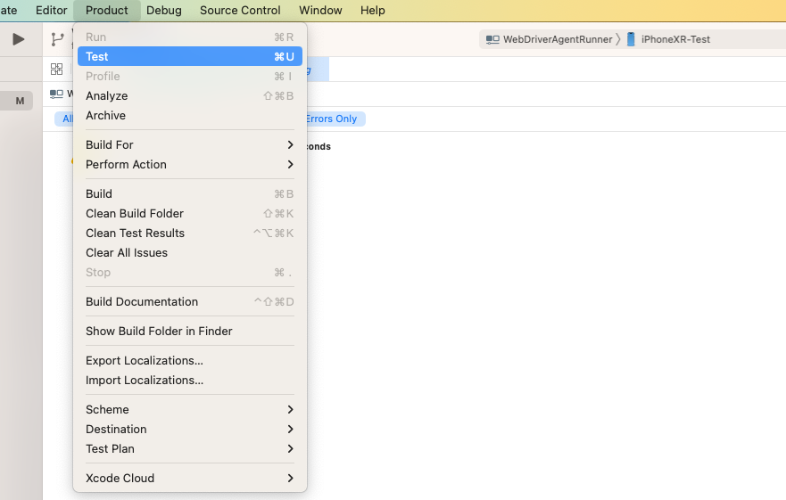

## WebDriverAgent-facebook-wda

> 背景是希望通过脚本，来启动和杀死指定 app。

`xcrun simctl` 命令行工具与模拟器进行交互。通过模拟器，你可以更容易地控制应用的启动和终止。真机上进行测试无效！

```sh
# 冷启动应用程序
xcrun simctl launch 设备 bundle_id

# 杀死应用程序
xcrun simctl terminate
```


`idevicedebug` 和 `idevicediagnostics` 同样无效


### [WebDriverAgent](https://github.com/appium/WebDriverAgent)

- [Common-Issue](https://github.com/facebookarchive/WebDriverAgent/wiki/Common-Issues)
- [Starting WebDriverAgent](https://github.com/facebookarchive/WebDriverAgent/wiki/Starting-WebDriverAgent)

#### 运行

```sh
xcodebuild -project WebDriverAgent.xcodeproj \
           -scheme WebDriverAgentRunner \
           -destination 'platform=iOS Simulator,name=iPhone 6' \
           test
```


**修改绑定端口**

```sh
./fbsimctl --state=booted \
           launch_xctest [path]/WebDriverAgentRunner.xctest com.apple.mobilesafari --port 8100 -- \
           listen
```


卡在 `Running tests...` 日志如下：

```

2023-07-03 18:19:18.085963+0800 WebDriverAgentRunner-Runner[5701:3158480] +[CATransaction synchronize] called within transaction
2023-07-03 18:19:18.099443+0800 WebDriverAgentRunner-Runner[5701:3158480] Running tests...
2023-07-03 18:20:12.830645+0800 WebDriverAgentRunner-Runner[5701:3158654] Connection peer refused channel request for "dtxproxy:XCTestDriverInterface:XCTestManager_IDEInterface"; channel canceled <DTXChannel: 0x28114f360>
2023-07-03 18:20:12.832166+0800 WebDriverAgentRunner-Runner[5701:3158654] [Default] Exiting due to IDE disconnection.
```

重新插拔手机解决了


#### 问题1 无法访问  `ServerURLHere->http://172.16.100.26:8100<-ServerURLHere` 的问题。搜索 issue 找到了，端口转发的方案：

```sh
iproxy 8100 8100 00008020-0003595E3C82002E
# -u, --udid UDID    target specific device by UDID
```

命令执行完之后，访问本地的 `localhost:8100`，就直接转发到了手机的`8100`端口。


#### 问题 2 直接使用 [Queries](https://github.com/facebookarchive/WebDriverAgent/wiki/Queries) 无效的问题

```sh
# curl
curl -X GET $JSON_HEADER $DEVICE_URL/status
curl -X GET https://localhost:8100/session/

curl -X POST -d "{\"desiredCapabilities\":{\"bundleId\":\"com.apple.mobilesafari\"},\"capabilities\":{}}" $DEVICE_URL/session
curl -X POST -d "{\"desiredCapabilities\":{\"bundleId\":\"com.meitu.mtxx\"}, \"capabilities\":{}}" http://localhost:8100/session
```

我直接执行上述命令，并没有唤起 App。😭 然后我开始使用 [facebook-wda](https://github.com/openatx/facebook-wda)

### [facebook-wda](https://github.com/openatx/facebook-wda)

在python 脚本项目中，安装依赖：

```sh
pip3 install -U facebook-wda
```


### 注意

- 需要设置签名
- 运行 Test



- 设置端口转发，`iproxy -u 设备udid 8100 8100`