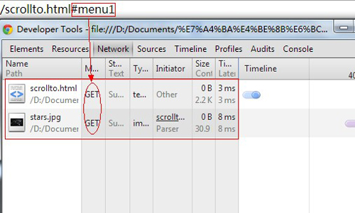
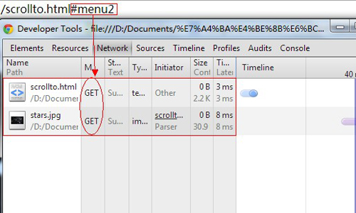
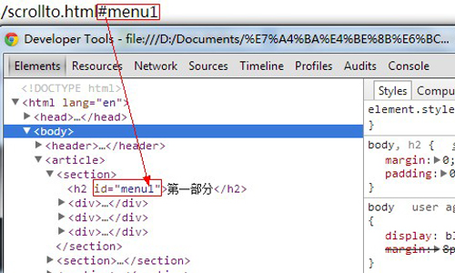
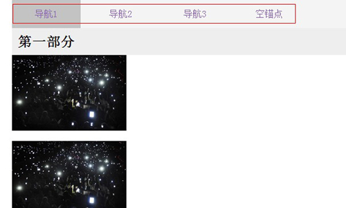

本篇文章将介绍锚点在网页中的那些个事儿，包括通过锚点跳转的实现方法，锚点的跳转机制以及jQuery下锚点跳转的巧妙应用。

<!--more-->

## 实现锚点跳转的方法
实现锚点跳转要为网页指定位置设置标识符然后创建到这些标示符的链接。有两种方式（通常我们会用第二种方式）
### 1 是`<a>`标签加上name属性；

    <li><a href="#menu4">第四部分</a></li>
    <section>
    	<h2 id="menu4">第四部分</h2>
    </section> 

### 2 是使用，id属性。

    <li><a href="#menu4">第四部分</a></li>
    <section>
    	<h2><a name="menu4">第四部分</></h2>
    </section>

## 锚点跳转机制
在介绍锚点的跳转机制之前，首先有必要了解一下URL的#，通过它我们可以看到锚点的更深入的一些东西。

### 搞明白#的含义，它代表网页中的一个位置，其右面的字符就是该位置的标示符。

    http://www.example.com/scrollto.html#menu

就代表网页 `scrollto.html` 的 menu 位置。浏览器读取这个URL后，会自动将 menu 位置滚动至可视区域。   
### #是用来指导浏览器动作的，对服务器端完全无用。所以，HTTP请求中不包括#。

    访问下面的网址:
    http://www.example.com/scrollto.html#menu
    浏览器实际发出的请求：
    GET /scrollto.html HTTP/1.1
    Host: www.example.com
    只请求scrollto.html，并没有#menu部分

如果，单单改变#后面的部分，浏览器只会滚动到相应位置，不会重新加载网页。

    比如，从
    　　http://www.example.com/scrollto.html#menu1
    改成
    　　http://www.example.com/scrollto.html#menu2
    浏览器不会重新向服务器请求scrollto.html

1. 
2. 

虽然改变#后面的部分不会导致页面重载，但是会改变#会改变浏览器的访问历史。每一次改变#后的部分，都会在浏览器的访问历史中增加一个记录，使用”后退”按钮，就可以回到上一个位置。这对于**ajax应用程序**特别有用，可以用不同的#值，表示不同的访问状态，然后向用户给出可以访问某个状态的链接。值得注意的是，上述规则对IE 6和IE 7不成立，它们不会因为#的改变而增加历史记录。ps:由于本篇重点在于锚点，这方面的知识不做剖析。
从上述分析，不难看出锚点的触发正是通过浏览器URL地址的#触发的而不是点击a触发。如下图解：

## 锚点跳转的条件

锚点的跳转要想工作起来必须满足的条件有二：
1. 元素可滚动；
2. 锚点元素在滚动父容器的内部。
    - 试想，如果父容器本身就不滚动，锚点也就只好自挂东南枝了。
    - 另一个需要考虑点是：如果锚点是空锚，则页面不会跳转，唯一变化的就是URL地址；如果是从其他页面跳转过来，则页面顶部显示。

## 锚点跳转的实际应用实例
如果要实现这样一个效果：页面滚动时，滚动到相应区域的时候相应的导航栏目高亮显示。要实现这个效果你会怎么做？第一反应是在HTML结构中用到锚点，然后通过一点jQuery实现比较平稳的过渡效果。好吧，现在让我们拉里一起实现。
### HTML 结构

    <body>
    	<header>
    		
			
    			<ul class="nav">
    				<li class="current"><a href="#menu1">导航1</a></li>
    				<li><a href="#menu2">导航2</a></li>
    				<li><a href="#menu3">导航3</a></li>
    				<li><a href="#menu">空锚点</a></li>
    			</ul>
    		

    	</header>
    	<article>
    		<section>
    			<h2 id="menu1">第一部分</h2>
    			

    				
    			

    			

    				
    			

    			

    				
    			

    		</section>
    		<section>
    			<h2 id="menu2">第二部分</h2>
    			

    				
    			

    			

    				
    			

    			

    				
    			

    		</section>
    		<section>
    			<h2 id="menu3">第三部分</h2>
    			

    				
    			

    			

    				
    			

    			

    				
    			

    		</section>
    		<section>
    			<h2 id="menu4">第四部分</h2>
    			

    				
    			

    			

    				
    			

    			

    				
    			

    			

    				
    			

    		</section>
    	</article>
    </body>

### 效果展示

### jQ 实现跳转功能

    $(document).ready(function() {
    	/*滚动、导航高亮*/
    	var offset_top = new Array();
    	//创建一个数组用来存取每个目标位置的相对偏移量
    
    	$(window).load(function(){
    	//等到全部都加载完了（包括图片）
    		$('#nav .nav li').each(function(){
    			var goTarget = $(this).find('a').attr('href').substring($(this).find('a').attr('href').indexOf("#"));
    			offset_top.push( $(goTarget).offset().top - 50 );
    			//用push把获取的偏移量压进数组
    		});
    	});
    
    	$(window).scroll(function(){		
    		var scrollT = document.documentElement.scrollTop + document.body.scrollTop;	
    		//判断滚动主要注意的是临界值	
    		for( var i = 0; i < offset_top.length; i++ ){
    			var j = i + 1;
    			if( j < offset_top.length ){
    				if( scrollT >= offset_top[i] && scrollT < offset_top[j] ){
    					$('#nav .nav li').removeClass('current');
    					$('#nav .nav li:eq(' + i + ')').addClass('current');
    				}
    			}else{
    				if( scrollT >= offset_top[i] ){
    					$('#nav .nav li').removeClass('current');
    					$('#nav .nav li:eq(' + i + ')').addClass('current');
    				}
    			}
    		}
    	});

		var url;//给导航菜单项目添加单击平滑滚动
		$('#nav .nav  li  a').click(function(event) {
			url = $(this).attr('href').substring($(this).attr('href').indexOf("#"));
			var gotoposition = $(url).offset().top - 50;
			$('html,body').animate({scrollTop:gotoposition}, 400);
			return false;
		});
	});

这样就算是把功能实现出来来了。jQuery代码中值得注意的几点：首先，jQuery禁用了锚点的默认跳转；其次，这里通过push方法把数获取的高度值压进数组；通过`$(window).load()`方法等到所用文件都加载完毕，这样计算的高度比较合理；在获取滚动条高度scrollT的时候，Chrome浏览器只识别`document.body.scrollTop`而其他现代浏览器支持`document.documentElement.scrollTop`，因为`document.body.scrollTop`与`document.documentElement.scrollTop`两者有个特点，就是同时只会有一个值生效。所以，我们这样用了`var scrollT = document.documentElement.scrollTop + document.body.scrollTop;`；判断滚动区域的时候，要注意临界值（根据具体情况）。

## 参考文献
- [6 Things You Should Know About Fragment URLs](http://blog.httpwatch.com/2011/03/01/6-things-you-should-know-about-fragment-urls/)
- [URL锚点HTML定位技术机制、应用与问题](http://www.zhangxinxu.com/wordpress/?p=3591)

## 结语
本篇文章对锚点是什么、锚点工作机理以及锚点怎么用做了分析。由于自己水平有限，语言也比较肤浅。所以，文中的错误之处感谢您您能够指出。我本人对锚点的使用场景了解的还不多，如果希望您能够指点一二（评论、邮件均可）。