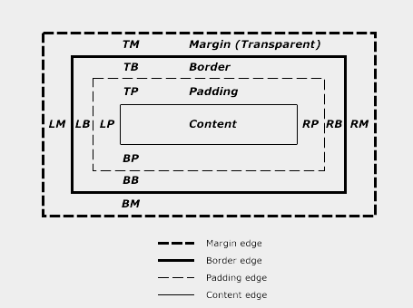

对盒模型的理解是每个学习CSS的同僚所必修的知识，今天这篇文章就简单介绍了盒模型的尺寸、对个尺寸的简单应用举例以及对MARGIN属性，PADDING属性及BORDER属性进行剖析。

<!--more-->

## 盒子尺寸描述
每个盒子都有其内容区域（比如：文本，图像···）以及可选的周围内边距、边框和外边距，每个区域的大小由相应的属性指定。如图所示：

通过此图，我们可以清楚的看到盒子的尺寸。下面我们就其属性做具体分析：

## 盒模型属性
### MARGIN属性
MARGIN属性的属性值分别为：

- margin-top
- margin-right
- margin-bottom
- margin-left

在书写的时候也是按照这个顺序：上，右，下，左，即按顺时针旋转一周。当然可以简写，情况如下：

    /*指定四个方向的值均相同*/
    div{
        margin: 2em;/*上右下左均为2em*/
    }
    /*指定四个方向的值且各不相同*/
    div{
        margin-top: 1em;
        marign-right: 2em;
        margin-bottom: 3em;
        margin-left: 5em;
    }
    div{
        margin:1em 2em 3em 5em;
    }
    /*指定四个方向的值上下相同左右相同*/
    div{
        margin: 4em 2em;/*上下边距各4em,左右边距各2em*/
    }
    /*左右相同*/
    div{
        margin: 1em 2em 4em;/*上1em,左右各2em,下4em*/
    }
    /*分别指定某个方向上的值*/
    div{
        margin-top:2em;
    }

#### 外边距折叠现象   
W3C官方文档中是这样描述的：

> In CSS, the adjoining margins of two or more boxes (which might or might not be siblings) can combine to form a single margin. Margins that combine this way are said to collapse, and the resulting combined margin is called a collapsed margin.

虽然我的英语也很鸡肋，但是大体意思如此：相邻的两个或两个以上的指定了外边距的盒子（他们可能相邻也可能嵌套）可以被合并为一个单一的外边距的现象。

两个或多个块级盒子的垂直相邻外边距会重合。结果外边距宽度是相邻外边距宽度中最大的值(即取最大)。如果出现负值，则在最大的正外边距中减去绝对值最大的负外边距；如果没有正外边距值，就从0中减去绝对值最大的负外边距（即取绝对值最大加负号）。以下是总结的几条不成文的规则：

1. 水平边距永远不会重合
2. 浮动的盒子与其他盒子之间外边距不重叠（以及与他们的孩子元素之间外边距不重叠）
3. 父容器用了`overflow:hidden;`它的子元素外边距不会重叠（`visiblite`除外）
4. 设置了`position:absolute;`的盒子，外边距不会重叠（以及与他们的孩子元素之间外边距不重叠）
5. 设置了`display:inline-block;`的盒子，外边距不会重合（以及与他们的孩子元素之间外边距不重叠）
6. 根元素的外边距不会重叠
7. 上下相邻的两个块级盒子，一个设置了底部外边距，一个设置了顶部外边距通常会发生边距重叠，除非他们之间存在间隙。
8. 父盒子的上外边距与其第一个子盒子的上外边距通常会重合，除非父盒子有边框，内边距或者子盒子与其存在间隙。
9. 由子盒子撑起来的父盒子他与其子盒子外边距重合。

### PADDING属性
PADDING属性的书写规则与MARGIN的相同。这里就不再赘述，下面是简单的代码示例:

    /*指定四个方向的值均相同*/
    div{
        padding: 2em;/*上右下左均为2em*/
    }
    /*指定四个方向的值且各不相同*/
    div{
        padding-top: 1em;
        padding-right: 2em;
        padding-bottom: 3em;
        padding-left: 5em;
    }
    div{
        padding:1em 2em 3em 5em;
    }
    /*指定四个方向的值上下相同左右相同*/
    div{
        padding: 4em 2em;/*上下边距各4em,左右边距各2em*/
    }
    /*左右相同*/
    div{
        padding: 1em 2em 4em;/*上1em,左右各2em,下4em*/
    }
    /*分别指定某个方向上的值*/
    div{
        padding-top:2em;
    }

### BORDER属性
它指定边框的宽度，类型，以及颜色。可以分别指定：
- border-width
    - border-top-width
    - border-right-width
    - border-bottom-width
    - border-left-width
- border-style
    - border-top
    - border-right
    - border-bottom
    - border-left
- border-color  
    - border-top-color
    - border-right-color
    - border-bottom-color
    - border-left-color  

亦可简写：

    div{
        border: 2px solid #fff;
    }

## 参考资料
- [CSS 框模型概述](http://www.w3school.com.cn/css/css_boxmodel.asp)
- [IE盒模型缺陷](http://zh.wikipedia.org/wiki/IE%E7%9B%92%E6%A8%A1%E5%9E%8B%E7%BC%BA%E9%99%B7)
- [CSS 盒模型](http://www.qianduan.net/css-box-model.html)
- [Internet Explorer and the CSS box model](http://www.456bereastreet.com/archive/200612/internet_explorer_and_the_css_box_model/)
- [IE浏览器和CSS盒模型](http://www.osmn00.com/translation/213.html)
- [The Box Model For Beginners](https://www.addedbytes.com/articles/for-beginners/the-box-model-for-beginners/)
- [Box model](http://www.w3.org/TR/CSS2/box.html)
- [CSS Box Model - W3Schools](https://www.google.com/url?sa=t&rct=j&q=&esrc=s&source=web&cd=1&ved=0CB8QFjAA&url=http%3A%2F%2Fwww.w3schools.com%2Fcss%2Fcss_boxmodel.asp&ei=mam_VLD4NMLqoASw3YKIBA&usg=AFQjCNEDIKDFEnu59p1akFM5Hk9scACuKQ&sig2=MJlgihKL-qJPb1ABaFCv6g)