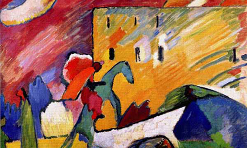
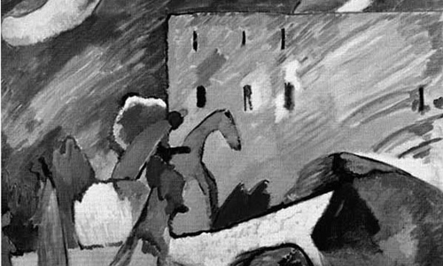

本篇文章，我们将通过一些方法来开启网页图形灰度，使图片变成黑白版的图片，并且兼容主流浏览器。

<!--more-->

## 第一种方法 CSS Filter
通过 CSS Filter 属性或许是开启网页图形灰度最简单的方式了。其实早在以前IE浏览器就拥有其特创的 Filter (滤镜) CSS属性来自定义效果其中就包括 Grayscale 效果。现在，Fileter 属性已经成为CSS3规范的一部分了，并且被诸如 Firefox ,Chrome and Safari 这样的现代浏览器所支持。一个值得一提的东东—— Webkit Filter，这些滤镜效果最初是用于SVG的，W3C引入到CSS中，然后制定了[CSS Filter Effects 1.0](https://dvcs.w3.org/hg/FXTF/raw-file/tip/filters/index.html)，现在 webkit 率先支持了它使我们不仅能够把图像的灰度，但也适用棕褐色和模糊效果。本文仅介绍开启网页图形灰度的方法，关于 -webkit-filter 的更多详细内容推荐[神飞](http://www.qianduan.net/)的[-webkit-filter是神马](http://www.qianduan.net/what-is-webkit-filter.html)这篇文章。
ps:这段代码兼容 IE6-9 和 Webkit 浏览器(Chrome 18+,Safari 6.0+,and Opera 15+)
### CSS 代码实现

    img {  
        -webkit-filter: grayscale(1); /* Webkit */
        -moz-filter: grayscale(1); /*Firefox*/
        -ms-filter: grayscale(1); /*IE*/
        -o-filter: grayscale(1); /*Opera*/ 
        filter: grayscale(1); /* W3C */ 
        filter: gray; /* IE6-9 */  
    }
    /*灰度值可以为百分比eg:*/
    img {  
        -webkit-filter: grayscale(100%); /* Webkit */
        -moz-filter: grayscale(100%); /*Firefox*/
        -ms-filter: grayscale(100%); /*IE*/
        -o-filter: grayscale(100%); /*Opera*/
        filter: grayscale(100%); /* W3C */ 
        filter: gray; /* IE6-9 */   
    }

### 效果展示
1. 
2. 

## 第二种方法 javascript
通过JavaScript可以兼容绝大多数开启JavaScript的浏览器，以下这段代码来自[Ajax Blender](http://www.ajaxblender.com/howto-convert-image-to-grayscale-using-javascript.html)

    $(document).ready(function(){
        $('#toggleDesaturate').click(function(){
            var imgObj = document.getElementById('image');
            
            if($.browser.msie){
                grayscaleImageIE(imgObj);
            } else {
                imgObj.src = grayscaleImage(imgObj);
            }           
        });
    });
    
    function grayscaleImageIE(imgObj)
    {
        imgObj.style.filter = 'progid:DXImageTransform.Microsoft.BasicImage(grayScale=1)';
    }
    
    function grayscaleImage(imgObj)
    {
        var canvas = document.createElement('canvas');
        var canvasContext = canvas.getContext('2d');
        
        var imgW = imgObj.width;
        var imgH = imgObj.height;
        canvas.width = imgW;
        canvas.height = imgH;
        
        canvasContext.drawImage(imgObj, 0, 0);
        var imgPixels = canvasContext.getImageData(0, 0, imgW, imgH);
        
        for(var y = 0; y < imgPixels.height; y++){
            for(var x = 0; x < imgPixels.width; x++){
                var i = (y * 4) * imgPixels.width + x * 4;
                var avg = (imgPixels.data[i] + imgPixels.data[i + 1] + imgPixels.data[i + 2]) / 3;
                imgPixels.data[i] = avg; 
                imgPixels.data[i + 1] = avg; 
                imgPixels.data[i + 2] = avg;
            }
        }
        
        canvasContext.putImageData(imgPixels, 0, 0, 0, 0, imgPixels.width, imgPixels.height);
        return canvas.toDataURL();
    }

IE浏览器下是添加灰度滤镜，这个大家都懂的。其他浏览器使用Canvas中的getImageData方法，然后对每个像素点进行灰度转换。但是本人在调用此代码的时候在最新的Chrome和FF浏览器下都没有调试出效果，在最新的Chrome浏览器上提示如下错误：

> Uncaught SecurityError: Failed to execute 'getImageData' on 'CanvasRenderingContext2D': the canvas has been tainted by cross-origin data.

这个错误让我颇感困惑，最终在["Unable to get image data from canvas because the canvas has been tainted by cross-origin data"问题产生原因及解决办法](http://www.cnblogs.com/jdksummer/articles/2565998.html)找到了答案;在张鑫旭的[小tip: 使用CSS将图片转换成黑白(灰色、置灰)](http://www.zhangxinxu.com/wordpress/?p=2547)这篇文章中也用提到一种JavaScript方法，大家可以一起学习一下。

## SVG
在一种方法是通过 SVG Filter 实现。首先我们要建一个SVG文件，然后把如下代码粘进去。
​    
    <svg xmlns="http://www.w3.org/2000/svg">  
        <filter id="grayscale">  
            <feColorMatrix type="matrix" values="0.3333 0.3333 0.3333 0 0 0.3333 0.3333 0.3333 0 0 0.3333 0.3333 0.3333 0 0 0 0 0 1 0"/>  
        </filter>  
    </svg> 

然后，用filter属性，加载SVG文件，如下：

    img {  
        filter: url('img/gray.svg#grayscale');  
    }  

## 参考资料
- [3 Ways To Turn Web Images To Grayscale](http://www.hongkiat.com/blog/grayscale-image-web/)
- [Ajax Blender](http://www.ajaxblender.com/howto-convert-image-to-grayscale-using-javascript.html)
- [-webkit-filter是神马？](http://www.qianduan.net/what-is-webkit-filter.html)
- ["Unable to get image data from canvas because the canvas has been tainted by cross-origin data"问题产生原因及解决办法](http://www.cnblogs.com/jdksummer/articles/2565998.html)
- [小tip: 使用CSS将图片转换成黑白(灰色、置灰)](http://www.zhangxinxu.com/wordpress/?p=2547)

## 结语
以上就是本篇文章所要讲的内容，希望看完以后可以给你的网页带来，不一样的视觉冲击。文中的不足与错误还请指正，谢谢！