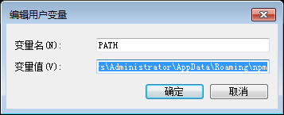

## 两类 Github Page 搞清楚

人家[GitHub Pages](https://pages.github.com/)说的很清楚，只怪我自己太晕，当时就因为没有搞清楚这两种类型，浪费了些时间。硬伤！要命啊······
<!--more-->
## 两个配置文件搞清楚

### 两个文件

1. 对整站的配置：

2. 对主题的配置：

上述连个文件要搞清楚，不要犯浑，一开始的时候我对这两个文件搞混了一次，浪费了些时间，希望大家注意。至于如何配置以及各个可配置项的用处大家可以到[Configuration](http://hexo.io/docs/configuration.html)学习配置。

## Hexo 命令丢失

> conmand not found

之前用的好好的，突然遇到这个问题后，我有点儿搞不懂了，稍微冷静了一会儿后，突然想到，我上午安装软件估计是把环境变量搞乱了，于是

1. 
2. 
3. 
4. 

修改了环境变量后，然后就恢复了。如果你也遇到了这样的问题可以先排查一下是不是因为环境变量的改变造成的。

## Hexo上传 README 文件

Github 的版本库通常建议同时附上 README.md 说明文件，但是 hexo 默认情况下会把所有 md 文件解析成 html 文件，所以即使你在线生成了README.md ，它也会在你下一次执行` hexo d -g `时被删去。
我没有找到解决办法，只是在**顺序**上做了一下调整，算是处理了这个问题吧如下：

1. 在本地
    1. 执行`hexo clean`(执行它的前提是你想清楚原来生成的文件)
    2. 执行`hexo g`
2. 在执行`hexo deploy`前把在本地写好的 README.md 文件复制到 .deploy 文件夹中，再去执行 `hexo d`。

### 补充

在浏览到[How do I add a README.md file into the root directory of the generated blog by HEXO? ](https://github.com/hexojs/hexo/issues/786)看到了处理方案：利用主题的 source 目录，也就是 themes/themes-name/source 。因为这个文件夹里面的所有文件都会被复制到网站的根目录中去，也就是说，如果在里面放上 README.md ，就可以正常的存在于网站的主目录了。于是尝试了一下，但是 README.md 文件还是被解析成了html文件：

既然 md 文件被解析成 html 文件无可避免，于是我就把 README.md 改成了 README.mdown ，终于问题算是解决了。

## Hexo 写文章

在本地搭建的博客的根目录下找到 scaffolds 文件下的 post.md 可对其进行编辑文章头：

    title: { { title } }
    date: { { date } }
    categories:
    tags:
    ---
    
    <!-- more -->

做这样的编辑就可在下次执行`hexo new "postname"`时，会是你一贯的作文结构。因此，避免每次都手工输入文章分类，readmore 这样的结构性的东西。这里我要谈的一点是，标签可以添加多个如下：

    tags:
    - tag1
    - tag2
    - ···
    - tagi
    
    tags: [tag1,tag2,···,tagi]

但是，分类并不是这样，如果你这样写：

    categories: 
    - CSS    
    - 前端相关

原本是希望，文章可在这两个同级分类下，但是结果却是：

所以，我看到其他博文里有提到说 categories 可添加多个分类，好像不太合理，当然也有可能是对静态博客系统做了自己的定制吧。

## 参考文献

- [GitHub Pages](https://pages.github.com/)
- [Configuration](http://hexo.io/docs/configuration.html)
- [Create a New Post](http://hexo.io/docs/writing.html)
- [hexo你的博客](http://ibruce.info/2013/11/22/hexo-your-blog/)
- [如何搭建一个独立博客——简明Github Pages与Hexo教程](http://www.jianshu.com/p/05289a4bc8b2)
- [How do I add a README.md file into the root directory of the generated blog by HEXO? ](https://github.com/hexojs/hexo/issues/786)
- [Hexo issue](https://github.com/hexojs/hexo/issues?page=1&q=is%3Aissue+is%3Aopen)
- [Hexo 安裝教學、心得筆記 (Windows)](http://wwssllabcd.github.io/blog/2014/12/22/how-to-install-hexo-on-window/#安裝_Hexo_所需檔案)
- [使用 Hexo 搭建静态博客](http://inching.org/2014/03/22/hexo/)
- [环境变量](http://baike.baidu.com/view/95930.htm)
- [Hexo 的学习、搭建、整理](http://lszb811.com/2014/07/08/Hexo-%E7%9A%84%E5%AD%A6%E4%B9%A0%E3%80%81%E6%90%AD%E5%BB%BA%E3%80%81%E6%95%B4%E7%90%86/)
- [Hexo常见问题解决方案](http://xuanwo.org/2014/08/14/hexo-usual-problem/)
- [How do I add a README.md file into the root directory of the generated blog by HEXO?](http://stackoverflow.com/questions/25258660/how-do-i-add-a-readme-md-file-into-the-root-directory-of-the-generated-blog-by-h)
- [如何搭建一个独立博客——简明Github Pages与Hexo教程](http://cnfeat.com/2014/05/10/2014-05-11-how-to-build-a-blog/#Hexo上传README文件)
- [hexo系列教程：（三）hexo博客的配置、使用](http://zipperary.com/2013/05/29/hexo-guide-3/)