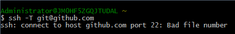
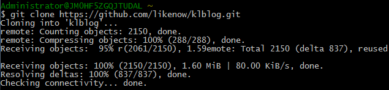
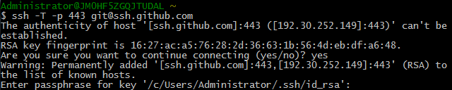
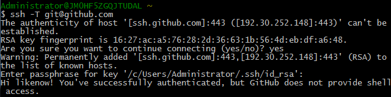

[Git](http://git-scm.com/) 的安装（大家可到[Set Up Git](https://help.github.com/articles/set-up-git/)学习安装）以及 [Github](https://github.com/) 的注册这里不再赘述。这里本人主要是想把自己在配置和使用 Github 时遇到的一些问题拿出来分析一下（**windows 平台下**）。
<!--more-->
## 配置 Github

这部分可以参考[使用Github Pages建独立博客](http://beiyuu.com/github-pages/)。

## 我遇到的问题

### 问题如图

### 解决问题

我到[Error: Bad file number](https://help.github.com/articles/error-bad-file-number/)找到了解决的办法，我尝试 GitHub Help提供的方案：

- Use HTTPS ，它干脆避免了 SSH 

- Test from a different network ，如果可以连到另一个没有防火墙的网络不失为一种方法，那我只有“呵呵”了
- Using SSH over the HTTPS port ，如果使用 HTTPS 行不通，而且你的防火墙管理员拒绝允许 SSH 连接，你可以尝试其他端口去连接 SSH ，这里用的是 443 端口，而且也确实可行：

那么我用的解决方案就是在`.ssh`文件下创建了`config`文件放到 rsa 相同目录下。`config`配置如下：

    Host github.com
    Hostname ssh.github.com
    PreferredAuthentications publickey
    IdentityFile /c/Users/Administrator/.ssh/id_rsa
    Port 443

成功解决如下，已经可以成功连接GitHub了：

## 常见问题

### Permission denied (publickey).

此提示一出，一般应该是程序没有找到 **rsa** 私有钥匙或者 **rsa** 密钥匹配出错。想了解更多到[Error: Permission denied (publickey)](https://help.github.com/articles/error-permission-denied-publickey/)我这里不再赘述。

### Host key verification failed

相信你也撞到了这个问题，主机的密钥验证失败。密钥验证失败有两个原因：
- RSA 做了更改，
- 在 known_hosts 中存在一个缓存的记录，如果确认了 RSA 没有错误，那你就应该去 known_hosts 中删掉对应的那个记录（这个记录可以当做是缓存，是对验证做了一次缓存，缓存的作用是减少验证次数，不需要每次都验证，读取缓存就行了）

### 多个服务端的维护

在配置 SSH 时，我们知道程序会默认寻找 `~/.ssh/id_rsa` 这个文件，同一目录下显然不能有两个重名文件，也就是说当我们去认证 github 和另外一个 git 服务器的时候，我们需要在两者之间互相替换。这样效率可见一斑了，本人从网上找到了一片不错的博文[Setting up multiple GitHub accounts on Windows](http://kevinpelgrims.com/blog/2012/07/19/setting-up-multiple-github-accounts-on-windows)，感觉挺靠谱，自己就不费口舌了。

## 参考文献

- [Generating SSH keys](https://help.github.com/articles/generating-ssh-keys/)
- [Error: Bad file number](https://help.github.com/articles/error-bad-file-number/)
- [Error: Permission denied (publickey)](https://help.github.com/articles/error-permission-denied-publickey/)
- [Git - Permission denied (publickey)](http://stackoverflow.com/questions/2643502/git-permission-denied-publickey)
- [SSH Keys (简体中文)](https://wiki.archlinux.org/index.php/SSH_Keys_(%E7%AE%80%E4%BD%93%E4%B8%AD%E6%96%87))
- [Git SSH error: “Connect to host: Bad file number”](http://stackoverflow.com/questions/7144811/git-ssh-error-connect-to-host-bad-file-number)
- [Permission denied (publickey) when SSH Access to Amazon EC2 instance](http://stackoverflow.com/questions/18551556/permission-denied-publickey-when-ssh-access-to-amazon-ec2-instance)
- [Git - Permission denied (publickey)](http://stackoverflow.com/questions/2643502/git-permission-denied-publickey)
- [Why do I get “Permission denied (publickey)” when trying to SSH from local Ubuntu to a Amazon EC2 server?](http://serverfault.com/questions/39733/why-do-i-get-permission-denied-publickey-when-trying-to-ssh-from-local-ubunt)
- [How to fix Permission Denied (Public key) error?](http://askubuntu.com/questions/337757/how-to-fix-permission-denied-public-key-error)
- [Setting up multiple GitHub accounts on Windows](http://kevinpelgrims.com/blog/2012/07/19/setting-up-multiple-github-accounts-on-windows)
- [How to setup multiple identities of git ssh on windows?](http://stackoverflow.com/questions/25810942/how-to-setup-multiple-identities-of-git-ssh-on-windows)
- [Multiple GitHub Accounts & SSH Config](http://stackoverflow.com/questions/3225862/multiple-github-accounts-ssh-config)