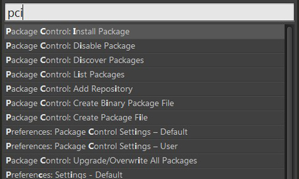
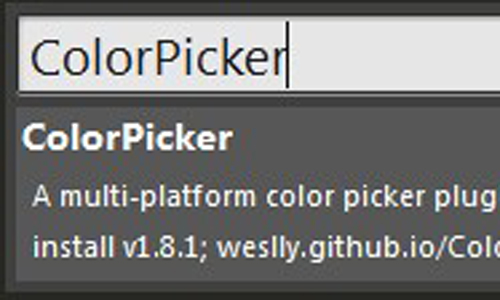
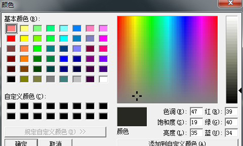
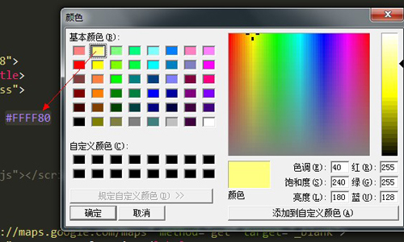
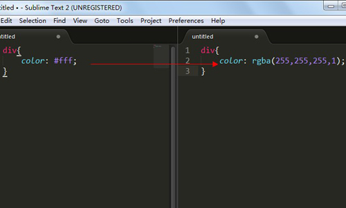
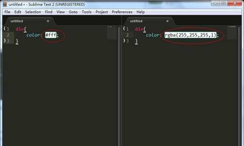

如果你已经习惯了图形化界面的编辑器，像`Sublime Text`这样界面简洁的编辑工具或许让你不爽。举个例子：当添加颜色时，通常会离开编辑器运行另一个应用程序比如：`Photoshop`或者`colorzilla`来获得颜色代码。但是，很明显这样会使工作效率下降。所以，我接下来将介绍一款插件是我们能够不离开编辑工具的情况下获得心仪的颜色。

<!--more-->

## ColorPicker
**Sublime Text**的这款插件[ColorPicker](https://github.com/weslly/ColorPicker)是Weslly Honorato所写。这款插件可以跨平台使用（Windows, OS X, and Linux）。
### 安装它
安装插件要通过Package Control这个插件，如果你还没有安装这个插件，抓紧先去安装一下吧。可参考[The simplest method of installation is through the Sublime Text console. ](https://packagecontrol.io/installation)安装完成之后。
- 我们摁下**shift + ctrl + p**呼出面板，输入`pci`即可锁定**Package Control：Install Package**这个功能，回车之后就可以看到一个列表，我们继续输入`ColorPicker`即可找到这个插件，回车之后等待一会就安装完成了。
    1. 
    2. 

- 安装完成后，如下
    1. 
    2. 

## HEX To RGB Converter
注意，上述ColorPicker插件仅生成十六进制颜色格式。所以如果你需要RGB格式的，你需要安装[HEX To RGB Converter](https://github.com/vitorleal/Hex-to-RGB)这款插件，它是Vitor Leal编写的。HEX To RGB Converter来帮助你转换十六进制颜色格式为RGB颜色格式。
安装方法同上不再赘述，选择十六进制颜色值或光标的前面或中间值，你可以使用菜单选项或键盘快捷键。通过`shift+ctr+r`快捷操作来实现格式的转换，我们来看一下效果:

## Color Highlighter
Color Highlighter是另一个比较不错的插件[Color Highlighter](https://github.com/Monnoroch/ColorHighlighter)但不要把这个与代码高亮混淆，这款插件可以让你实现颜色预览功能。这样对你的颜色选择是不是更有帮助呢？单击颜色代码区域就可以预览颜色了，来看一下：

还不赖吧，此版本为测试版，不支持ST3、不支持多颜色值预览。虽然它工作得很好，但是它附带产生的颜色值会破坏配色方案。配色方案仍然可以工作，但它会变得越来越大。无论如何，你总是可以从菜单中恢复原来的颜色方案文件。总的来说，还是一款不错的插件工具。

## 结语
本文介绍了Windows下**Sublime Text2**的拾色功能插件，相信这样就不用离开编辑器专门花时间去打开其他的应用工具了。这一定程度上提高你的工作效率。该篇是介绍**Sublime Text**工具系列篇的开始，在接下来的文章中会进一步介绍**Sublime Text**。最后，提前感谢您能够指出文中的错误，希望与您交流经验。