用过LINUX和Mac OS X的童鞋都知道**虚拟桌面**，每个桌面都运行不同的程序，可以随时切换，用起来也比较方便。而天朝呢，都知道用微软的WINDOWS系统的比较多。由于WINDOWS系统本身有些臃肿，所以一直到WIN7也没有加入这个功能，淡然这不是我们讨论的话题。如何让自己的WIN7拥有虚拟桌面功能呢？本篇文章将介绍一款第三方软件Dexpot，如果你还在为本本的屏幕太小而发愁，如果你在羡慕苹果本本的虚拟桌面多么好用，这篇文章值得一读。

<!--more-->

## 准备
首先，我们要下载Dexpot，这当然不用我说了吧。不过如果你觉得网上资源太杂乱我这里直接给您个官网链接吧[Dexpot官网下载](http://dexpot.de/?id=download)，这里您可以找到想要的资源。下载的时候有这样几个版本：
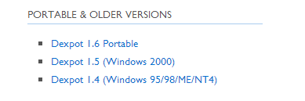
这里讲的是WIN7下的使用，自然是选择Dexpot 1.6版本。ps：有便携版（Portable），我这里选择的是安装版。安装比较简单，按照提示不到一分钟就可以装好,这里不再赘述。如果遇到问题可以留言。我会尽快帮助您解决问题。

## 使用
万事俱备只欠东风，现在开始使用。为了更好的使用，通常我们会根据自己的喜好配置一下。
### 使用前的设置
1. 鼠标右键单击Dexpot的系统托盘图标，会出现如图：

2. 当然该Dexpot托盘菜单中桌面名称都是有设置的，接下来就要将这一点。为了提高识别度我为每个桌面起了一个名字，你也可以来设置一下，还是右击，然后选择配置桌面，如下：
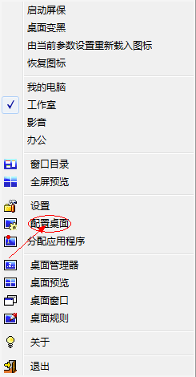
3. 
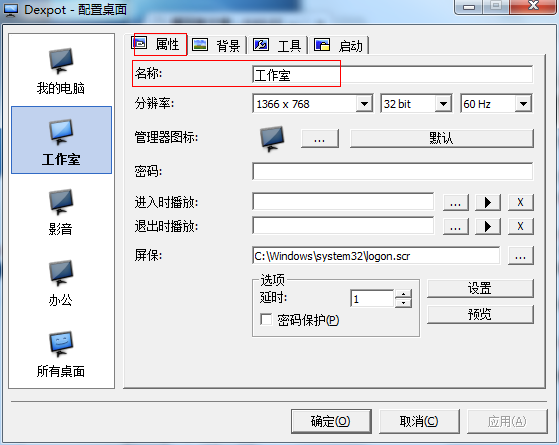
4. 背景选项

5. 工具选项

6. 启动选项
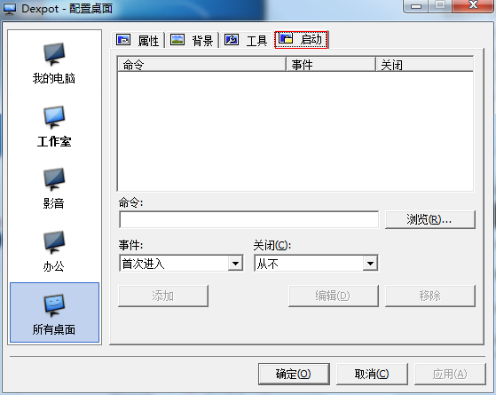
7. 其次，让我们看一看设置选项。选择设置选项后，弹出如下窗口： 
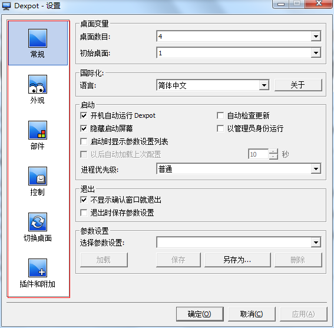
8. 其左侧是六个选项，分别为常规、外观、部件、控制、切换桌面以及插件和附件，常规如下：
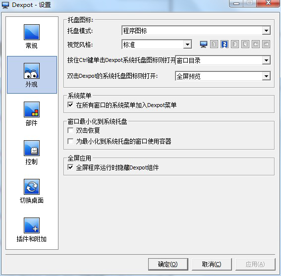
9. 外观
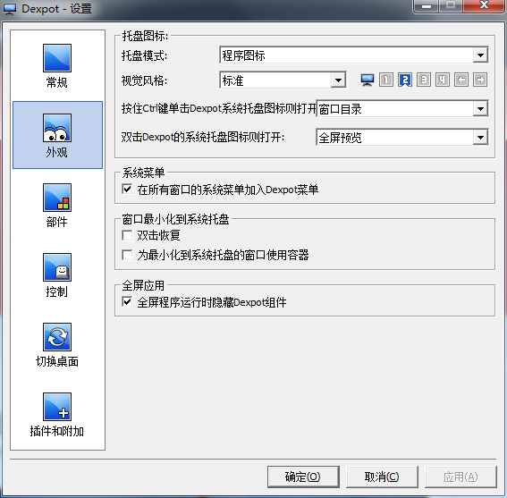
10. 部件
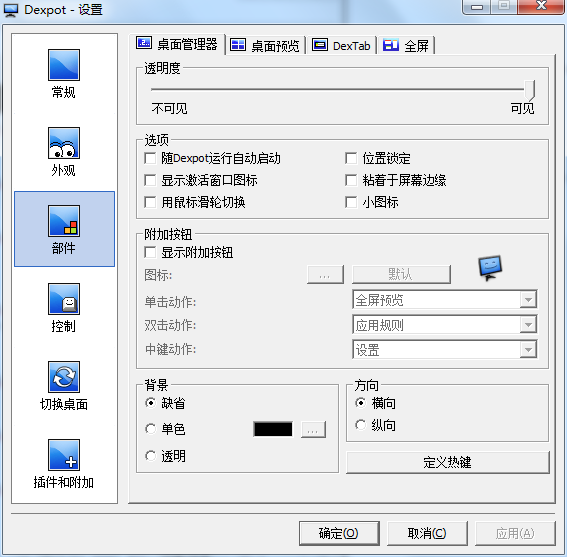
11. 控制
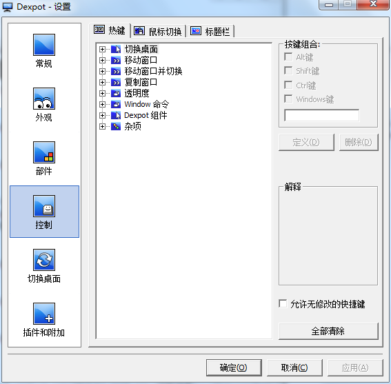
12. 切换桌面
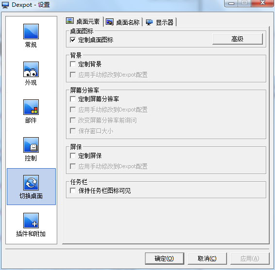
13. 插件和附件
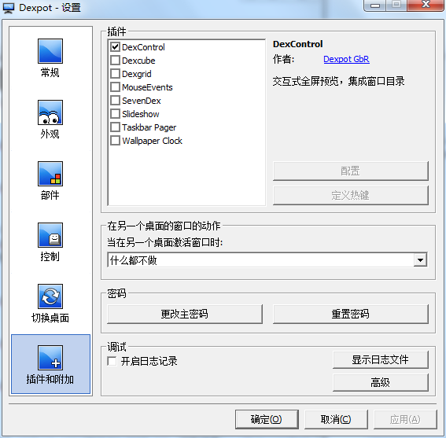

以上六个选项，根据自己的喜好设置，自己舒服最好，像常规选项里面的桌面数、语言、启动；外观选项里面的图盘图标；切换桌面选项里面的桌面元素、桌面名称等根据自己的习惯来就好。值得注意的是：部件选项中的设置比桌面管理器、桌面预览还是比较有趣的；插件和附件中选择需要的效果就好，比如DexControl插件就是来控制虚拟桌面图标的。

## 开始使用
使用之前我们已经根据自己的习惯设置好了，接下来就是使用了。这里介绍一下软件的几个快捷操作，提高我们的工作效率。
- 切换桌面
    - ALT+第几个虚拟桌面比如：ALT+1将跳转到第一个虚拟桌面。
- 移动窗口
    - ALT+SHIFT+第几个虚拟桌面比如：ALT+SHIFT+1将当前操作窗口移动到第一个虚拟桌面
- 复制窗口
    - ALT+CTRL+第几个虚拟桌面例如：ALT+CTRL+1将当前操作窗口复制到到第一个虚拟桌面
- 透明度
    - ALT+CTRL+Num+/-例如：ALT+CTRL+Num+增加透明度
- 窗口菜单
    - WINDOWS+它将显示对当前窗口的操作，卷起？移动？复制？等
- 关闭窗口
    - ALT+SHIFT+F4它将关闭操作窗口
    - Dexpot组件快捷操作
    - WINDOWS+F2操作将显示该虚拟桌面的窗口目录
    - WINDOWS+F3是全屏预览操作
    - WINDOWS+Q是任务切换操作
    - WINDOWS+W是虚拟桌面切换操作

## 结语
未提及的功能还要靠自己体验，本篇是推荐一款实用软件，兴许可以帮助你提高些工作效率。十一小长假即将结束，带上顺手的工具再出发！