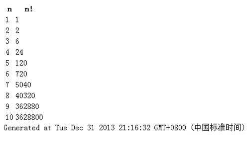

客户端（通常是浏览器端）JavaScript程序没有严格的定义。我们可以说JavaScript程序是有Web页面中所包含的所有JavaScript代码（内联脚本、HTML事件处理程序和javascript：URL【bookmarklet中的，可以看做是一种用户扩展或者对于其他程序的修改】）和通过 script 标签的 src 引用的外部JavaScript代码组成。JavaScript程序的执行有两个阶段，上一篇文章[总结JavaScript文件的加载](http://kai-lee.com/2013/12/29/js-to-load/)总结了文档的载入，JavaScript程序的载入阶段是相对短暂的，通常仅需1~2秒。在文档载入后，只要Web浏览器显示文档，第二个阶段(事件驱动阶段)就会一直持续下去。这个阶段是异步的，而且是事件驱动的也正因为这样，可能有长时间不活动状态，没有JavaScript被执行，Web浏览器通过调用事件处理程序函数来响应异步发生的事件。

<!--more-->

## 一个同步载入的JavaScript程序
### javascript 代码

    

### 如图分析

在页面载入时开始执行，生成输出，然后结束。这种类型的程序在今天已经不常见了。我们通过注册事件处理程序函数来写程序。之后在注册的事件发生时异步调用这些函数。

## 事件处理程序（函数）
如果想要程序响应一个事件，写一个函数，叫做“事件监听器”或“回调”。然后注册这个函数，这样他就会在事件发生时调用它。在**行为内容分离**原则的基础上注册事件最简单的方法是把JavaScript函数赋值给目标对象的属性。应用示例代码：

	eg1:
	window.load = function(){
		// xxx
	};
	eg2:
	document.getElementById("button").onclick = function(){
		// xxx
	};

注意按照约定，事件处理程序的名字是以on开始，后面跟着事件的名字。还要注意在上面这段代码里没有调用：只是把函数本身赋值给这些属性。浏览器会在事件发生时执行调用。
如果需要为一个事件注册多个事件处理程序函数，或者如果想要写一个可以安全注册事件处理程序的代码块，就算另一个模块已经为相同的目标上的相同的事件注册了一个处理程序，也需要用到另一种事件处理程序注册技术。大部分可以成为事件目标的对象都有一个叫做`addEventListaner()`的方法，允许注册多个监听器：

	window.addEventListener('load',function,false);
	
	/*早期 IE 中有 attachEvent 方法效果类似：*/
	window.attachEvent('onload',function);

## window.onload 事件
举个例子，首先我创建一个函数为 firstFuction 。我必须执行 firstFuction 函数才能对事件进行绑定。如果马上执行这个函数，它将无法完成其工作。如果在HTML文档完成加载之前执行脚本，此时DOM是不完整的（DOM不完整事态的发展往往偏离我们的计划）。应该让这个函数在网页加载完毕之后立刻执行。网页加载完毕时会触发一个 onload 事件，这个事件与window对象相关联。为了让事态的发展不偏离计划，必须把 firstFuction 函数绑定到这个事件上：

	window.onload = firstFuction;

这样，这个函数会在加载完成之后被处理。但是，这种方法有个缺陷，就是只能用于这一个函数。页面中无法出现多个window.onload事件，如果出现了多个，那么后面的内容会覆盖前面的。

	window.onload = firstFuction;
	window.onload = secondFuction;

上述代码，secondFuction函数会覆盖掉firstFuction函数。有一种解决方案可以然我们避过这个问题：我们可以先创建一个匿名函数来容纳这两个函数，然后把那个匿名函数绑定到onload事件上，如下：

	window.onload = function(){
  		firstFuction;
   		secondFuction;
 	}

	function firstFuction(){...}
	function secondFuction(){...}

他确实能很好的工作——在需要绑定的函数不是很多的场合，这应该是最简单的解决方法了。这里还有一个弹性最佳的解决方案——不管你打算在页面加载完毕时执行多少个函数，他都可以应付自如。这个方案需要额外编写一些代码，但好处是一点有了那些代码，把函数绑定到window.onload事件就小意思了。
这个函数的名字是 addLoadEvent,它是Simon Willison编写的。他只有一个参数：打算在页面加载完毕时执行的函数名字。它将完成以下操作：(1)把现有的window.onload事件处理函数的值存入变量oldonload(2)如果在这个处理函数上还没有绑定任何函数，就像平时那样把新函数添加给她。(3)如果在这个处理函数上已经绑定了一些函数，就把新函数追加到现有指令的末尾。

	function addLoadEvent(func) {
	  var oldonload = window.onload;
	  if (typeof window.onload != 'function') {
	    window.onload = func;
	  } else {
	    window.onload = function() {
	      oldonload();
	      func();
	    }
	  }
	}

则上面举得例子添加这个队列里，只需这样写：

	addLoadEvent(firstFuction);
	addLoadEvent(secondFuction);

## 参考文献
- [Document Object Model Events](http://www.w3.org/TR/DOM-Level-2-Events/events.html)
- [Event-Driven Web Application Design](http://yuiblog.com/blog/2007/01/17/event-plan/)
- [Simon Willison](http://blog.simonwillison.net/)