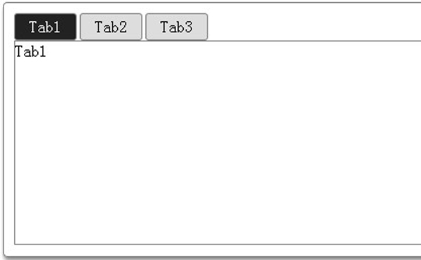

选项卡利用有限的容器来完成较多操作，这样我们在单个窗口下完成较为丰富的操作。在WEB页面中，选项卡也得到了较好的应用。

<!--more-->

## 网页选项卡实现
### HTML 代码结构

    <body>
    	

    		

    			<ul>
    				<li class="selected">Tab1</li>
    				<li>Tab2</li>
    				<li>Tab3</li>
    			</ul>
    		

    		

    			
Tab1

    			
Tab2

    			
Tab3

    		

    	

    </body>

### CSS 样式式

    .tab{
    	width: 500px;
        height: 250px;
        border: 1px solid gray;
        border-radius: 4px;
        box-shadow: 1px 3px 5px gray;
    }
    .tab_menu ul{
    	overflow: hidden;
    	padding: 0;
    	margin: 10px;
    	margin-bottom: 0;
    }
    .tab_menu ul li{
    	width: 60px;
    	height: 25px;
    	line-height: 25px;
    	margin-right: 3px;
    	float: left;
    	text-align: center;
    	border: 1px solid gray;
    	border-radius: 3px;
    	background: #ddd;
    	cursor: pointer;
    	list-style: none;
    }
    .tab_box{
    	margin-left: 10px;
    	margin-bottom: 10px;
    	width: 90%;
    	height: 200px;
    	border: 1px solid gray;
    }
    .tab_menu ul .selected{
    	background-color: #222;
    	color: #fff;
    }
    .hide{
    	display: none;
    }
    .show{
    	display: block;
    }

### jQ 实现切换功能
切换的原理主要是通过隐藏和显示来切换不同的内容。首先，要为`<li>`绑定单击事件，然后为当前单击的`<li>`元素高亮。接下来是实现内容的切换，让`<li>`与对应的`
`建立联系，通过索引来实现。
#### jQ 代码

    $(function(){
    	var $div_li = $('div.tab_menu>ul>li')
    	$div_li.click(function(event) {
    		/* Act on the event */
    		$(this).addClass('selected')
    		//当前<li>元素高亮
    		.siblings().removeClass('selected');
    		//去掉其他同辈<li>元素的高亮
    		var index = $div_li.index(this);
    		//获取当前单击的<li>元素在全部<li>元素中的索引
    		$('div.tab_box > div').eq(index).show().siblings().hide();
    		//实现对应内容的隐藏和显示
    	})
    });

### 实现展示
这样，当单击`<li>`元素后，选项卡相应的内容也将切换。效果如下：

## 结语
以上，就是对选项卡功能WEB实现的全部内容。HTML结构很简单、样式比较简陋、jQuery实现当然可以更加光鲜动人，这里抛砖引玉。如果您有更好的实现感谢您对能够拿出来交流。最后，提前感谢您指出文中的错误，我一定会立即改正。