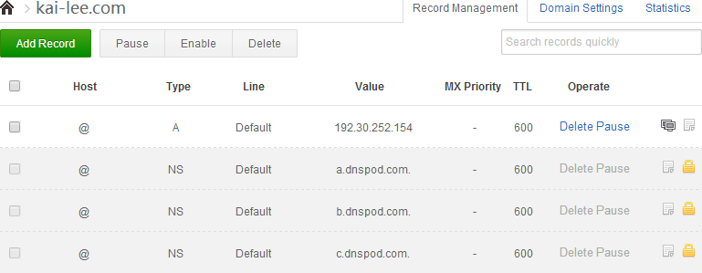

购买的主机到期又不太想续费了，而且看到同学的静态博客也很给力便不再使用 [WordPress](https://WordPress.org/download/) 系统，于是花了几天的时间用 [Hexo](http://hexo.io/) 搭建了静态博客,搬到了 [Github Pages](https://pages.github.com/) 。下面就我在博客搬家的时候遇到的一些问题以及解决方案做一下总结。
<!--more-->
## 博客搬家要做哪些准备

### 思想准备

有句古话：“麻雀虽小五脏俱全” 。博客搬迁和一般网站一样并不轻松甚至说有一定的风险，尤其是遇到一些 BUG 的时候后就更是闹心，所以在你搬家之前要有一定的思想觉悟。

### 资源准备
所谓“资源准备”也就是：

- 你原站上的文件
- 新的空间

## 上传博客到新空间

### 本地导入博客文章

我原来的博客是用的 WordPress 系统，现在用的是静态博客生成系统 Hexo 。现在要想把原来 WordPress 上写的文章导入到 Hexo 也很简单：
1. 从 WordPress 导出文章
    1. 登录 WordPress 管理控制台，选择工具->导出，再选择文章。点击下载导出的文件，就可以得到一个名称类似`WordPress.xml`的文件。
    2. 将以上导出的文件放在本地 Hexo 博客的根目录下
2. 把文章导入到 Hexo
    1. 要导入 WordPress 的文章要安装插件执行以下命令： `npm install hexo-migrator-WordPress`
    2. 导入文章执行以下命令：`hexo migrate WordPress WordPress.xml`
3. 执行完成后，在站点目录->source->_posts目录中，就可以看到导入的文章。    
4. 注：这里导出的文件不必放在本地 Hexo 博客的根目录下，但在2.2步下要相应改变`WordPress.xml`的文件路径

### 部署到 Github

该部署环节默认你已经在本地搭建好了，并且在 Github Pages 建立了自己的 **Repository** 并完成了一系列的工作（这不是本文的重点在后续的文章中我会进一步分享经验）。你可以到[Github Pages](https://pages.github.com/)提前学习一下。
然后就是把本地博客上传到 Github Pages 具体请参考[Deployment](http://hexo.io/docs/deployment.html)即可完成部署这里不再赘述。

### 将独立域名与 GitHub Pages 的空间绑定

你完全可以参考：[Setting up a custom domain with GitHub Pages](https://help.github.com/articles/setting-up-a-custom-domain-with-github-pages/)完成独立域名的绑定工作，因为再花哨的语言在这里都显得相形见绌。我就自己出的错讲几点注意事项：

- DNS 设置
    - 我开始用的是[DNSPOD 中国版](https://www.dnspod.cn/)当我添加一条 A 记录使其指向：`192.30.252.153` `192.30.252.154`中的一个时出现了莫名的错误，于是我转而使用[DNSPOD 国际版](https://www.dnspod.com/)算是解决了。
    - 关于 DNS 的参数设置在使用 DNSPOD 时都会有说明，这里不再浪费口舌，值得主义的一个小技巧是：Time To Live（TTL），缓存的生存时间。指地方dns缓存您域名记录信息的时间，缓存失效后会再次到DNSPod获取记录值。为了快速生效可置为：60s，待解析生效后再改回正常值：600s。
    - 最终效果：
- 当然，到这里只是意味着,如果你的域名解析到了 DNSPod ，它会帮你转到 Github 但是它为什么回到 DNSPod 呢?这就需要我们在 Godaddy 那也做一些设置了
    - 因为用了DNSPOD 国际版所以修改的时候也要参照对应的修改教程[How can the domain name registered in Godaddy use DNSPod?](https://www.dnspod.com/support/index/fid/119)
- 最后，稍作等待然后就可以用你自己的域名访问你的博客了

## 自己挖的坑

### SEO 收录清空

博客搬到 Github Pages 后，因为修改了部分文章的 URL 、内容、标题、描述、和关键字，结果搜索引擎把对之前收录的我的博客的收录都清掉了，之前积累的就都没了，搜索引擎又开始重新收录了。呜呜呜······

### sitemap

为了让搜索引擎的蜘蛛机器人(spider)对网站更好的进行爬行，我安装了 [sitemap](https://github.com/hexojs/hexo-generator-sitemap) 插件。为达到较好的收录效果我到 [google](https://www.google.com/webmasters/) 手动提交了 `sitemap.xml` 以及登陆[百度搜索引擎网站](http://zhanzhang.baidu.com/sitesubmit/index)提交我的网址。

## 参考文献

- [Github Pages](https://pages.github.com/)
- [Deployment](http://hexo.io/docs/deployment.html)
- [Migrate My blog from WordPress to Hexo](http://bubbyroom.com/2013/08/11/migrate-my-blog-from-WordPress-to-hexo/)
- [Setting up a custom domain with GitHub Pages](https://help.github.com/articles/-setting-up-a-custom-domain-with-github-pages/)
- [How can the domain name registered in Godaddy use DNSPod?](https://www.dnspod.com/support/index/fid/119)
- [浅谈github页面域名绑定](http://yanping.me/cn/blog/2011/12/04/github-pages-domain/)
- [将WordPress迁移到hexo并同时托管到Github和Gitcafe上](http://armsword.com/2014/11/22/move-from-WordPress-to-hexo/)
- [把博客从WordPress中迁移到hexo中](http://zhaiyz.com/2014/04/12/migrator-blogs-from-WordPress-to-hexo/)
- [网站搬家的一般步骤](http://www.qianxingzhem.com/post-369.html)
- [手把手教会WordPress博客网站robots.txt文件写法](http://www.afengseo.com/1594.html)
- [在搬家的时候随时注意好你的robots](http://www.qianxingzhem.com/post-1048.html)
- [robots.txt](http://zh.wikipedia.org/wiki/Robots.txt#.E6.9B.BF.E4.BB.A3)
- [网站地图](http://zh.wikipedia.org/wiki/%E7%B6%B2%E7%AB%99%E5%9C%B0%E5%9C%96)
- [Plugins](https://github.com/hexojs/hexo/wiki/Plugins)
- [谷歌搜索引擎优化初学者指南](http://static.googleusercontent.com/media/www.google.com/zh-CN/us/intl/zh-CN/webmasters/docs/search-engine-optimization-starter-guide-zh-cn.pdf)
- [网站如何登录搜索引擎、怎么提交sitemap（搜索引擎登录入口,网站收录入口）](http://blog.sina.com.cn/s/blog_4a840cc50100wqmi.html)