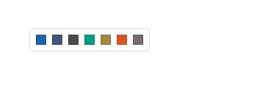

网页换肤的基本原理也不难理解：通过使用脚本语言（这里以javascript的库jQuery为例）切换对应的样式表。这样的功能在很多情况下使用不到的，当然用户希望有的话也不得不做是吧。在Firefox默认的首页上就有该功能。
当然仅仅是切换是不够的，通常还需要能够记录用户选择的皮肤，这样用户下次访问的时候，就不用再次选择自己喜欢的皮肤。这种实现需要**cookie**的支持。

<!--more-->

## 换肤功能实现流程

    if(用户除此访问网页) // js 读取 cookie 为空选择默认的皮肤
      if(点击换肤按钮定制皮肤)
        js 控制切换到相应的样式表 // 将皮肤选项记录到 cookie 保存
      使用制定皮肤
    else(已定制皮肤用户访问) // js 读取 cookie 
       选择指定皮肤
      if(点击换肤按钮重新定制)
        js 控制切换到相应的样式表使用指定皮肤

##开始实现换肤功能
### 了解实现需要的准备工作
首先，应该是有多套CSS样式分别代表不同皮肤；再者，是在网页上增加一个列表作为换肤按钮；最后，是功能上的实现分别是切换功能和 Cookie 记录功能

### 换肤工具栏实现
#### HTML结构

    

    	<ul>
    		<li><a href="#" rel="blue" class="blue" title="Blue">Blue</a></li>
    		<li><a href="#" rel="dark-violet" class="dark-violet" title="Dark-Violet">Dark-Violet</a></li>
    		<li><a href="#" rel="dark" class="dark" title="Dark">Dark</a></li>
    		<li><a href="#" rel="emerald" class="emerald" title="Emerald">Emerald</a></li>
    		<li><a href="#" rel="golden" class="golden" title="Golden">Golden</a></li>
    		<li><a href="#" rel="grapefruit" class="grapefruit" title="Grapefruit">Grapefruit</a></li>
    		<li><a href="#" rel="light-brown" class="light-brown" title="Light-Brown">Light-Brown</a></li>
    	</ul>
    

#### CSS样式

    /* ---- Colors Box ---- */
    
    .schemes{
    	width:432px;
    	padding:5px;
    	position:absolute;
    	z-index:1000;
    	top:50px;
    	left:50px;
    	background:#fff;
    	border:1px solid #d9d9d9;
    	border-radius:5px;
    	-moz-border-radius:5px;
    	-khtml-border-radius:5px;
    	-webkit-border-radius:5px;
    	-webkit-border-radius:5px;
    }
    				
    .schemes a{
    	float: left;
    	width:15px;
    	height:15px;
    	margin:5px;
    	display:block;
    	overflow:hidden;
    	outline:none;
    	text-indent:-999px;
    }
    .schemes a.dark	{
    	background:#474c52;
    	border:1px solid #2b3035;
    }
    .schemes a.blue	{
    	background:#2261a8;
    	border:1px solid #174c88;
    }
    .schemes a.dark-violet{
    	background:#44547f;
    	border:1px solid #2e3959;
    }
    .schemes a.emerald{
    	background:#009e8c;
    	border:1px solid #02665b;
    }
    .schemes a.golden{
    	background:#a88342;
    	border:1px solid #84642c;
    }
    .schemes a.grapefruit{
    	background:#d8552a;
    	border:1px solid #b64622;
    }
    .schemes a.light-brown{
    	background:#7a6c6c;
            border:1px solid #574a4a;
    }    

#### 效果如图

### 换肤功能实现
实现换肤功能主要是实现单击切换按钮时的切换样式文件功能和 Cookie 记录皮肤功能。
#### 样式切换功能
##### 实现描述：
载入不同皮肤的CSS文件，遍历载入的CSS文件载入方式

    <link rel="alternate stylesheet" id="css_blue-css" title="blue" href="colors/blue.css" type="text/css" media="screen">

只有当前使用的CSS文件`this.disabled = false`可用，其他的都不可用`this.disabled = true`从而达到切换效果。ps：以下代码并非本人所写，为了易懂本人作了适当的注释。

##### jQ 代码

    (function($)
    	{
    		// Local vars for toggle
    		var availableStylesheets = [];
    		var activeStylesheetIndex = 0;
    		
    		// To loop through available stylesheets
    		$.stylesheetToggle = function()
    		{
    			activeStylesheetIndex ++;
    			activeStylesheetIndex %= availableStylesheets.length;
    			$.stylesheetSwitch(availableStylesheets[activeStylesheetIndex]);
    		};
    		
    		// To switch to a specific named stylesheet
    		$.stylesheetSwitch = function(styleName)
    		{
    			$('link[rel*=style][title]').each(
    				function(i) 
    				{
    					/*首先禁用所有的样式表链接*/
    					this.disabled = true;
    					/*然后开启任何title属性值与匿名函数传递过来的字串(styleName)相同的样式表*/
    					if (this.getAttribute('title') == styleName) {
    						this.disabled = false;
    						activeStylesheetIndex = i;
    					}
    				}
    			);
    			/*创建Cookie*/
    			createCookie('style', styleName, 365);			
    		};
    		
    		/*等网页加载完毕后JS就读取Cookie内容*/
    		$.stylesheetInit = function()
    		{
    			$('link[rel*=style][title]').each(
    				function(i) 
    				{
    					availableStylesheets.push(this.getAttribute('title'));
    				}
    			);
    			/*获取Cookie的皮肤值*/
    			var c = readCookie('style');
    			/*如果有就转到对应的皮肤*/
    			if (c) {
    				$.stylesheetSwitch(c);
    			}
    		};
    	}
    )(jQuery);

#### Cookie 记录功能
以下是两个自定义的函数，用来创建、读取Cookie内容。ps：不用担心这些代码的晦涩难懂，其实只需copy到JS代码区域下就ok，这段代码也是我从前辈们那里copy的。如想深入了解很高兴与您交流。
##### jQ 代码

    function createCookie(name,value,days)
    {
    	if (days)
    	{
    		var date = new Date();
    		date.setTime(date.getTime()+(days*24*60*60*1000));
    		var expires = "; expires="+date.toGMTString();
    	}
    	else var expires = "";
    	document.cookie = name+"="+value+expires+"; path=/";
    }
    function readCookie(name)
    {
    	var nameEQ = name + "=";
    	var ca = document.cookie.split(';');
    	for(var i=0;i < ca.length;i++)
    	{
    		var c = ca[i];
    		while (c.charAt(0)==' ') c = c.substring(1,c.length);
    		if (c.indexOf(nameEQ) == 0) return c.substring(nameEQ.length,c.length);
    	}
    	return null;
    }
    function eraseCookie(name)
    {
    	createCookie(name,"",-1);
    }

## 综述
通过上述描述，换肤功能新鲜出炉。提醒一下，换肤功能是个性化比较强，根据用户的需要酌情添加！！料想你也看到了该方法加载了一干CSS文件，网页加载速度肯定会受到影响。
在CSS切换这方面也有其他的一些方法比如我看过的[潜行者M](http://www.qianxingzhem.com/post-1980.html)——网页换肤其切换CSS文件的方式就和本文讲述的不同。它是通过改变类来改变样式，具体想了解的可以去学习一下。
最后，提前感谢您能帮忙指正文中的错误。如果您有更有的换肤实现希望您能告知。