**Sublime Text 2**有强大的插件支持，使他无与伦比。从之前我谈到的关于颜色的几款插件就可以察觉到**Sublime Text 2**是如此的方便快捷和强大。本篇文章将详细介绍**Sublime Text 2**快捷键操作，这会进一步提高正在使用**Sublime Text 2**的开发者的工作效率。光说不练假把式，我们真刀真枪的练一下吧。

<!--more-->

## WINDOWS 下Sublime Text快捷键
### Ctrl+Shift+P：打开命令面板
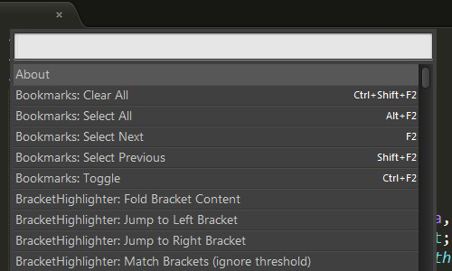
### Ctrl+P：搜索项目中的文件
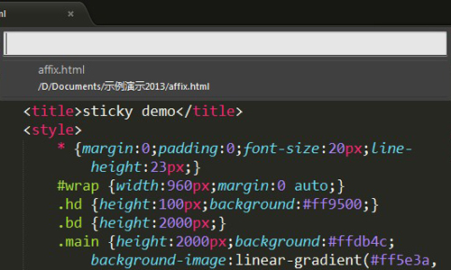
### Ctrl+G：跳转到第几行
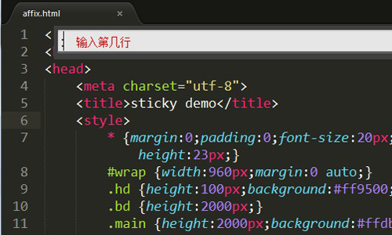
###Ctrl+W：关闭当前打开文件 
### Ctrl+Shift+D：复制光标所在整行，插入在该行之前
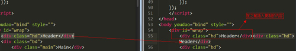
### Ctrl+Shift+W：关闭所有打开文件
### Ctrl+Shift+V：粘贴并格式化
### Shift+Tab：去除缩进
### Ctrl+D：选词，重复可增加选择下一个相同的单词
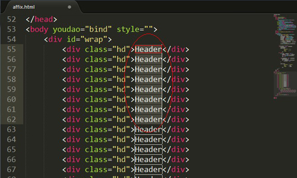
### Ctrl+L：选择行，重复可依次增加选择下一行
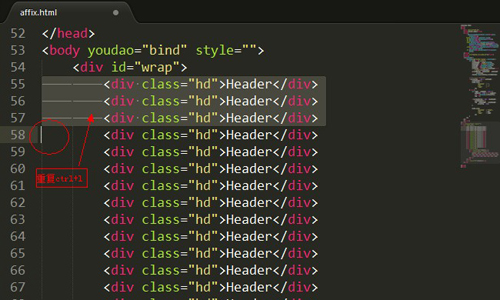
### Ctrl+Shift+L：选择多行
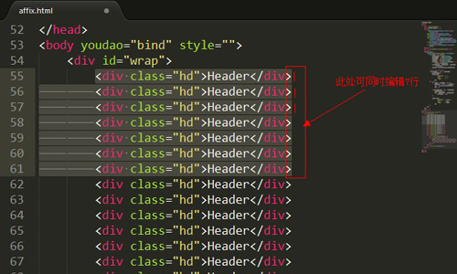
### Ctrl+Shift+Enter：在当前行前插入新行
### Ctrl+Enter：在当前行后插入新行
### Ctrl+X：删除当前行
### Ctrl+Z：撤销
### Ctrl+M：光标移动至括号内开始或结束的位置
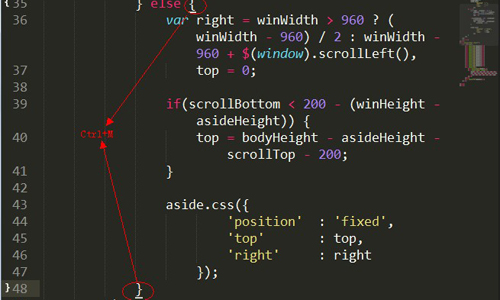
### Ctrl+U：软撤销，撤销光标位置
### Ctrl+k接着按Ctrl+U：改为大写
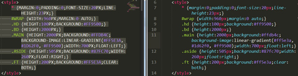
### Ctrl+k接着按Ctrl+L：改为小写

### Ctrl+J：合并行
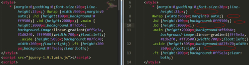
### Ctrl+F：查找
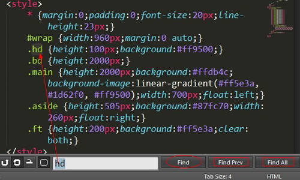
### Ctrl+H：替换
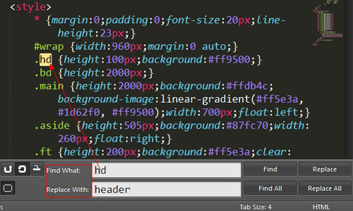
### Ctrl+R：前往 method
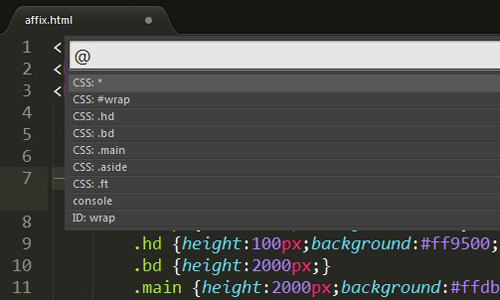
### Ctrl+N：新建窗口
### Ctrl+K连续按两次组合键：从光标处删除至行尾
### Ctrl+Shift+K：删除整行
### Ctrl+Shift+M：选中当前括号内容，重复可选着括号本身
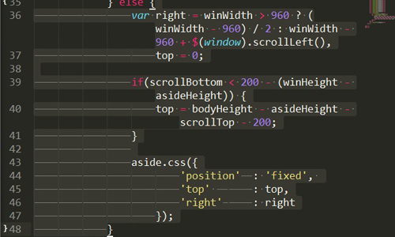
### Ctrl+F2：设置/删除标记
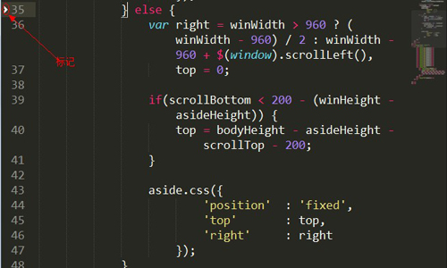
### Ctrl+/：注释当前行以及Ctrl+Shift+/：当前位置插入注释
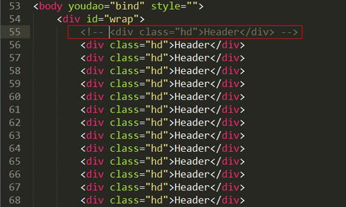
### Ctrl+Alt+/：块注释，并Focus到首行，写注释说明用的
### Ctrl+Shift+A：选择当前标签前后，修改标内容签用的
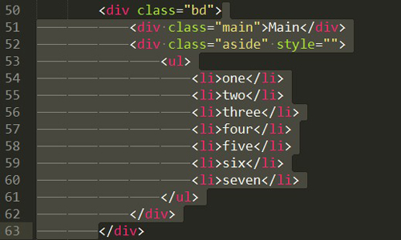
### Ctrl+Shift+[：折叠代码
### Ctrl+Shift+]：展开代码
### F11：全屏
### Shift+F11：全屏免打扰模式，只编辑当前文件
### Alt+F3：选择所有相同的词
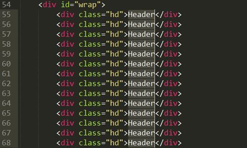
### Alt+Shift+数字：分屏显示
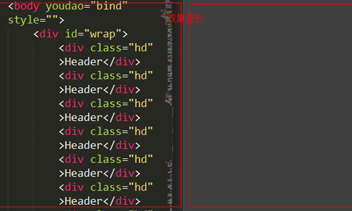
### Alt+数字：切换打开第N个文件
### F9：行排序（按a-z）
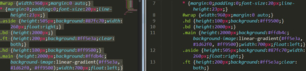
### 按Ctrl+Shift+上下键，可替换行
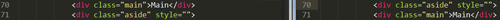
### 按Ctrl，依次点击或选取，可需要编辑的多个位置

## 参考文献
- [sublime text docs](https://packagecontrol.io/docs#End_Users)
- [Sublime Text 2/3使用心得](http://andrewliu.tk/2014/11/25/Sublime-Text-3%E4%BD%BF%E7%94%A8%E5%BF%83%E5%BE%97/)
- [Sublime Text 全程指南](http://zh.lucida.me/blog/sublime-text-complete-guide/)

## 结语
以上，列出了**Sublime Text 2**在Windows平台下常用的快捷操作键。本篇文章就介绍这些，在后续的文章中，我还会提到**Sublime Text 2**这一神器。希望以上列出的常用快捷操作可以给您的编程带来更高的效率。提前感谢您能够指文中的错误与不足，期待与你交流。