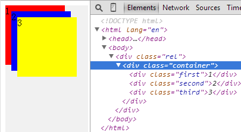
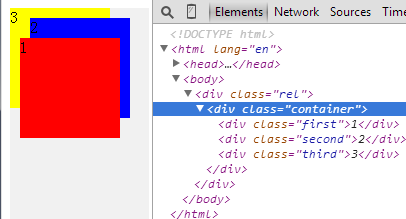
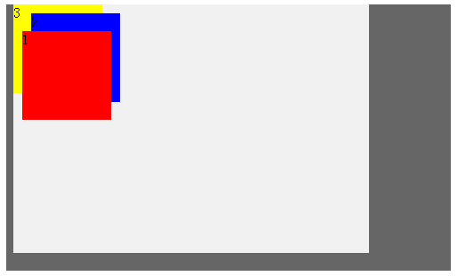
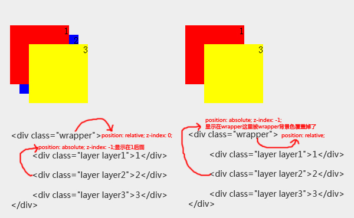
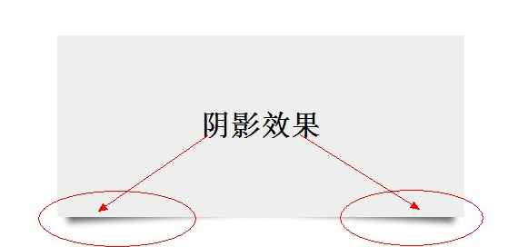
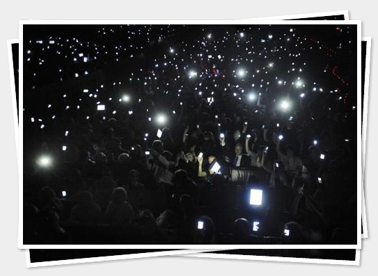

你问我z-index属性水多深，对z-index了解有几分？其实我对它的了解也只是冰山一角，下面我将把我所了解记录下来。

<!--more-->

Z-INDEX表示层级关系，其可能的值有：

- auto是默认值；
- number设置数字，数字越大层级越高（可为负数哦！！！）。
Z-INDEX属于那种给点儿阳光就灿烂的属性，在`position: relative;``position: absolute;``position: fixed;`的普照下，终于得瑟坏了···

## 没有Z-INDEX时的自动层级
其实，元素应用了position属性之后，它们就会脱离普通文档流上升到另一个空间（position的值为非static），而且后面的会覆盖前面的即越后面层级越高。
### 用例代码-HTML部分

    

        
1

        
2

        
3

    

### 用例代码-CSS部分

    .container{
        position: relative;
        width: 400px;
        height: 280px;
        background-color: #f1f1f1;
    }
    .first,.second,.third{
        position: absolute;
        width: 100px;
        height: 100px;
    }
    .first{
        top: 0px;
        left: 0px;
        background-color: red;
    }
    .second{
        top: 10px;
        left: 10px;
        background-color: blue;
    }
    .third{
        top: 20px;
        left: 20px;
        background-color: yellow;
    }

### 分析如图。    
在不使用Z-INDEX的情况下层级关系表达的也是不错的

## 使用Z-INDEX表达层级关系
使用Z-INDEX表达层级关系，为了使其在最上层，对于其数值的设置为：`z-index: 9999;`我表示反对。有必要把数字搞得这么大吗？真是逗啊！看一下我是怎么用的：
### 用例代码-HTML部分

    

        
1

        
2

        
3

    

### 用例代码-CSS部分

    .container{
        position: relative;
        width: 400px;
        height: 280px;
        background-color: #f1f1f1;
    }
    .first,.second,.third{
        position: absolute;
        width: 100px;
        height: 100px;
    }
    .first{
        top: 30px;
        left: 10px;
        z-index: 3;
        background-color: red;
    }
    .second{
        top: 10px;
        left: 20px;
        z-index: 2;
        background-color: blue;
    }
    .third{
        top: 0px;
        left: 0px;
        z-index: 1;
        background-color: yellow;
    }

### 分析如图
使用Z-INDEX之后，给`.first`赋值为3，然后他就展现在最前面了。这里我对它的值仅用到了1,2,3这样连幼儿园的小朋友都可以数的阿拉伯数字。在使用Z-INDEX的情况下层级关系表达的也是不错的。    

## 复杂情况举例
上述讲述的都是中规中矩的应用，当然还有比较复杂的应用。这里主要提一下应用Z-INDEX上下文的层级优先关系，即其父元素的层级优先关系。有时候，不能光看z-index: 999999;值有多大，还要看父元素的层级。看下面的例子：
### 用例代码-HTML部分

    

    

        
1

        
2

        
3

    

### 用例代码-CSS部分

    .cover{
        position: absolute;
        z-index: 1;
        left: 0;
        top: 0;
        width: 500px;
        height: 300px;
        background: #666;    
    }
    .container{
        position: relative;
        z-index: 1;
        width: 400px;
        height: 280px;
        background-color: #f1f1f1;
    }
    .first,.second,.third{
        position: absolute;
        width: 100px;
        height: 100px;
    }
    .first{
        top: 30px;
        left: 10px;
        z-index: 3;
        background-color: red;
    }
    .second{
        top: 10px;
        left: 20px;
        z-index: 2;
        background-color: blue;
    }
    .third{
        top: 0px;
        left: 0px;
        z-index: 1;
        background-color: yellow;
    }

### 分析如图
1. cover设置`z-index: 1;`效果如下：    

2. cover设置`z-index: 2;`效果如下： 

以上，我们清楚地看到，当`.cover`的层级比`.container`大的时候，`.container`整个就被`.cover`遮住，即使`.first`的z-index属性值为3也于事无补。看来韩信再牛，在项羽麾下是没有出头之日啊！

## Z-INDEX负值工作原理
### 比较拙劣的手工演示图

正如演示图所示，当给绝对定位的wrapper（设定了Z-INDEX）的子元素layer2绝对定位并设置`z-index: -1;`后，该子元素会显示在wrapper的其他子元素之下；而给绝对定位的wrapper（设未定Z-INDEX）的子元素layer2绝对定位并设置`z-index: -1;`后，它会显示在wrapper之下。
根据个人理解：当绝对定位的父元素在设置了Z-INDEX之后其绝对定位的子元素的Z-INDEX为负值时，会显示在该父元素的其他子元素之下；当绝对定位的父元素在没有设置Z-INDEX，其绝对定位的子元素的Z-INDEX为负值时，会显示在该父元素之下。总算把Z-INDEX负值的工作原理说明白了。如果你还不太明白没关系继续看下文，我将通过实例进一步探索Z-INDEX负值。

## 使用Z-INDEX制作阴影效果
该示例结合CSS3的box-shadow属性和transform属性以及伪元素，但这里只关注z-index负值。实现如下：
### 用例代码-HTML部分

    

    	<h1>阴影效果</h1>
    

### 用例代码-CSS部分

    .box h1{
    	text-align:center;
    	position:relative;
    	top:80px;
    }
    .box {
    	width:70%;
    	height:200px;
    	background:#EEE;
    	margin:40px auto;
    }
    .shadow
    {
      position: relative;
    }
    .shadow:before, .shadow:after
    {
      z-index: -1;
      position: absolute;
      content: "";
      bottom: 15px;
      left: 10px;
      width: 50%;
      top: 80%;
      max-width:300px;
      background: #666;
      -webkit-box-shadow: 0 15px 10px #666;
      -moz-box-shadow: 0 15px 10px #666;
      box-shadow: 0 15px 10px #666;
      -webkit-transform: rotate(-3deg);
      -moz-transform: rotate(-3deg);
      -o-transform: rotate(-3deg);
      -ms-transform: rotate(-3deg);
      transform: rotate(-3deg);
    }
    .shadow:after
    {
      -webkit-transform: rotate(3deg);
      -moz-transform: rotate(3deg);
      -o-transform: rotate(3deg);
      -ms-transform: rotate(3deg);
      transform: rotate(3deg);
      right: 10px;
      left: auto;
    }

### 分析如图
通过伪元素`:before` `:after`在box前后布置阴影，CSS3的`box-shadow`属性做出阴影，然后通过transform属性变换阴影的角度，最后通过`z-index: -1;`使其在box之下显示。

## 使用Z-INDEX制作图像叠加效果
### 用例代码-HTML部分

    

      
    

### 用例代码-CSS部分

    body{
        background: #eee;
    }
    .stacks{
        border: 6px solid #fff;
        float: left;
        width: 480px; 
        height: 316px;
        margin: 50px;
        position: relative;
        -webkit-box-shadow: 2px 2px 5px rgba(0,0,0,0.3);
        -moz-box-shadow: 2px 2px 5px rgba(0,0,0,0.3);
        box-shadow: 2px 2px 5px rgba(0,0,0,0.3);
    }
    .stacks:before{
        position: absolute;
        z-index: -1;
        top: 0px;
        left: -10px;
        content: "";
        height: 316px;
        width: 480px;
        -webkit-box-shadow: 2px 2px 5px rgba(0,0,0,0.3);
        -moz-box-shadow: 2px 2px 5px rgba(0,0,0,0.3);
        box-shadow: 2px 2px 5px rgba(0,0,0,0.3);     
        -webkit-transform: rotate(-5deg);
        -moz-transform: rotate(-5deg);
        -o-transform: rotate(-5deg);
        -ms-transform: rotate(-5deg);
        transform: rotate(-5deg);
        background: url(stars.jpg) no-repeat;
        border: 6px solid #fff;
    }
    .stacks:after {
        content: "";
        height: 316px;
        width: 480px;
        background: url(stars.jpg) no-repeat;
        border: 6px solid #fff;
        position: absolute;
        z-index: -2;
        top: 5px;
        left: 0px;
        -webkit-box-shadow: 2px 2px 5px rgba(0,0,0,0.3);
        -moz-box-shadow: 2px 2px 5px rgba(0,0,0,0.3);
        box-shadow: 2px 2px 5px rgba(0,0,0,0.3);
        -webkit-transform: rotate(3deg);
        -moz-transform: rotate(3deg);
        -o-transform: rotate(3deg);
        -ms-transform: rotate(3deg);
        transform: rotate(3deg);
    }

### 分析如图
图片叠加实现影集一样的效果，其中叠加的图片通过伪元素`:before` `:after`在stacks的前后添加，通过transform完成角度的旋转，关键是通过`z-index`负值实现叠加的层次效果。

## 结语
- 要用Z-INDEX属性一定要使用绝对定位，所以考虑再慎重使用Z-INDEX属性之前，先对自己的布局有一个整体的把握。其次，涉及到上下文时，父元素层级地位高者要呈现在最前面；父元素层级地位低者即使其子元素Z-INDEX属性值再大也也会被覆盖。
- Z-INDEX属性的数值要有尺度1~10就够用了，其实在前两条的基础之上根本不会出现`z-index: 999999;`的情况。
- 正文中使用Z-INDEX负值的两个实例仅仅是其使用中的一小部分，更多的好的应用还是靠大家发挥。如果您有比较新颖的使用技巧，提前感谢您能够给与我提示。
- 如果在不使用Z-INDEX属性的情况下层级关系表现良好，那就把它跑到九霄云外吧！

以上，就是我对Z-INDEX属性的了解，文中错误之处还请帮忙指正。